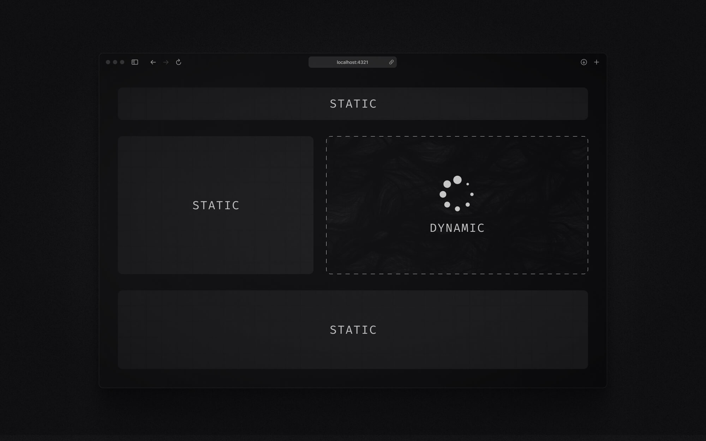
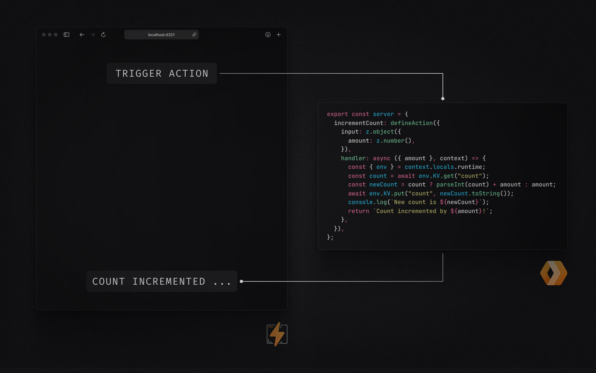
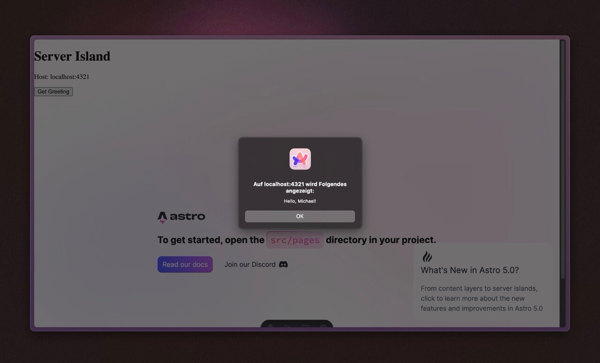

# Deep Dive: Einrichtung von Astro Server Islands & Actions auf Cloudflare Pages

Mit meinem Background in React und Next.js, habe ich Astro bisher hauptsächlich als Static Site Generator betrachtet. Aber mit den letzten Releases hat sich Astro von einem reinen Static Site Generator zu einem leistungsstarken Full-Stack-Framework entwickelt, das statische und dynamische Inhalte kombiniert. Insofern war ich besonders froh, als Server Islands und Actions eingeführt wurden. Sie ermöglichen es mir nun, umfangreiche, interaktive Anwendungen zu erstellen und gleichzeitig die Performance-Vorteile statischer Inhalte beizubehalten. Während andere Full-Stack-Frameworks wie Next.js ähnliche Möglichkeiten bieten, fand ich Astro immer einfacher zu verstehen und zu deployen. In diesem Guide werden wir untersuchen, wie man ein Astro-Projekt mit diesen Features einrichtet und auf Cloudflare Pages hostet. Wir werden auch den Build-Output untersuchen, den der Cloudflare-Adapter generiert, um den Code, den wir shippen, besser zu verstehen.

Du findest das gesamte Projekt auf GitHub: [Astro Cloudflare Deep Dive](https://github.com/michaelheckmann/personal-website/tree/main/code/astro-cloudflare-deep-dive).

## Verständnis von Astro Server Islands und Actions

Bevor wir in den Code einsteigen, lass uns kurz klären, was Server Islands und Actions sind und warum sie so spannend sind.



### Was sind Server Islands

Stell dir Server Islands als kleine "Inseln" dynamischer Inhalte innerhalb deiner ansonsten statischen Astro-Seiten vor. Denk an einen Blogpost – größtenteils statischer Inhalt. Aber was, wenn du einen Kommentarbereich oder User Avatare einbinden möchtest? Server Islands ermöglichen es dir, solche interaktiven Komponenten zu erstellen. Sie werden auf dem Server gerendert und nach dem initialen Laden der Seite mittels Script Tags in die Seite eingefügt. Sie sind nicht Teil des anfänglichen statischen HTML, was entscheidend ist. So bleibst du bei deinen statischen Inhalten flink und SEO-freundlich, kannst aber dennoch dort dynamische Elemente einstreuen, wo es nötig ist.



### Was sind Server Actions

Server Actions erlauben es, serverseitigen Code direkt aus deinen Astro-Komponenten aufzurufen. Praktisch bei form submissions, Datenbankabfragen oder API-Interaktionen. Das Tolle an Server Actions ist, dass sie typesafe sind und direkt neben deinem Frontend-Code leben. So kannst du sensible Sachen wie API Keys oder Geschäftslogik auf dem Server behandeln, ohne sie dem Client preiszugeben. Zudem sind Astro Server Actions mit einer eingebauten Input-Validierung via `⁠zod` sowie mit einem konsistenten Fehlermanagement ausgestattet.

### Warum Cloudflare Pages

Ich nutze Cloudflare Pages zum Deployen meiner Webseiten und Webapps, weil sie ein großzügiges Free Tier bieten und einfach zu bedienen sind. Zudem arbeitet Cloudflare Pages besonders gut mit Astro zusammen, selbst wenn du serverseitigen Code und Bindings an andere Cloudflare-Produkte integrierst. Der Astro Cloudflare Adapter übernimmt dabei die harte Arbeit, den passenden Build Output zu generieren, den Cloudflare Pages erwartet.

## Projekt Setup und Konfiguration

Okay, lass uns praktisch werden und ein Astro Projekt mit Server Islands und Actions aufsetzen.

### Astro Starter Template

Der einfachste Weg ist, das Cloudflare Starter Template zu verwenden. Öffne dein Terminal und führe folgenden Befehl aus:

```bash cn-show-copy
pnpm create cloudflare@latest my-astro-app --framework=astro
```

Dieser Befehl erstellt ein neues Astro Projekt, das bereits alle nötigen Dependencies und Konfigurationen mitbringt.

Sobald der Vorgang abgeschlossen ist, wechsle mit `⁠cd` in dein neues `⁠my-astro-app`-Verzeichnis. Dort wirst du eine Projektstruktur finden, die ungefähr so aussieht:

```
my-astro-app/
├── public/
├── src/
│   ├── actions/
│   ├── assets/
│   ├── components/
│   ├── layouts/
│   └── pages/
├── .gitignore
├── astro.config.mjs
├── package.json
├── README.md
├── tsconfig.json
├── worker-configuration.d.ts
└── wrangler.jsonc
```

### Manuelles Setup

Falls du Server Islands und Actions zu einem bestehenden Astro Projekt hinzufügen möchtest, achte darauf, dass du die neueste Version von Astro (5.0 oder höher) verwendest. Zudem musst du den Cloudflare Adapter, Worker Types sowie Wrangler installieren:

```bash cn-show-copy
pnpm add @astrojs/cloudflare
```

```bash cn-show-copy
pnpm add -D @cloudflare/workers-types wrangler
```


#### Konfigurationsdateien

Hier sind die wichtigsten Anpassungen, die du vornehmen musst. Diese sind bereits implementiert, wenn du das Cloudflare Starter Template nutzt:

**astro.config.mjs**

Füge den Cloudflare Adapter in deine Astro Konfiguration ein:

```javascript
// @ts-check
import { defineConfig } from "astro/config";
import cloudflare from "@astrojs/cloudflare";

// https://astro.build/config
export default defineConfig({
  adapter: cloudflare({
    platformProxy: {
      enabled: true,
    },
  }),
});
```

Die Option `platformProxy` erlaubt es, Cloudflare-spezifische Features lokal während der Entwicklung zu simulieren. Das ist besonders zu empfehlen, wenn du Bindings zu Cloudflare Diensten wie `KV` und `Durable Objects` nutzt.

Unser Projekt nutzt den Standard-Output-Modus "static", was bedeutet, dass Astro alle Seiten im Voraus rendert. Bisher bedeutete das Hinzufügen dynamischer Inhalte, dass du dich entscheiden musstest: entweder machst du deine gesamte Anwendung mittels Output-Modus „server“ serverseitig oder du machst ganze Routen dynamisch mit `⁠export const prerender = false`. Server Islands bieten nun einen flexibleren Ansatz: Du kannst deine Seiten standardmäßig statisch belassen und gezielt dynamische Komponenten mithilfe der `⁠server:defer` Direktive einbinden. So behältst du die feingranulare Kontrolle darüber, welche Teile deiner Seite statisch und welche serverseitig gerendert werden.

**wrangler.toml**

Erstelle die Datei `wrangler.toml` (oder `wrangler.jsonc`). Diese Datei konfiguriert deine Cloudflare Workers Umgebung.

```toml
#:schema node_modules/wrangler/config-schema.json
name = "my-astro-app"
compatibility_date = "2025-02-04"
compatibility_flags = [ "nodejs_compat" ]
pages_build_output_dir = "./dist"
```

Wichtige Einstellungen hier sind:

- `name`: Der Name deines Projekts.
- `compatibility_date`: Ein spezifisches Datum, das bestimmt, auf welche Eigenschaften des Workers-Runtimes zugegriffen werden kann.
- `compatibility_flags`: `nodejs_compat` ist entscheidend für die Node.js-Kompatibilität.
- `pages_build_output_dir`: Gibt das Verzeichnis an, in dem deine gebaute Astro-Seite liegt.

**package.json**

Passe den `scripts`-Bereich in deiner `package.json` wie folgt an:

```jsonc
"scripts": {
  "dev": "astro dev",   // Dein Projekt lokal ausführen
  "build": "astro build", // Dein Projekt bauen
  "preview": "astro build && wrangler pages dev", // Deine Produktions-Build lokal in der Vorschau anzeigen
  "deploy": "astro build && wrangler pages deploy", // Auf Cloudflare Pages deployen
  "cf-typegen": "wrangler types" // worker-configuration.d.ts generieren
}
```

Diese Skripte bieten dir praktische Befehle für Entwicklung, Build, Vorschau und Deployment deines Astro Projekts auf Cloudflare Pages.

#### TypeScript

Für ein reibungsloseres Entwicklungserlebnis, insbesondere mit Server Actions, wird TypeScript stark empfohlen. Das Starterprojekt beinhaltet bereits eine `tsconfig.json`, die die Standardkonfiguration von Astro erweitert. Um volle Type-Safety bei Cloudflare Workers zu gewährleisten, solltest du `@cloudflare/workers-types` zu `compilerOptions.types` in deiner `tsconfig.json` hinzufügen:

**tsconfig.json**

```json
{
  "extends": "astro/tsconfigs/strict",
  "include": [".astro/types.d.ts", "**/*"],
  "exclude": ["dist"],
  "compilerOptions": {
    "types": ["@cloudflare/workers-types/2023-07-01"]
  }
}
```

**worker-configuration.d.ts**

Führe `pnpm run cf-typegen` aus, um die Datei `worker-configuration.d.ts` zu generieren. Diese Datei stellt TypeScript-Typen für Cloudflare Bindings bereit und erleichtert dir den Umgang mit Environment-Variablen und Cloudflare Bindings in deinem Astro Projekt. Sie liest aus der `wrangler.toml` Datei, um die Typen zu generieren. Da wir noch keine Bindings oder Variablen definiert haben, enthält die Datei lediglich ein leeres Interface.

**src/env.d.ts**

Erstelle diese Datei in deinem `src` Verzeichnis `src/env.d.ts`:

```typescript
type Runtime = import("@astrojs/cloudflare").Runtime<Env>;

declare namespace App {
  interface Locals extends Runtime {}
}
```

Diese Datei spielt eine zentrale Rolle in deinem Entwicklungsworkflow, indem sie TypeScript Type Safety für deine Environment-Variablen bereitstellt, welche über die Datei `worker-configuration.d.ts` exponiert werden. So stellt sie eine Brücke zwischen Cloudflares Environment-Variablen und deiner Astro Anwendung dar und sorgt dafür, dass du Autovervollständigung und Typüberprüfung beim Zugriff auf deine Environment-Variablen erhältst.

Mit diesen Konfigurationen ist dein Astro Projekt bereit, Server Islands und Actions auf Cloudflare Pages zu nutzen!

## Implementierung von Server Islands

Nachdem wir unser Projekt eingerichtet haben, erstellen wir nun eine einfache Server Island, die eine künstliche Verzögerung simuliert und dynamische Daten anzeigt.

### Erstellung eines Server Island components

Erstelle eine Datei namens `server-island.astro` in deinem Verzeichnis `src/components` und füge folgenden Code ein:

```astro cn-show-copy
---
// Warte 5 Sekunden, um einen langsamen Server zu simulieren
await new Promise((resolve) => setTimeout(resolve, 5000));
const host = Astro.request.headers.get("host");
---

<div>
  <h1>Server Island</h1>
  <p>Host: {host}</p>
</div>
```

Diese einfache Komponente macht zwei Dinge: Zunächst führt sie eine Verzögerung von 5 Sekunden mittels `await new Promise(...)` ein. Das dient ausschließlich zu Demonstrationszwecken, um visuell hervorzuheben, dass diese Komponente erst nach dem initialen Laden der Seite erscheint. In einem echten Szenario könnte diese Verzögerung das Abrufen von Daten aus einer Datenbank oder einer externen API repräsentieren. Anschließend liest sie den `host` Header aus der Astro Anfrage aus und zeigt ihn an. Dadurch wird der Zugriff auf serverseitige Daten innerhalb der Komponente demonstriert.

### Integration mit Cloudflare Pages

Nun binden wir das Server Island in unsere Homepage ein. Öffne `src/pages/index.astro` und ergänze den Code, sodass die `ServerIsland` Komponente eingebunden wird:

```astro
---
import ServerIsland from "../components/server-island.astro";
import Welcome from "../components/Welcome.astro";
import Layout from "../layouts/Layout.astro";
---

<Layout>
  <ServerIsland server:defer />
  <Welcome />
</Layout>
```

Die Direktive `server:defer` ist hierbei entscheidend. Sie weist Astro an, diese Komponente nicht im initialen Response zu rendern, sondern deren Rendering zu verschieben, bis später. Dadurch lädt der Rest der Seite schnell, während das Server Island im Hintergrund nachgeladen wird.

Um dies in Aktion zu sehen, starte deinen Dev Server mit `pnpm dev` und öffne dein Projekt (vermutlich unter `http://localhost:4321`). Du solltest sehen, dass die "Welcome"-Komponente sofort geladen wird und nach einer Verzögerung von 5 Sekunden die "Server Island"-Komponente erscheint, die den Host Header anzeigt.


Dieses einfache Beispiel demonstriert die Stärke der Server Islands: Du kannst dynamische, serverseitig gerenderte Komponenten gezielt in deine statischen Astro-Seiten einfügen, um dort zusätzlich Interaktivität zu schaffen.

## Arbeiten mit Server Actions

Wir erweitern das Beispiel, indem wir eine Server Action hinzufügen! Erstelle eine einfache Action, die dir einen Begrüßungstext zurückgibt.

### Definition einer Server Action

Erstelle eine neue Datei `src/actions/index.ts` und füge folgenden Code hinzu:

```typescript cn-show-copy
import { defineAction } from "astro:actions";
import { z } from "astro:schema";

export const server = {
  getGreeting: defineAction({
    input: z.object({
      name: z.string(),
    }),
    handler: async (input, context) => {
      console.log("action getGreeting called with input", input);
      return `Hallo, ${input.name}!`;
    },
  }),
};
```

Dieser Code definiert eine Server Action mittels Astors eingebautem `⁠defineAction` Helper. Die Action mit dem Namen `⁠getGreeting` nimmt einen `⁠name` als Input entgegen und liefert eine Begrüßung zurück. Wir nutzen `⁠astro:schema` zusammen mit Zod, um den Input zu validieren. Die Action's `⁠handler` Funktion wird auf dem Server ausgeführt, wenn sie aufgerufen wird, und erhält zwei Parameter: den validierten `⁠input` sowie ein `⁠context` Objekt. Auch wenn wir den Context in diesem Beispiel nicht verwenden, ist er nützlich, um in komplexeren Szenarien auf Request-Daten oder Cloudflare Bindings zuzugreifen. TypeScript ermittelt automatisch den Rückgabetyp der Handler-Funktion und sorgt so für Type-Safety.

### Client-seitige Integration

Fügen wir diese Action in unsere `⁠server-island.astro` Komponente ein. Aus Gründen der Einfachheit betten wir sie direkt in unsere Server-Komponente ein – beachte jedoch, dass Server Actions in jeder Astro-Komponente funktionieren, also nicht nur in Server-Komponenten.

Ändere die Komponente so ab, dass ein Button integriert wird, der beim Klicken die `getGreeting` Action aufruft:

```astro cn-show-copy
---
// Warte 5 Sekunden, um einen langsamen Server zu simulieren
await new Promise((resolve) => setTimeout(resolve, 5000));
const host = Astro.request.headers.get("host");
---

<div>
  <h1>Server Island</h1>
  <p>Host: {host}</p>
</div>
<div>
  <button>Begrüßung abrufen</button>
</div>
<script>
  import { actions } from "astro:actions";

  const button = document.querySelector("button");
  button?.addEventListener("click", async () => {
    // Zeige Alert Pop-up mit Begrüßung von Action
    const { data, error } = await actions.getGreeting({ name: "Michael" });
    if (!error) alert(data);
  });
</script>
```

Im `<script>` Block selektieren wir das Button-Element und fügen einen Event Listener hinzu, der beim Klicken `actions.getGreeting({ name: "Michael" })` ausführt. Dieser Aufruf ist voll typesafe, da TypeScript sicherstellt, dass der Input unserem Schema entspricht und den richtigen Typ für die zurückgegebenen `⁠data` und `⁠error` Eigenschaften liefert.

Starte daraufhin deinen Dev Server neu (`pnpm dev`) und besuche `http://localhost:4321`. Nun solltest du innerhalb des Server Islands einen Button "Get Greeting" sehen. Klickst du diesen, erscheint nach einem kurzen Moment ein Alert-Fenster mit "Hello, Michael!", was bestätigt, dass die Server Action ausgeführt wird.



## Der Build Output

Nachdem Server Islands und Actions eingerichtet sind, schauen wir uns an, was passiert, wenn wir unser Astro Projekt für die Produktion bauen.

### Build Struktur

Führe den Build-Befehl aus:

```bash cn-show-copy
pnpm run build
```

Dieser Befehl generiert ein `dist` Verzeichnis, das alle produktionsreifen Assets für den Deployment-Prozess enthält. Schauen wir uns die Struktur an:

```

dist
├── _astro
│ ├── astro.Dm8K3lV8.svg
│ ├── background.BPKAcmfN.svg
│ └── server-island.astro_astro_type_script_index_0_lang.BsjdNvop.js
├── \_routes.json
├── \_worker.js
│ ├── _@astrojs-ssr-adapter.mjs
│ ├── _astro-internal_middleware.mjs
│ ├── chunks
│ │ ├── ServerIsland_Bc79u-lm.mjs
│ │ ├── _@astrojs-ssr-adapter*D_lazfOM.mjs
│ │ ├── \_astro_internal-actions_Bl2mGVjj.mjs
│ │ ├── astro
│ │ │ └── server_v5JSe12O.mjs
│ │ ├── astro-designed-error-pages_BROhq1O-.mjs
│ │ ├── index_Dlc7Cg9n.mjs
│ │ ├── noop-middleware_BpHVpHBn.mjs
│ │ └── server_D0SgkohY.mjs
│ ├── index.js
│ ├── manifest_sX19WnR9.mjs
│ ├── pages
│ │ ├── \_actions
│ │ │ └── *---path\\\_.astro.mjs
│ │ ├── \_image.astro.mjs
│ │ └── index.astro.mjs
│ └── renderers.mjs
├── favicon.svg
└── index.html

```

- **`_astro/`**: In diesem Verzeichnis befinden sich statische Assets wie Bilder, Fonts und clientseitige JavaScript-Module. In unserem Beispiel enthält es die Astro und Background SVGs sowie eine JavaScript-Datei, die den clientseitigen JS-Code zur Ausführung unserer Server Action beinhaltet.
- **`_worker.js/`**: Dieses Verzeichnis enthält den Cloudflare Worker Code, der das serverseitige Rendering, Server Islands und Actions verarbeitet. Dies ist das Herzstück unserer dynamischen Funktionalitäten auf Cloudflare Pages.
- **`_routes.json`**: Diese Datei definiert die Routing-Konfiguration für Cloudflare Pages und legt fest, welche Teile des Build Outputs als statische Assets und welche als serverlose Funktionen behandelt werden.
- **`favicon.svg` und `index.html`**: Das sind statische Assets. Die `index.html` ist die statische Hülle unserer Homepage.

### Wie Cloudflare Pages Inhalte bereitstellt

Die `_routes.json` Datei bestimmt, wie Cloudflare Pages den Build Output interpretiert. Im Wesentlichen teilt sie Cloudflare mit: „Liefere `index.html`, `favicon.svg` und alles im `_astro/` Verzeichnis als statische Assets aus. Für alles andere (wie Anfragen an `/_server-islands/*` oder Action-Endpunkte) rufe den Cloudflare Worker Code in `_worker.js` auf.“

Diese Trennung ist der Schlüssel zu den Performance-Vorteilen. Cloudflare’s CDN liefert statische Assets direkt aus, was schnell und kosteneffizient (oft kostenlos) ist. Serverless Funktionen (über Cloudflare Workers) laufen nur, wenn es notwendig ist – also etwa zum Rendern von Server Islands oder zur Verarbeitung von Action-Anfragen.

### Server Islands im Build Output

Öffne die Datei `dist/index.html`. Dort siehst du die statische Hülle deiner Webseite.

```html
<h1 data-astro-cid-mmc7otgs>
  To get started, open the
  <code data-astro-cid-mmc7otgs>
    <pre data-astro-cid-mmc7otgs>src/pages</pre>
  </code>
  directory in your project.
</h1>
```

Anstelle eines vollständig gerenderten Server Islands findest du einen Platzhalter und ein `<script>` Tag:

```html
<!--[if astro]>server-island-start<!
[endif]--><link
  rel="preload"
  as="fetch"
  href="/_server-islands/ServerIsland?e=default&p=&s=%7B%7D"
  crossorigin="anonymous"
/>
<script async type="module" data-island-id="...">
  // ... JavaScript Code, um das Server Island HTML abzurufen und zu injecten
</script>
```

So funktionieren Server Islands im Build Output: Das initiale HTML enthält einen Platzhalter. Clientseitiges JavaScript ruft dann das gerenderte HTML des Server Islands über einen spezifischen Endpoint (`/_server-islands/ServerIsland`) ab und fügt es dynamisch in die Seite ein.

Im Inneren von `_worker.js/index.js` findest du den Code, der Server Island Namen den entsprechenden Modulen zuordnet:

```javascript
const serverIslandMap = new Map([
  ["ServerIsland", () => import("./chunks/ServerIsland_Bc79u-lm.mjs")],
]);
```

Der eigentliche Code des Server Islands befindet sich in einer Chunk-Datei innerhalb des Verzeichnisses `_worker.js/chunks` und wird bei Bedarf ausgeliefert.

### Server Actions im Build Output

Auch der Server Action Code wird im `_worker.js` Verzeichnis gebündelt, was sicherstellt, dass er nur auf dem Server ausgeführt wird.

Wenn du einer Action im Build Output folgst, wirst du feststellen, dass sie diese Dateien durchläuft:

- `dist/_worker.js/pages/_actions/_---path_-.astro.mjs`
- `dist/_worker.js/chunks/server_D0SgkohY.mjs`
- `dist/_worker.js/chunks/_astro_internal-actions_Bl2mGVjj.mjs`

Ein Blick in `dist/_worker.js/chunks/_astro_internal-actions_Bl2mGVjj.mjs` zeigt tatsächlich die Definition unserer `getGreeting` Action:

```javascript
const server = {
  getGreeting: defineAction({
    input: objectType({
      name: stringType(),
    }),
    handler: async (input, context) => {
      console.log("action getGreeting called with input", input);
      return `Hallo, ${input.name}!`;
    },
  }),
};
```

Dies bestätigt, dass der Handler der Action – inklusive der Input-Validierung und der Begrüßungslogik – kompiliert und innerhalb des serverseitigen Worker Codes platziert wurde. Wenn du `actions.getGreeting()` vom Client aus aufrufst, wird eine Netzwerk-Anfrage an einen spezifischen Endpoint gestellt, der vom Cloudflare Worker verwaltet wird. Der Worker führt dann den Handler der `getGreeting` Action aus und liefert das Ergebnis zurück an den Client.

## Deployment und Produktion

Lass uns unser Astro Projekt zu Cloudflare Pages deployen.

### Deployment Optionen

Hier sind zwei gängige Deployment-Optionen:

**1. GitHub Integration (Empfohlen für Continuous Deployment):**

- Schiebe dein Projekt in ein GitHub Repository.
- Navigiere in deinem Cloudflare Dashboard zu "Workers & Pages" und dann zu "Pages".
- Klicke auf "Create a new Pages project" und wähle "Connect to Git".
- Wähle dein GitHub Repository und den entsprechenden Branch.
- Unter "Framework preset" wähle "Astro".
- Setze den "Build command" auf `pnpm run build` und das "Build output directory" auf `dist`.
- Klicke auf "Save and Deploy".

Cloudflare Pages baut und deployed deine Seite automatisch jedes Mal, wenn du Änderungen in dein GitHub Repository pushst.

**2. CLI Deployment (Für manuelle Deployments oder Scripting):**

Du kannst direkt von deinem Terminal aus deployen, indem du den Befehl `wrangler pages deploy` benutzt. Füge folgenden Eintrag in das `scripts` Objekt deiner `package.json` ein, falls noch nicht vorhanden:

```json
"deploy": "astro build && wrangler pages deploy"
```

Führe dann folgenden Befehl aus:

```bash cn-show-copy
pnpm run deploy
```

Dieser Befehl baut zunächst dein Astro Projekt (`astro build`) und setzt anschließend Wrangler ein, um den Inhalt des `dist` Verzeichnisses zu Cloudflare Pages zu deployen. Stelle sicher, dass Wrangler in deinen Dependencies enthalten ist und korrekt konfiguriert wurde (`pnpm add -D wrangler` und `wrangler login`).

### Verifikation

Nach dem Deployment besuchst du die URL deines Cloudflare Pages Projekts. Du solltest deine Astro Seite live sehen! Um zu überprüfen, ob Server Islands und Actions korrekt funktionieren:

1.  Schau dir den Seitenquelltext an: Bestätige, dass das initiale HTML des Server Islands nur einen Platzhalter enthält und nicht den bereits gerenderten Inhalt.
2.  Überprüfe die "Server Island" Komponente: Vergewissere dich, dass sie nach einer kurzen Verzögerung (in unserem Beispiel 5 Sekunden) geladen wird und den Host Header anzeigt.
3.  Klick auf den "Get Greeting" Button: Stelle sicher, dass ein Alert-Fenster mit "Hello, Michael!" erscheint, was bestätigt, dass die Server Action ausgeführt wird.

Für eine tiefere Verifikation und Überwachung kannst du die Logfiles der Cloudflare Functions heranziehen:

1.  Rufe in deinem Cloudflare Pages Dashboard das Projekt auf.
2.  Überprüfe die "Deployments" Seite, um den Status deines Deployments zu sehen.
3.  Klicke auf "View details", um die hochgeladenen Assets und deployten Funktionen zu begutachten.
4.  Gehe auf den Tab "Functions" und starte den Log Stream.
5.  Besuche deine Seite und interagiere mit dem Server Island und der Action. Im "Functions" Tab solltest du Folgendes sehen:
    - Eine GET-Anfrage, die den Code des Server Islands abruft.
    - Eine POST-Anfrage, wenn die Server Action (zum Beispiel "getGreeting") aufgerufen wird.

## Fazit

Die Kombination von Astro Server Islands und Actions mit Cloudflare Pages bietet eine effiziente Architektur für moderne Webanwendungen. Statische Inhalte werden direkt über das CDN von Cloudflare ausgeliefert, während dynamische Funktionen bei Bedarf über Cloudflare Workers verarbeitet werden. Dieser Ansatz optimiert sowohl die Performance als auch die Kosten und sorgt dennoch für ein klares und unkompliziertes Entwicklungserlebnis.

Weitere Informationen findest du in den folgenden Ressourcen:

- [Astro Documentation](https://docs.astro.build)
- [Cloudflare Pages Documentation](https://developers.cloudflare.com/pages)
- [Example Project](https://github.com/alexweberk/astro-action-cloudflare)
- [Detailed Tutorial](https://alexweberk.com/blog/astro-actions-on-cloudflare)
