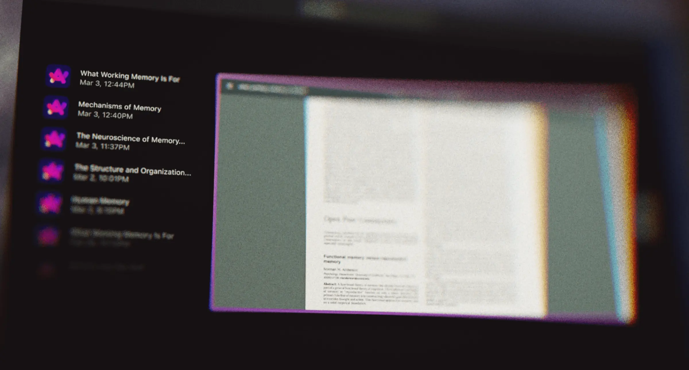

# Wiederfinden statt Verlieren: Orbit geht in die Preview-Phase

Ich freue mich riesig, endlich bekannt zu geben, dass mein neues Projekt Orbit ab sofort als frühe Preview Version zum Testen verfügbar ist! Orbit ist eine Mac-App, die im Hintergrund privat deine Bildschirmaktivitäten aufzeichnet, damit du alles, was du einmal gesehen hast, später bequem suchen und erneut abrufen kannst. Ein bisschen wie eine Zeitmaschine für deinen Screen.

Mehr zur Entstehung der Idee findest du übrigens in meinen Beiträgen über die [Entwicklung einer Rewind-Alternative](my-rewind-alternative) und zum Erstellen des [Moodboards für die App](orbit-moodboard).

Bevor ich näher darauf eingehe, wie du dir einen early access sichern kannst, möchte ich kurz erzählen, wie Orbit entstanden ist, wo die App aktuell steht und welche Zukunft ich mir für sie wünsche. So bekommst du hoffentlich ein klares Bild davon, was Orbit überhaupt ist – und warum mir dieses Projekt so sehr am Herzen liegt.

## Warum ich Orbit entwickele

Vor ein paar Jahren habe ich eine App namens Rewind entdeckt. Damit konnten Mac-Nutzer privat ihren Bildschirmverlauf aufzeichnen und später problemlos durchsuchen. Meines Wissens war Rewind das erste Tool, das diese Funktionalität umfassend angeboten hat – und ich war von Anfang an begeistert dabei. Leider wurde die Entwicklung irgendwann eingestellt, wodurch die Nutzung mit der Zeit immer komplizierter wurde.

Da ich die Idee dahinter aber weiterhin super fand, erwischte ich mich immer häufiger bei dem Gedanken, dass es doch unbedingt eine ähnliche Lösung geben müsste. Nachdem ich mehrere andere Tools ausprobiert und einige Zeit darüber nachgedacht hatte, wurde mir bewusst: Dieses Bedürfnis verschwindet nicht einfach – und wenn ich mir dafür eine bessere Lösung wünsche, gibt es vielleicht noch viele andere, die ebenfalls darauf warten.

So entstand Orbit. Der Name ist übrigens vorerst nur ein Platzhalter. Apropos Namensfindung: Ich habe mal in einem Podcast gehört, dass manche Eltern ihrem Baby nicht sofort bei der Geburt einen Namen geben, sondern erst einmal abwarten, um es besser kennenzulernen. Das fand ich lustig, aber gleichzeitig auch irgendwie sinnvoll. Genau das mache ich jetzt ebenfalls: Ein endgültiger Name folgt erst dann, wenn ich die App besser kennengelernt habe.

Mein Ziel mit Orbit ist es nicht, die ursprüngliche Idee von Rewind einfach nur nachzubauen, sondern sie spürbar besser zu machen – schneller, effizienter und mit hilfreichen zusätzlichen Features.

## Wie Orbit funktioniert

Das Grundprinzip hinter Orbit ist denkbar einfach: Im Hintergrund hält die App regelmäßig Snapshots deines gesamten Bildschirms fest und speichert diese lokal ab. So kannst du jederzeit deinen Verlauf durchsuchen und noch einmal genau das finden, was du gesehen hast.

Stell dir folgendes Szenario vor: Du erinnerst dich dunkel an ein leckeres Backrezept, weißt aber nicht mehr, auf welcher Webseite du es gesehen hast. Mit Orbit gibst du einfach ein paar Worte, die dir noch im Gedächtnis geblieben sind, wie „Chocolate Chip Cookies“, in die Suche ein. Sofort erhältst du eine Timeline mit den passenden Momenten auf deinem Bildschirm. Deine Ergebnisse kannst du natürlich bequem nach App oder Zeitraum filtern, um das Gesuchte noch leichter zu finden.

## Volle Kontrolle über deine Privatsphäre

Deine Privatsphäre hat oberste Priorität. Deshalb macht Orbit klare Versprechen:

Sämtliche Bildschirm-Aufnahmen bleiben ausschließlich lokal auf deinem Mac gespeichert. Deine Daten verlassen niemals dein Gerät – kein Upload, keine Synchronisation, kein Cloud-Speicher.
Die Orbit-Datenbank ist vollständig verschlüsselt. Derzeit sind die Bildschirm-Bilder selbst (noch) nicht verschlüsselt – das folgt aber in Kürze.
Keine Datensammlung oder -weitergabe. Deine Privatsphäre ist mir extrem wichtig, und ich habe keinerlei Interesse daran, deine Daten irgendwo zu speichern, darauf zuzugreifen oder sie zu verkaufen.
Schnell und ressourcenschonend by design

Weil das Speichern mehrerer Monate oder sogar Jahre an Bildschirmmaterial naturgemäß Speicherplatz und CPU-Power verbraucht, war Geschwindigkeit und Ressourceneffizienz von Anfang an eine meiner Kernprioritäten. Du sollst niemals Angst haben müssen, dass der Speicher deines Macs ausgeht oder dein Rechner langsamer wird.

Daher habe ich bei Orbit von Anfang an großes Augenmerk auf verschiedenste Optimierungen gelegt. Dazu gehören unter anderem clevere Kompressionsansätze, die deinen Speicherbedarf minimieren, sowie smarte Tricks, damit die App trotz kontinuierlicher Hintergrundaufnahme möglichst wenig CPU-Leistung verbraucht. In Kürze werde ich dazu auch einige technische Blogposts veröffentlichen – abonnier gerne meinen Newsletter, wenn dich solche Hintergrunddetails interessieren!

## Frühe Alpha-Phase

Momentan befindet sich Orbit in einer frühen Alpha-Phase. Das heißt konkret: Die Kernfunktionalität läuft komplett – du kannst bereits Bildschirmaktivitäten aufnehmen, Volltext-Suchen durchführen und blitzschnell durch deine visuelle Historie scrollen, um vergangene Momente wiederzufinden. Jede Woche veröffentliche ich neue Features sowie Performance- und Stabilitätsverbesserungen, die sich am Feedback der ersten Nutzer orientieren.

Für die nächste Zeit suche ich leidenschaftliche Technikbegeisterte, die Orbit früh ausprobieren und aktiv die Entwicklung mit ihrem Feedback mitgestalten wollen. Hast du Lust drauf? Perfekt – trag dich gerne auf [orbit.heckmann.app](https://orbit.heckmann.app) in die Warteliste ein, um mit dabei zu sein.

## Wie es mit Orbit weitergeht

Mein Hauptfokus liegt aktuell darauf, die bestehende Kernfunktionalität solide umzusetzen, doch ich sehe jetzt schon viele spannende Features am Horizont: Von smarteren, KI-gestützten Such-Features bis hin zu nahtloser Integration in deine täglichen Workflows. Ich bin jedenfalls ziemlich begeistert davon, Orbit gemeinsam mit einer leidenschaftlichen Community weiterzuentwickeln.

Hast du vielleicht schon Ideen oder Feedback beim Lesen bekommen? Was wäre für dich besonders hilfreich oder spannend? Ich freue mich total darauf, deine Gedanken zu hören – schreib mir jederzeit gern!
