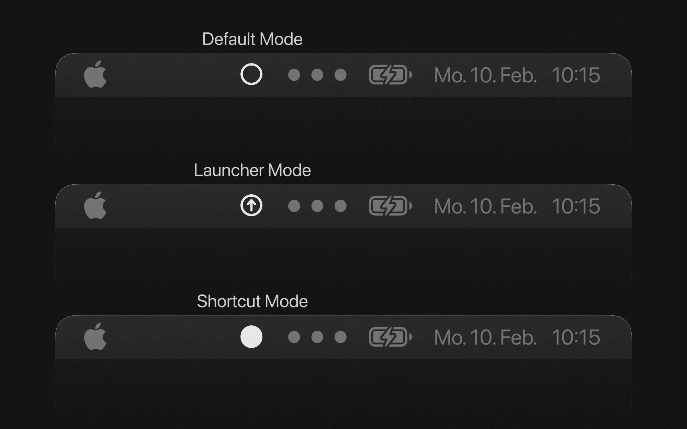

# Benutzerdefinierten Multi-Key Shortcut Systems mit skhd und Raycast

## Das Problem mit herkömmlichen Shortcuts

Das Einrichten eines umfassenden Hotkey-Systems auf macOS war für mich eine frustrierende Erfahrung. Da es nur begrenzt viele Tastenkombinationen gibt, stieß ich ständig auf Konflikte mit den bereits vorhandenen App-Shortcuts. Zum Beispiel wollte ich meine Clipboard-History auf <kbd>Cmd</kbd> + <kbd>Shift</kbd> + <kbd>C</kbd> mappen, stellte jedoch fest, dass der Arc Browser diese Kombination bereits zum Kopieren von URLs nutzte. Statt Arc’s Shortcut anzupassen, wurde mir klar, dass ich einen systematischeren Ansatz brauchte, der diese Konflikte gänzlich vermeidet, anstatt ständig Shortcuts umzustellen.

Ich war angenehm überrascht, als ich Max Stoibers Lösung in seinem [Interview auf dem Raycast YouTube Channel](https://youtu.be/m5MDv9qwhU8?t=156) entdeckte. Sein Ansatz nutzt Karabiner Elements, um sogenannte „Layer“ zu erstellen (stell dir unterschiedliche Shortcut-Sets vor, die nach Drücken einer bestimmten Tastenkombination verfügbar werden). So könnte beispielsweise das Drücken einer Leader-Taste, gefolgt von "f", einen „Finder-Layer“ mit Dateiverwaltungs-Shortcuts aktivieren.

Beim Versuch, sein Setup nachzubauen, stieß ich auf Probleme mit Karabiner. Es setzte zum Beispiel meine Tastaturzuordnung zurück, sodass die Tasten auf meiner physischen Tastatur andere Zeichen am Bildschirm erzeugten. Ich wollte eine einfachere Lösung mit visuellem Feedback über den aktiven Modus. Dies führte dazu, dass ich mein eigenes System entwickelte – eine Kombination aus skhd (einem lightweight keyboard shortcut manager) und Raycast (einem mächtigen Application Launcher und Productivity-Tool).

### Was wir bauen werden

In diesem Projekt bauen wir unser eigenes benutzerdefiniertes Multi-Key Shortcut System nach. Dieses Setup ermöglicht es dir, dieselbe Taste zu verwenden, um unterschiedliche Aktionen auszulösen – abhängig vom aktiven Modus oder Layer. Wir konfigurieren skhd so, dass es die Tastatureingaben überwacht. Dabei integrieren wir zwei Raycast-Extensions. Eine Extension bietet einen Menüleisten-Befehl zur visuellen Rückmeldung des aktiven Modus. Die andere erzeugt eine durchsuchbare Liste, welche stets die aktuellste Dokumentation deiner Shortcuts anzeigt. Zusätzlich entwickeln wir einen TypeScript-basierten Konfigurationsgenerator, der eine einfache und typensichere Einrichtung deiner Shortcuts ermöglicht. Das Endergebnis ist ein hochgradig anpassbares, effizientes und wartungsfreundliches System, mit dem du Anwendungen, Skripte und Systemaktionen mit nur wenigen Tastendrücken ausführen kannst.

Du findest das gesamte Projekt auf GitHub: [Multi-Key Shortcuts](https://github.com/michaelheckmann/personal-website/tree/main/code/multi-key-shortcuts).

## Multi-Key Shortcuts

### Modi und Aktionen

Das Kernkonzept meines Systems dreht sich um Modi. Diese Modi beschreiben verschiedene Zustände, in denen sich deine Tastatur befinden kann – jeder mit seinem eigenen Satz an Shortcuts. Ich verwende drei Hauptmodi:

- Default Mode: Der normale Zustand, in dem die Tasten wie erwartet funktionieren
- Launcher Mode: Dediziert zum Öffnen von Anwendungen
- Shortcut Mode: Zum Ausführen von Skripten und anderen Aktionen

Der Clou an diesem Ansatz ist, dass dieselbe Taste je nach aktivem Modus unterschiedliche Aktionen auslösen kann. Zum Beispiel:

- Im Launcher Mode könnte das Drücken von <kbd>C</kbd> Chrome öffnen.
- Im Shortcut Mode könnte das Drücken von <kbd>C</kbd> die Clipboard-History anzeigen.
- Ebenso könnte im Launcher Mode das Drücken von <kbd>S</kbd> Spotify öffnen.
- Während im Shortcut Mode das Drücken von <kbd>S</kbd> das Screenshot-Tool aktivieren könnte.

Dieser Ansatz passt zu meinem Workflow, aber du kannst viele verschiedene Modi für eine Vielzahl von Anwendungsfällen erstellen.

### Wie der Moduswechsel funktioniert

Jeder Modus wird durch eine spezifische Hotkey-Kombination aktiviert:

- <kbd>Cmd</kbd> + <kbd>Space</kbd>: Schaltet in den Shortcut Mode
- <kbd>Cmd</kbd> + <kbd>Shift</kbd> + <kbd>Space</kbd>: Schaltet in den Launcher Mode
- <kbd>Esc</kbd>: Kehrt in den Default Mode zurück

Das visuelle Feedback, welcher Modus aktiv ist, ist entscheidend. Ohne Indikatoren würde es leicht passieren, dass man den Überblick verliert, in welchem Modus man sich befindet, was zu unerwünschten Aktionen führen könnte. Dies habe ich mit einer Raycast Menüleisten-Extension umgesetzt, die den aktiven Modus anzeigt.

Tauchen wir nun in die technische Umsetzung dieses Systems ein.

## Technische Umsetzung

### Einrichtung von skhd

skhd ist der Keyboard-Shortcut-Manager, der dieses System antreibt. Es ist ein leichtgewichtiges Tool, das die Tastatureingaben überwacht und basierend auf deiner Konfiguration Kommandos ausführt.

Bevor wir starten, musst du Homebrew auf deinem Mac installiert haben. Falls du Homebrew noch nicht installiert hast, findest du die Anleitung unter [brew.sh](https://brew.sh).

Die Installation und das Starten von skhd sind unkompliziert:

```bash cn-show-copy
brew install skhd
skhd --start-service
```

Dadurch wird eine Konfigurationsdatei unter `~/.skhdrc` erstellt. In dieser Datei definierst du all deine Shortcuts und Modi mithilfe der einfachen Syntax von skhd. Du kannst die Datei während des laufenden Betriebs von skhd editieren und neu laden – das macht es einfach, dein Setup on the fly anzupassen. Weitere Informationen zu skhd findest du in der [offiziellen Dokumentation](https://github.com/koekeishiya/skhd).

### Der TypeScript Generator

Anstatt die skhd-Konfiguration direkt zu schreiben, habe ich einen TypeScript-basierten Generator entwickelt, der type safety und eine bessere Organisation bietet. Dieser Ansatz ermöglicht eine leichtere Wartbarkeit, Validierung und Code Wiederverwendung.

Der Generator erfüllt folgende Aufgaben:

- Typensichere Konfiguration von Shortcuts und Modi
- Validierung, um Konflikte zu vermeiden
- Hilfsfunktionen für gängige Operationen
- Single source of truth für alle Shortcuts

#### Projektstruktur

Der TypeScript-basierte Generator besteht aus diesen Komponenten:

```
├── src/
│ ├── config.ts # Main configuration file defining modes and shortcuts
│ ├── constants.ts # System-wide constants and defaults
│ ├── types.ts # Type definitions for the configuration
│ ├── utils.ts # Utility functions for generating commands
│ └── index.ts # Entry point that generates the skhd configuration

```

#### Typsystem

Die Datei `types.ts` definiert die grundlegenden Typen für Modi, Shortcuts und Modifier:

```typescript
type Modifier = "fn" | "cmd"; // ...
type KeyLiteral = "return" | "tab"; // ...
type Char = "a" | "b" | "c" | "d"; // ...
type Key = KeyLiteral | Char | `0x${string}`; // Supports hex codes for special keys

// Icons that are supported by the menu-bar-manager extension
type Icon = "default" | "shortcut" | "launcher";
type Mode = {
  name: string;
  icon: Icon;
  isDefault: boolean;
};
```

Ich habe die verfügbaren Modifiers und Key Literals aus diesem Issue im skhd-Repository übernommen: [Key names and modifiers](https://github.com/koekeishiya/skhd/issues/1).

Mit diesen Typen kann ich sicher sein, dass meine Konfiguration korrekt ist und vor dem Laden in skhd validiert wird.

#### Konfiguration

Die Datei `config.ts` legt die Modi, Modus-Shortcuts und die eigentlichen Shortcuts fest:

```typescript
// Mode Definitions
const modes = [
  {
    name: "default",
    icon: "default",
    isDefault: true,
  },
  {
    name: "shortcut",
    icon: "shortcut",
    isDefault: false,
  },
  {
    name: "launcher",
    icon: "launcher",
    isDefault: false,
  },
] as const;

// Mode Activation Shortcuts
const modeShortcuts = {
  shortcut: {
    modifiers: ["cmd"],
    key: "space",
  },
  launcher: {
    modifiers: ["cmd", "shift"],
    key: "space",
  },
};

// Example Shortcuts
const shortcuts = [
  {
    mode: "launcher",
    modifiers: ["cmd"],
    key: "a",
    comment: "Open Arc",
    command: openApp("Arc"),
    omitModifierAllowed: true,
  },
  // ... more shortcuts
];
```

Schauen wir uns die Konfiguration der Shortcuts genauer an:

1. **Mode:** Der Modus, in dem der Shortcut aktiv ist.
2. **Modifiers:** Die Modifier-Tasten, die zusammen mit der Taste gedrückt werden.
3. **Key:** Die Taste, die das Kommando auslöst.
4. **Comment:** Eine Beschreibung des Shortcuts zur Dokumentation.
5. **Command:** Das Kommando, das ausgeführt wird, wenn du den Shortcut triggert.
6. **OmitModifierAllowed:** Ein Flag, das es erlaubt, den Shortcut auch ohne den Modifier auszuführen.

**Implementation Deep Dive: OmitModifierAllowed**

Mit aktiviertem omitModifierAllowed-Flag kannst du einen Befehl auch ohne das Drücken der Modifier-Taste ausführen. Zum Beispiel im Shortcut Mode (aktiviert durch <kbd>Cmd</kbd> + <kbd>Space</kbd>) kannst du Befehle ausführen, indem du entweder deinen Daumen auf der Command-Taste behältst (<kbd>Cmd</kbd> + <kbd>C</kbd>) oder einfach nur den Buchstaben drückst (<kbd>C</kbd>).

Ich fand es mühsam, konstant entscheiden zu müssen, ob ich den Daumen von der Modifier-Taste heben oder gezielt darauf gedrückt halten muss. Diese Interaktion wirkt natürlicher und nachsichtiger. Die einzige Einschränkung ist, dass du pro Buchstabe nur einen „modifierfreien“ Shortcut pro Modus anlegen kannst. Daher ist es am besten, diese Option deinen häufigsten Befehlen vorzubehalten.

#### Validierung

Bevor die finale skhd-Konfiguration generiert wird, ist eine Validierung der Shortcuts unerlässlich, um Laufzeitfehler zu vermeiden und die Konsistenz zu gewährleisten. Dieser Validierungsschritt fängt häufige Probleme wie doppelte Shortcuts innerhalb desselben Modus ab, die zu unvorhersehbarem Verhalten führen könnten. Der Generator beinhaltet eine eingebaute Validierung:

```typescript
const validateShortcuts = (shortcuts) => {
  // Create a shortcut string from the configuration
  const renderedShortcuts = shortcuts.map(renderBaseShortcut);
  // Check for duplicates
  let duplicates = renderedShortcuts.filter(
    (command, index) => renderedShortcuts.indexOf(command) !== index,
  );
  if (duplicates.length > 0) {
    throw new Error(`Duplicate shortcuts: ${duplicates.join(", ")}`);
  }
  return shortcuts;
};
```

#### Hilfsfunktionen

Um gängige Operationen zu standardisieren und die Fehleranfälligkeit zu minimieren, habe ich einen Satz an Hilfsfunktionen erstellt. Diese Utilities kümmern sich um alles, von der Formatierung von AppleScript-Kommandos bis hin zum Öffnen von URLs in spezifischen Arc-Spaces. Hier einige nützliche Beispiele:

```typescript
// Creates a single-line AppleScript command from a multi-line script
const createAppleScriptCommand = (script: string) => {
  return (
    "osascript " +
    script
      .trim()
      .split("\n")
      .map((s) => `-e '${s}'`)
      .join(" ")
  );
};

// Open a Raycast extension with optional parameters.
const openRaycast = (
  script: `${string}/${string}/${string}`,
  params?: {
    // Usedful for forcing Raycast to open, necessary for some commands to work
    forceFocus?: boolean;
    // Arguments can be defined as a key-value pair
    arguments?: Record<string, string>;
    launchType?: "userInitiated" | "background";
  },
) => {
  let command = `open -g 'raycast://extensions/${script}`;

  const searchParams = new URLSearchParams();

  if (params?.arguments) {
    searchParams.append("arguments", JSON.stringify(params.arguments));
  }
  if (params?.launchType) {
    searchParams.append("launchType", params.launchType);
  }

  command += `?${searchParams.toString()}'`;

  if (params?.forceFocus) {
    command += ` && open -a 'Raycast'`;
  }
  return command;
};

const openUrl = (url: string, space?: Space) => {
  // Use the standard open command if no space is specified
  if (!space) {
    return open(url);
  }
  // Open a URL in Arc in the specified space
  return createAppleScriptCommand(`
    tell application "Arc"
      tell front window      
        tell space "${space}"
          make new tab with properties {URL:"${url}"}
        end tell
      end tell
      activate
    end tell
  `);
};

// Simulate a keypress using a built-in skhd command
const executeKeypress = (keyCombo: { key: Key; modifiers?: Modifier[] }) => {
  const command = renderBaseShortcut(keyCombo);
  return `skhd -k '${command}'`;
};
```

#### Generierte Konfiguration

Der TypeScript-Generator erzeugt eine skhd-Konfigurationsdatei, die unser Shortcut-System implementiert. Die generierte Datei enthält drei Hauptbereiche: Modus-Definitionen, Moduswechsel-Kommandos und die eigentlichen Shortcuts. Ein Beispiel:

```bash frame="none"
# Define modes and their visual indicators
:: default : open -g 'raycast://extensions/michaelheckmann/menu-bar-manager/change-icon?launchType=background&arguments=%7B%22icon%22%3A%22default%22%7D'
:: shortcut @ : open -g 'raycast://extensions/michaelheckmann/menu-bar-manager/change-icon?launchType=background&arguments=%7B%22icon%22%3A%22shortcut%22%7D'
:: launcher @ : open -g 'raycast://extensions/michaelheckmann/menu-bar-manager/change-icon?launchType=background&arguments=%7B%22icon%22%3A%22launcher%22%7D'

# Mode Shortcut Commands
## Default -> Shortcut
default < cmd - space ; shortcut
## Shortcut -> Default
shortcut < cmd - space ; default
shortcut < escape ; default
## Default -> Launcher
default < cmd + shift - space ; launcher
## Launcher -> Default
launcher < cmd + shift - space ; default
launcher < escape ; default

# Shortcuts
## Shortcut: Open Arc
launcher < cmd - a : open -a 'Arc'; skhd -k 'cmd + shift - space'
launcher < a : open -a 'Arc'; skhd -k 'cmd + shift - space'

## Shortcut: Open Calendar
launcher < cmd - k : open -a 'Calendar'; skhd -k 'cmd + shift - space'
launcher < k : open -a 'Calendar'; skhd -k 'cmd + shift - space'

# ... more shortcuts
```

Gehen wir die einzelnen Bereiche der Konfiguration durch:

**Modus-Definitionen**

Jeder Modus wird mit seinem visuellen Indikator-Kommando definiert, das über unsere Raycast-Extension das Icon in der Menüleiste aktualisiert. Das `@`-Symbol nach den Modus-Namen (zum Beispiel `shortcut @`) hat dabei einen wichtigen Zweck: Es verhindert Missverständnisse. Ohne das `@` würde das Drücken einer undefinierten Taste in einem Modus stillschweigend fehlschlagen und nicht in den Default Mode zurückkehren. Dies könnte verwirrend sein – du drückst eine unkonfigurierte Taste, bleibst unbemerkt im selben Modus und löst später unerwartete Shortcuts aus, weil du den aktiven Modus vergessen hast. Durch das Abfangen aller Tastendrücke mit `@` bleibt das System so lange im aktuellen Zustand, bis es explizit geändert wird – das macht das Verhalten vorhersehbarer und transparenter.

**Moduswechsel**

Die Konfiguration definiert eindeutige Pfade für den Übergang zwischen den Modi. Mit <kbd>Cmd</kbd> + <kbd>Space</kbd> wird zwischen dem Default und dem Shortcut Mode gewechselt, während <kbd>Cmd</kbd> + <kbd>Shift</kbd> + <kbd>Space</kbd> den Übergang zwischen Default und Launcher Mode regelt. Um sicherzustellen, dass du das System immer zurücksetzen kannst, ist <kbd>Esc</kbd> so konfiguriert, dass dich jeder andere Modus wieder in den Default Modus zurückführt. Dieser konsistente "Escape-Hatch" verhindert, dass du in einem Modus stecken bleibst.

**Shortcuts**

Der abschließende Abschnitt enthält die eigentlichen Shortcut-Definitionen, die mit einem spezifischen Modus verknüpft sind. Wenn ein Shortcut das Flag `omitModifierAllowed` aktiviert hat, erzeugt der Generator zwei Einträge: einen mit dem Modifier (z. B. <kbd>Cmd</kbd> + <kbd>a</kbd>) und einen ohne (<kbd>a</kbd>). Diese Flexibilität macht die Shortcuts benutzerfreundlicher. Nachdem ein Befehl ausgeführt wurde, wechselt das System automatisch durch Simulieren der entsprechenden Modus-Wechsel-Tastenkombination in den Default Mode.

#### Interessante Muster

Während der Umsetzung dieses Systems bin ich auf einige Probleme mit bestimmten Shortcuts gestoßen, die kreative Lösungen erforderten. Hier zwei besonders interessante Fälle:

##### Öffnen der Raycast AI Chat Presets

Beim Implementieren von Shortcuts für Raycast-Features stellte ich fest, dass der Deeplink `raycast://extensions/raycast/raycast-ai/search-ai-chat-presets` nicht wie erwartet funktionierte. Obwohl er den Befehl für die AI Chat Presets in Raycast erfolgreich öffnete, gelang es ihm nicht, das Raycast-Fenster in den Vordergrund zu bringen.

Die Lösung war einfach: Ich fügte der `openRaycast`-Funktion eine Option `forceFocus` hinzu. Dies stellt sicher, dass das Raycast-Fenster in den Vordergrund geholt wird, selbst wenn Raycast nicht die aktive Anwendung ist:

```typescript
const shortcut = {
  mode: "shortcut",
  modifiers: ["cmd", "shift"],
  key: "p",
  comment: "Search AI Chat Presets",
  command: openRaycast("raycast/raycast-ai/search-ai-chat-presets", {
    forceFocus: true,
  }),
};
```

Dies generiert den folgenden skhd-Befehl:

```bash frame="none"
## Shortcut: Search AI Chat Presets
shortcut < cmd + shift - p : open -g 'raycast://extensions/raycast/raycast-ai/search-ai-chat-presets?' && open -a 'Raycast'; skhd -k 'cmd - space'
```

##### Ausführen von no-view Raycast-Befehlen

Ein besonderes Problem trat mit bestimmten Raycast-Extensions auf, die zwar keinen neuen View erzeugen, sondern stattdessen mit Inline-Eingaben arbeiten. Nehmen wir als Beispiel den `Quick Add Reminder`-Befehl aus der `apple-reminders`-Extension. Normalerweise gibst du in Raycast den Kommando-Namen ein und fügst dann deine Eingabe direkt im Raycast-Fenster hinzu.

Der herkömmliche Deeplink-Ansatz (`raycast://extensions/...`) funktionierte für diese Befehle nicht gut. Zwar könntest du Argumente über die Query-Parameter des Deeplinks übergeben, was den Befehl sofort ausführen würde – ohne dir die Möglichkeit zu geben, deine Eingabe zu tätigen. Was ich stattdessen wollte, war, Raycast mit einem bereits vorausgefüllten, aber noch nicht ausgeführten Befehl zu öffnen, sodass ich meine Eingabe anschließend eingeben kann.

Die Lösung war, das interne Hotkey-System von Raycast zu nutzen. Das funktioniert folgendermaßen:

1. Zuerst habe ich in den Raycast-Einstellungen einen ungewöhnlichen Hotkey (in diesem Fall `hyper ^`) dem Befehl zugewiesen.
2. Dann konfiguriere ich meinen skhd-Shortcut so, dass er statt eines Deeplinks die entsprechende Hotkey-Kombination simuliert.

```typescript
const shortcut = {
  mode: "shortcut",
  modifiers: ["cmd"],
  key: "r",
  comment: "Create a Reminder",
  // Hex code for the ^ key
  command: executeKeypress({ key: "0x0A", modifiers: ["hyper"] }),
  omitModifierAllowed: true,
};
```

Dies erzeugt die folgenden skhd-Befehle:

```bash frame="none"
## Shortcut: Create a Reminder
shortcut < cmd - r : skhd -k 'cmd - space'; skhd -k 'hyper - 0x0A'
shortcut < r : skhd -k 'cmd - space'; skhd -k 'hyper - 0x0A'
```

Wenn der Shortcut ausgelöst wird, öffnet er Raycast mit dem `Quick Add Reminder`-Befehl vorausgefüllt und bereit für die Eingabe – genau so, als hättest du den Befehl manuell eingegeben. Ein entscheidender Punkt ist die Reihenfolge der Operationen: Der Moduswechsel muss erfolgen, bevor der Tastendruckbefehl ausgeführt wird. Wechselt man nicht zuerst in den Default Mode, interpretiert skhd den Tastendruck im "Shortcut"-Modus, sodass der Befehl nie Raycast erreicht.

## Integration mit Raycast

Raycast erfüllt in diesem Setup zwei zentrale Funktionen: Es bietet visuelles Feedback über den aktiven Modus über das Menüleisten-Icon und stellt eine durchsuchbare Schnittstelle für alle konfigurierten Shortcuts bereit.

### Menüleisten-Manager-Extension

Die Menüleisten-Manager-Extension liefert visuelles Feedback, indem sie je nach aktivem Modus unterschiedliche Icons anzeigt. Obwohl das Konzept einfach ist, ist diese visuelle Rückmeldung essenziell, um zu wissen, welcher Modus gerade aktiv ist.



Die Datei `package.json` konfiguriert die Extension:

```json
{
  "commands": [
    {
      "name": "change-icon",
      "title": "Change Icon",
      "subtitle": "Change the menu bar icon",
      "description": "Change the menu bar icon programmatically",
      "mode": "menu-bar",
      "arguments": [
        {
          "name": "icon",
          "placeholder": "🚀",
          "type": "text",
          "description": "The icon to set"
        }
      ]
    }
  ]
}
```

`change-icon.tsx` implementiert die Kernfunktionalität, indem es das Menüleisten-Icon anhand des übergebenen Arguments aktualisiert:

```typescript
import { LaunchProps, MenuBarExtra } from "@raycast/api";
import { states } from "./states";

export default function Command({
  arguments: { icon },
}: LaunchProps<{ arguments: Arguments.ChangeIcon }>) {
  const state = states[icon] ?? states.default;
  return <MenuBarExtra icon={state.icon} tooltip={state.tooltip} />;
}
```

`states.ts` definiert die verfügbaren Zustände und deren Icons:

```typescript
import { Icon } from "@raycast/api";

type States = Record<
  string,
  {
    icon: Icon;
    tooltip: string;
  }
>;

// The keys of the states object correspond to the icons that can be set
// and were also defined in the Icon type in the generator's types.ts file
export const states: States = {
  default: {
    icon: Icon.Circle,
    tooltip: "Default state",
  },
  shortcut: {
    icon: Icon.CircleFilled,
    tooltip: "Executing shortcut",
  },
  launcher: {
    icon: Icon.ArrowUpCircle,
    tooltip: "Opening app",
  },
};
```

Diese Icons werden über die skhd-Konfiguration aktualisiert, die den passenden Icon-Namen als Query-Parameter in die generierten Befehle übergibt.

### Shortcuts Dokumentations-Extension

Um das Shortcut-System leichter zugänglich und benutzbar zu machen, habe ich eine Extension entwickelt, die die `skhdrc`-Datei automatisch parst und die Shortcuts in einer durchsuchbaren Liste präsentiert. Mit dieser Extension hast du immer eine aktuelle Dokumentation der verfügbaren Shortcuts zur Hand.


Die Parsing-Logik in `parse-skhdrc.ts` extrahiert die Shortcut-Informationen aus der Konfigurationsdatei:

```typescript
// Avoid "magic strings"
const SKHDRC_PATH = path.join(homedir(), ".skhdrc");
const DESCRIPTION_PREFIX = "## Shortcut:";
const MODE_DELIMITER = "<";
const COMMAND_DELIMITER = ":";
const COMMAND_END = ";";

const parseSkhdrc = () => {
  const file = fs.readFileSync(SKHDRC_PATH, "utf8");
  const lines = file.split("\n");
  const shortcuts: Shortcut[] = [];

  // Track current shortcut while parsing - reset after each complete definition
  let currentShortcut: Shortcut = {
    description: "",
    mode: "",
    keys: [],
    command: "",
  };

  lines.forEach((line) => {
    const trimmedLine = line.trim();
    const isDescription = trimmedLine.startsWith(DESCRIPTION_PREFIX);

    // Skip empty lines and lines before first shortcut description
    if (!trimmedLine) return;
    if (!isDescription && !currentShortcut.description) return;

    if (isDescription) {
      // When we hit a new description, save previous shortcut if it exists
      // This handles multi-key shortcuts that share the same command
      if (currentShortcut.description) {
        // Sort keys by length for consistent display and easier comparison
        currentShortcut.keys = currentShortcut.keys.sort(
          (a, b) => a.length - b.length,
        );
        shortcuts.push(currentShortcut);
        // Reset to prepare for next shortcut definition
        currentShortcut = {
          description: "",
          mode: "",
          keys: [],
          command: "",
        };
      }

      const description = trimmedLine.replace(DESCRIPTION_PREFIX, "");
      currentShortcut.description = description.trim();
      return;
    }

    // For non-description lines, our goal is to extract the mode, key, and command.
    // This follows the pattern: "mode < key : command ;"
    const [mode, ...commandPartOne] = trimmedLine.split(MODE_DELIMITER);
    currentShortcut.mode = mode.trim();

    const [key, ...commandPartTwo] = commandPartOne
      .join(MODE_DELIMITER)
      .split(COMMAND_DELIMITER);

    // The replaceKey function replaces specific key names in a command string with their corresponding symbols. E.g. cmd -> ⌘
    currentShortcut.keys.push(replaceKey(key.trim()));

    const [command] = commandPartTwo.join(COMMAND_DELIMITER).split(COMMAND_END);
    currentShortcut.command = command.trim();
  });

  // Don't forget to add the final shortcut after processing all lines
  if (currentShortcut) {
    currentShortcut.keys = currentShortcut.keys.sort(
      (a, b) => a.length - b.length,
    );
    shortcuts.push(currentShortcut);
  }

  // The groupByCommand function groups shortcuts by related actions (e.g. open app, open URL, execute Raycast command)
  return groupByCommand(shortcuts);
};
```

Der Parser extrahiert Informationen, indem er bestimmte Muster identifiziert:

- Beschreibungslinien, die mit `## Shortcut:` beginnen
- Modus-Definitionen unter Verwendung des `<`-Trennzeichens
- Befehle, die nach dem `:`-Trennzeichen folgen

Die extrahierten Shortcuts werden dann übersichtlich in einer Liste dargestellt – durch `list-shortcuts.tsx`:

```tsx
const items = parseSkhdrc();
export default function Command() {
  return (
    <List>
      {Object.entries(items).map(([section, items]) => (
        <List.Section key={section} title={section}>
          {items.map((item) => (
            <List.Item
              key={item.command}
              title={item.description}
              subtitle={item.keys[0]}
              accessories={[
                { tooltip: item.command, icon: Icon.CommandSymbol },
              ]}
            />
          ))}
        </List.Section>
      ))}
    </List>
  );
}
```

Dies erstellt eine durchsuchbare Oberfläche, in der die Shortcuts:

- Nach Befehls-Typen gruppiert sind,
- Mit ihren Beschreibungen angezeigt werden,
- Die erforderlichen Tastenkombinationen zeigen,
- Und Tooltips mit den vollständigen Befehlen enthalten.

## Fazit

Dieses benutzerdefinierte Shortcut-System hat sich in meinem Workflow als äußerst effektiv erwiesen. Seine Hauptvorteile umfassen:

- Schnellen Zugriff auf eine Vielzahl von Aktionen mittels intuitiver Tastenkombinationen
- Klare visuelle Rückmeldungen über das Menüleisten-Icon, die versehentliche Befehle verhindern
- Typensichere Konfiguration durch den TypeScript-Generator
- Geringe Latenz sowie zuverlässige Performance
- Einfache Wartbarkeit und Erweiterbarkeit

Obwohl ich gelegentlich kleinere Probleme erlebe (wie das gelegentliche Nicht-Aktualisieren des Menüleisten-Icons), hat sich das System als stabil und nützlich erwiesen. Dieses Projekt war zudem eine hervorragende Lernerfahrung. Ich habe nun deutlich mehr darüber gelernt, wie man Konfigurationsgeneratoren entwickelt, Raycast-Menüleisten-Befehle implementiert und Multi-Key Hotkey-Setups gestaltet.

### Blick in die Zukunft: LeaderKey

Eine interessante Alternative zu diesem individuellen Setup ist [LeaderKey](https://github.com/mikker/LeaderKey.app). Das Projekt lässt sich ebenfalls von derselben Quelle (Max Stoibers Multi-Key Setup) inspirieren, bietet jedoch eine ausgefeiltere, verpackte Lösung mit überzeugenden Features:

- Nested Multi-Key Shortcuts
- Integriertes visuelles Feedback
- Keine Notwendigkeit, eigene Konfigurationsgeneratoren zu pflegen
- Native macOS-App-Erfahrung

LeaderKey könnte eine Überlegung wert sein, wenn du eine schlüsselfertige Lösung möchtest, die keinen eigenen Code erfordert. Ich prüfe LeaderKey derzeit als möglichen Ersatz für mein individuelles Setup und bin von dessen Umsetzung beeindruckt. Die ausgefeilte Benutzererfahrung und das durchdachte Design machen es zu einer vielversprechenden Alternative, die mein aktuelles System eventuell ersetzen könnte.
