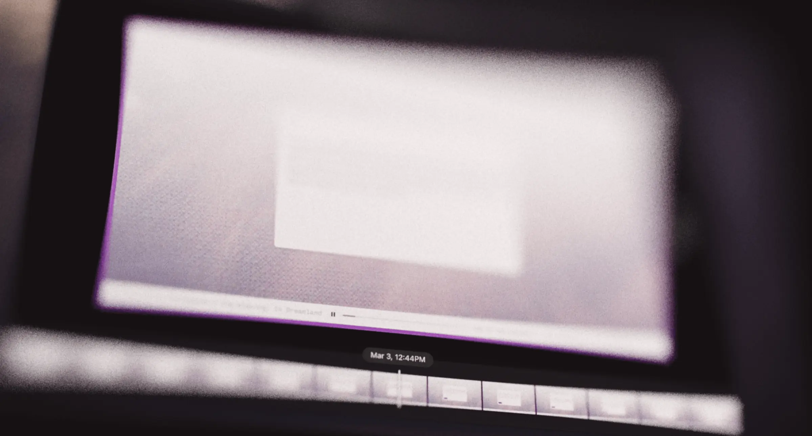

# Wie ich meine eigene Rewind-Alternative entwickle

Ich liebe Tools, die mich produktiver machen. Software wie [Raycast](https://www.raycast.com/), [Alfred](https://www.alfredapp.com/) und [Superwhisper](https://superwhisper.com/) sind perfekte Beispiele dafür – Tools, die ich täglich nutze und ohne die ich mir meine Arbeit kaum noch vorstellen kann. Sie sparen mir nicht nur massiv Zeit, sondern ermöglichen mir komplett neue Arbeitsweisen. Auch [Rewind](https://www.rewind.ai/) vom Rewind AI Team gehört in diese Kategorie. Ich nutze es seit der Early-Access-Phase 2022 täglich. Das Grundkonzept von Rewind ist simpel, aber unglaublich effektiv: Es zeichnet deinen Bildschirm auf und macht alles durchsuchbar. Das ist extrem praktisch, um Informationen wiederzufinden, die man vergessen oder aus den Augen verloren hat. In meiner Arbeit muss ich oft auf Informationen zugreifen, die Tage, Monate oder sogar Jahre zurückliegen – URLs, Dateinamen, E-Mail-Adressen, Code-Snippets und vieles mehr. Rewind ist eines dieser seltenen Tools, bei denen ich wirklich das Gefühl habe, Superkräfte zu besitzen. Es spart nicht nur Zeit, sondern erweitert fundamental meine Möglichkeiten.

Man kann sich also vorstellen, wie frustriert ich war, als ich erfuhr, dass das Rewind-Team, das sich jetzt [Limitless](https://www.limitless.ai/) nennt, seinen Fokus von Rewind wegverlagert. Zwar ist Rewind weiterhin verfügbar, und Screen Recording steht angeblich auch auf der Roadmap für das Limitless-Produkt, aber ich bezweifle, dass Rewind die Aufmerksamkeit bekommen wird, die es verdient. Es fehlen immer noch einige wichtige Features, die ich mir schon lange wünsche. Zum Beispiel hätte ich gerne ausgefeiltere Möglichkeiten, meine Aufzeichnungen zu filtern und zu durchsuchen. Auch Performance-Probleme treten gelegentlich auf, und bei der reduzierten Priorität des Projekts bin ich nicht sehr optimistisch, dass diese Mängel behoben werden. Das hat mich dazu gebracht, über die Entwicklung einer eigenen Alternative nachzudenken.

## Meine Wunschliste für ein neues Rewind

Ich habe einige Ideen für eine Rewind-Alternative. Hier ist meine Wunschliste für ein solches Screen-Memory-Tool:

### Aufzeichnungen

Genau wie Rewind muss meine Alternative einen Local-First-Ansatz verfolgen, um maximale Privatsphäre zu gewährleisten. Das bedeutet, dass alle Daten direkt auf deinem Gerät erstellt, verarbeitet und gespeichert werden – nicht in der Cloud. Das ist heutzutage eher ungewöhnlich. Dieser lokale Ansatz ist entscheidend, damit Nutzer die Kontrolle über ihre persönlichen Daten behalten. Außerdem ist es sehr wichtig, dass das Tool weder den Speicherplatz auffrisst noch den Computer verlangsamt. Die gesamte Architektur muss also sehr effizient sein. Rewind verwendet bereits clevere Techniken zur Optimierung der Aufzeichnungsdaten, wie Kevin Chen in seinem aufschlussreichen [Blogpost](https://kevinchen.co/blog/rewind-ai-app-teardown/) zur Analyse der Rewind-App beschreibt. Ich frage mich, wie viel Effizienz man da noch herausholen kann.

Nutzer sollten präzise Kontrolle über ihre Aufzeichnungen haben – von der Auswahl aufzuzeichnender Apps und Websites bis hin zur Festlegung von Aufbewahrungsfristen. Auch manuelle Ein/Aus-Schalter für die Aufzeichnung sind unverzichtbar. Für meinen persönlichen Workflow ist die Bildschirmaufzeichnung das Kernfeature. Obwohl Rewind auch Audio und Meetings aufzeichnet, macht es meiner Meinung nach mehr Sinn, sich zunächst voll und ganz auf die Bildschirmaufzeichnung zu konzentrieren. Es gibt bereits ausgezeichnete Lösungen speziell für Meeting-Aufzeichnungen, und mein Ziel ist es, ein Tool zu entwickeln, das sich bei der visuellen Erfassung wirklich auszeichnet.

### Privatsphäre

Bei einem Tool wie diesem ist Privatsphäre absolut entscheidend. Features wie eine verschlüsselte Datenbank und verschlüsselte Aufzeichnungsdateien sind ein Muss, damit nur die App selbst Zugriff auf deine Daten hat. Auch die Möglichkeit, Aufzeichnungen manuell zu löschen, ist essentiell. Es sollte einfach sein, nach Zeiträumen zu löschen oder sogar nach genutzter App oder Stichwort zu filtern.

Angesichts der Kritik am [Microsoft Recall](https://www.techspot.com/news/105943-microsoft-recall-capturing-screenshots-full-sensitive-information-despite.html) Feature wird deutlich, wie wichtig Privatsphäre für ein solches Produkt ist.

### Suche

Für mich ist die Suchfunktion der überzeugendste Aspekt von Rewind. Während Features wie der AI-Chat und die täglichen Zusammenfassungen (die die Zeit pro Anwendung anzeigen) interessant sind, hat sich die Zeitreise-Suche für mich als am wertvollsten erwiesen. Und ich glaube, es gibt noch viel Potenzial, die Sucherfahrung weiter zu verbessern. Ich möchte auf jeden Fall fortgeschrittenere Möglichkeiten zum Filtern und Speichern von Suchen einbauen. Außerdem möchte ich Nutzern ermöglichen, bestimmte Wörter auszufiltern und innerhalb app-spezifischer Details zu suchen, wie Text auf Websites oder Dateinamen in Texteditoren. Ich denke, es gibt hier viele Möglichkeiten, die Sucherfahrung zu optimieren.

### Performance

Ich bewahre ein Jahr an Aufzeichnungen in Rewind auf. Das bedeutet, es muss eine riesige Datenmenge verarbeiten. Das Problem ist, dass dies oft zu Abstürzen oder langsamer Performance führt, wenn ich etwas in Rewind suche. Es wäre toll, eine leistungsfähigere Suchmaschine zu haben, die große Datenmengen besser verarbeiten kann.

### Backups

Ich finde, es wäre sehr cool, eine Backup-Funktion zu haben, mit der Nutzer ihre Aufzeichnungen lokal oder in einem Cloud-Service exportieren und sichern können. Mir gefällt sehr gut, wie [Obsidian](https://obsidian.md/sync) Backups für ihre Vaults handhabt. Die Backups sind Ende-zu-Ende verschlüsselt, man kann bestimmte Teile sichern, und alles ist sehr klar und transparent. Sie haben sogar eine [Anleitung](https://obsidian.md/blog/verify-obsidian-sync-encryption/), wie man die Verschlüsselung selbst überprüfen kann.

### KI

Die Daten, die man aus einem solchen Tool gewinnt, könnten super nützlich als Kontext für KI sein. Zum Beispiel könnte KI Bildschirmaufzeichnungen nutzen, um zu verstehen, woran du in einem Projekt arbeitest, oder sogar Muster in deiner Arbeitsweise erkennen.

Ehrlich gesagt bin ich mit Rewinds KI-Chat nie richtig warm geworden. Es fühlte sich immer so an, als würde er meine Suchergebnisse oder den verfügbaren Kontext nicht wirklich nutzen. Er hat meine Suchen nicht wirklich verbessert und oft Dinge übersehen, was mich vermuten lässt, dass er die Dinge nicht richtig filtert oder meine Bildschirmaufzeichnungshistorie nicht wirklich versteht.

KI wirklich gut mit dieser Art von Daten arbeiten zu lassen und sie in ein Format zu bringen, das für LLMs tatsächlich nutzbar ist, wird eine Herausforderung sein. Ich denke, es könnte einige coole Anwendungsfälle geben, bei denen das LLM die Daten verarbeitet, um Erkenntnisse zu gewinnen oder Dinge zu automatisieren. Stell dir vor, die App hebt wichtige Dinge hervor, die du dir merken solltest, wie Deadlines oder Erinnerungen. Oder KI-Agenten, die die Bildschirmhistorie durchsuchen, um mehr Kontext für eine bestimmte Aufgabe zu bekommen. Es gibt so viele Möglichkeiten, und ich freue mich sehr darauf, sie zu erforschen.

### Interface

Ich möchte, dass dieses Produkt sich wirklich durchdacht und gut designed anfühlt. Ich liebe Tools wie [Fey](https://www.fey.com/) oder [Linear](https://linear.app/) – sie achten so sehr auf die kleinen Details und machen ihre Produkte zu einer Freude in der Benutzung. Ich liebe ihren visuellen Stil, wie einfach sie zu navigieren sind, das Layout, sogar die kleinen Animationen. Auch wenn man nicht den ganzen Tag auf die Such-UI schaut, trägt ein wirklich durchdachtes Interface dazu bei, dass das gesamte Produkt professioneller und vertrauenswürdiger wirkt.

## Fazit

Ich denke, dass die Entwicklung meiner eigenen Rewind-Alternative ein wirklich spannendes Projekt ist. Ich sehe da enormes Potenzial und bin sehr gespannt darauf, es umzusetzen. Ich habe mir andere Optionen wie [Screenpipe](https://github.com/mediar-ai/screenpipe) und [Screen Memory](https://screenmemory.app/) angeschaut, aber keine davon trifft genau das, was ich suche. Sie scheinen die Suche und Datenanalyse nicht so weit zu treiben, wie ich es mir wünsche.

Ich werde Updates auf Twitter und hier im Blog posten, während ich Fortschritte mache. Wenn du dabei sein möchtest, abonniere gerne meinen Newsletter oder folge mir auf Twitter. Ich überlege noch, wie ich das Ganze nennen soll – habe ein paar Ideen, aber noch nichts, das wirklich passt. Wenn du Vorschläge hast, lass es mich wissen, ich bin ganz Ohr!
