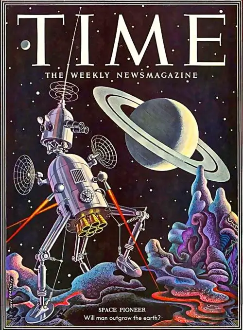
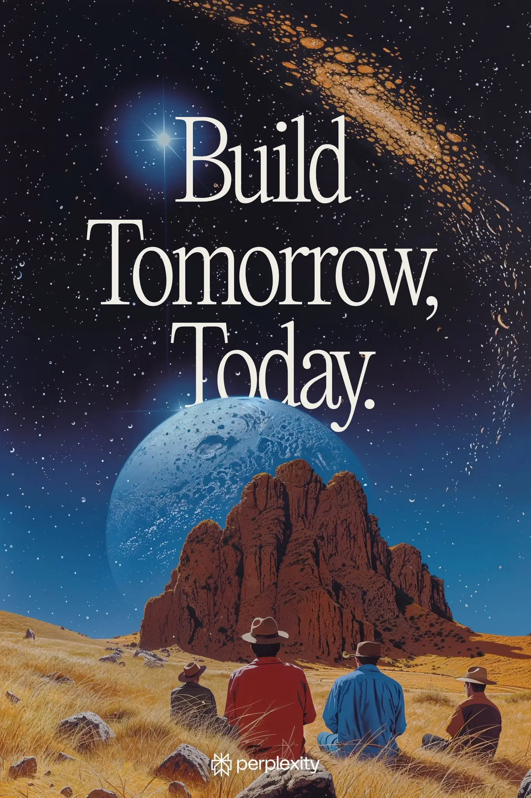
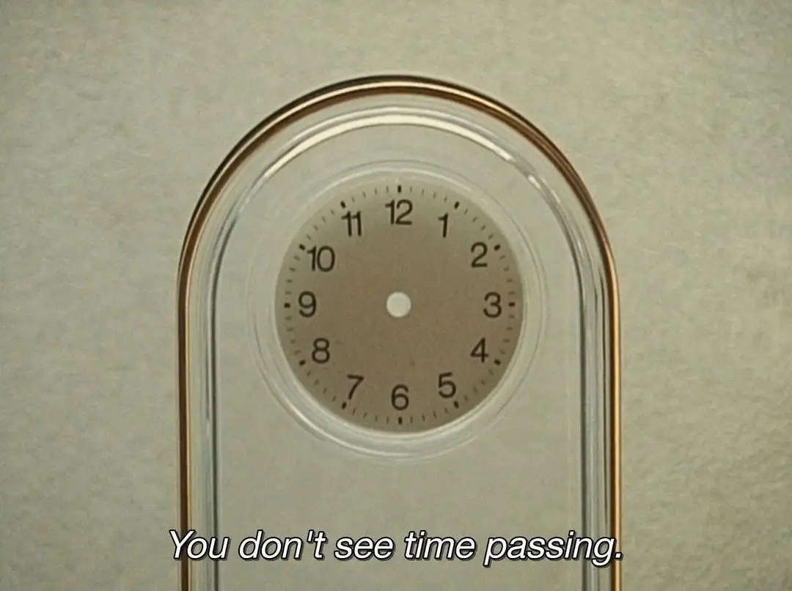
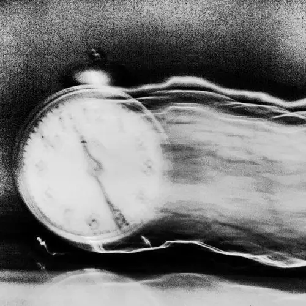
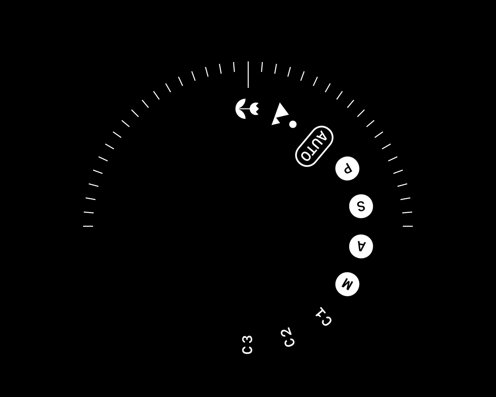
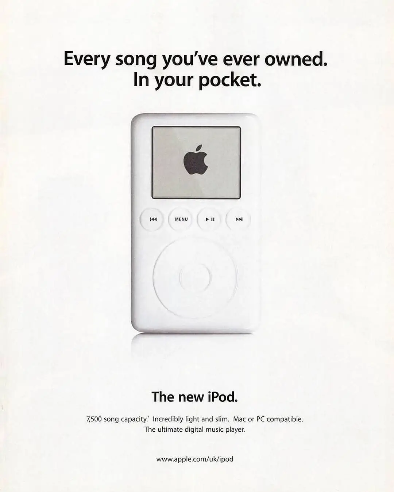
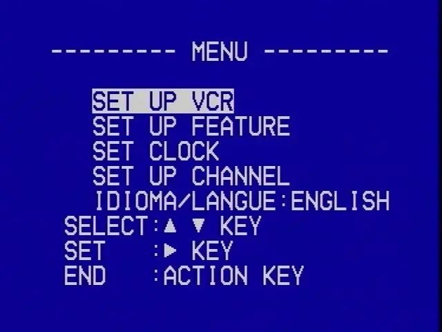
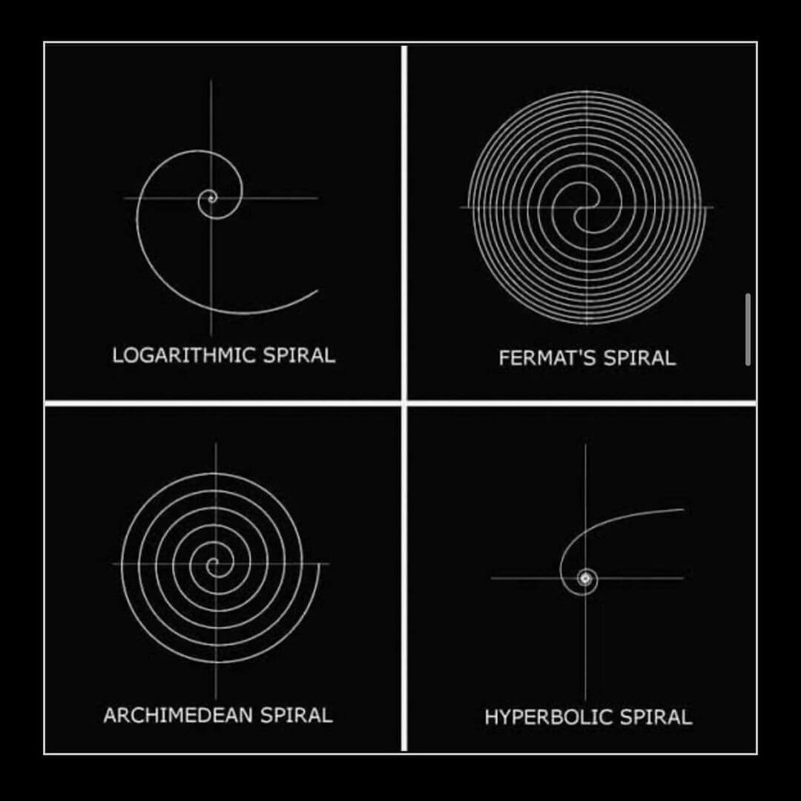
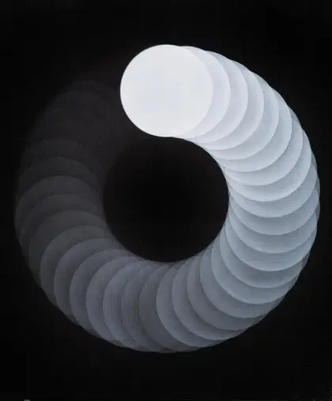

# Projekt Orbit: Moodboard und visuelle Themen

Nach einigem Überlegen habe ich mich für „Orbit“ als temporären Codenamen für meine Rewind-Alternative entschieden. Wahrscheinlich taugt der Name nicht als finale Produktbezeichnung, aber die generelle Richtung gefällt mir. Außerdem ist es ganz praktisch, einen klar unterscheidbaren Codenamen zu verwenden, da später weniger Verwechslungsgefahr besteht. Übrigens bin ich bei der Namensrecherche über diesen unterhaltsamen Artikel zu bekannten Codenamen aus der Entwicklerwelt gestolpert – sehr lesenswert: [The Developer Obsession With Code Names](https://www.pingdom.com/blog/the-developer-obsession-with-code-names-186-interesting-examples/).

In den vorherigen Beiträgen habe ich viel über technische Anforderungen und Features geschrieben. Heute möchte ich bewusst einen Schritt zurückgehen und zeigen, welche visuelle und ästhetische Richtung mir vorschwebt. Dafür habe ich ein kleines Moodboard mit einigen meiner Lieblingsthemen zusammengestellt. Mein tatsächliches Inspirationsboard ist zwar größer und aktuell noch etwas quer über Tools wie [Cosmos](https://www.cosmos.so) und [MyMind](https://mymind.com/) verteilt – dennoch sollten die nachfolgenden Ideen und Bilder dir einen guten Eindruck davon geben, welche Atmosphäre ich mit Orbit erzeugen möchte.

## Retrofuturismus

Ich bin ein relativ nostalgischer Mensch und verliere mich gern mal in Erinnerungen (auch wenn mein Gehirn öfter mal Pause macht bei der Erinnerungssuche, als mir lieb wäre). Was mich am Retrofuturismus so fasziniert, ist genau dieser Schnittpunkt zwischen dem Blick zurück und gleichzeitig nach vorne. Stell dir Zeitreisen vor, nostalgische Darstellungen futuristischer Technik oder vergangene Zukunftsvisionen. Genau dieser Kontrast bietet für mich eine spannende Grundlage und inspiriert die Erlebnisse und Interfaces, die ich hier schaffen möchte.

## Analoge Uhren

Uhren passen natürlich perfekt zur Idee hinter Orbit: Zeit, Erinnerungen und Nostalgie. Besonders analoge Zifferblätter strahlen eine Wärme und Vertrautheit aus, die vielen digitalen UIs fehlt – und genau diesen emotionalen Bezug möchte ich in meinem Produkt widerspiegeln. Optisch eignen sie sich hervorragend als Metapher, um vergangene Momente wiederzuentdecken und durch Erinnerungen zu reisen.

## Wählscheiben

Ein weiteres nostalgisches Element, das mich beschäftigt, sind Rotary Dials – Wählscheiben. Ihre haptische Interaktion, Intuition und ihr besonderer Charme fehlen in der heutigen Software fast vollkommen. Natürlich eignen sie sich in ihrer ursprünglichen Form nicht direkt für moderne UIs. Trotzdem glaube ich, dass man einzelne Aspekte ihres Designs, ihrer Interaktionsidee oder einfach eine visuelle Anspielung darauf wunderbar integrieren kann, um genau diesen nostalgisch-spielerischen Effekt zu erzeugen.

## VHS-Kassetten

VHS-Kassetten symbolisieren für mich perfekt das Festhalten und erneute Erleben von Erinnerungen. Dafür bin ich zwar eigentlich etwas zu jung – selbst aufgenommen habe ich mit VHS nie – trotzdem erinnere ich mich deutlich daran, als Kind mit meinen Eltern alte VHS-Aufnahmen anzuschauen. Die physische Präsenz, die unverwechselbare Optik der Kassetten-Cover und ihre irgendwie imperfecte, charmante Ästhetik bringen für mich Nostalgie wunderbar zum Ausdruck. Zugleich lassen sich ihre visuellen Aspekte toll abstrakt weiterentwickeln und spannend für die Oberfläche nutzen.

## Spiralen

Ein eher abstraktes Element, welches ich sehr passend finde, sind Spiralen. Im Gegensatz zu simplen Kreisen bewegen sich Spiralen dynamisch vorwärts und kehren gleichzeitig an bereits bekannte Orte zurück. Gerade als Metapher für Zeitreisen eignen sie sich daher hervorragend. Wie genau sich das in einem UI- oder Brand-Kontext umsetzen lässt, weiß ich noch nicht genau – aber ich finde das Element spannend genug, um es tiefer zu erforschen.

## Was diese Themen verbindet

Zusammen genommen empfinde ich diese Themen als starken Ausgangspunkt für Orbit. Sie helfen mir dabei, ein Projekt zu gestalten, das nicht nur praktisch und funktional ist, sondern gleichzeitig emotional, schön und bedeutungsvoll. Wie genau ich diese Konzepte im finalen Interface wiederfinden werde, weiß ich noch nicht sicher – aber sie werden garantiert Branding, Messaging und die generelle Atmosphäre des Produkts beeinflussen. Je weiter Orbit wächst und Gestalt annimmt, desto häufiger werde ich diese visuelle Inspirationsbasis überprüfen, um einen möglichst kohärenten Gesamteindruck zu schaffen.

Was meinst du? Lösen diese Themen bei dir spontane Assoziationen oder bestimmte Erinnerungen aus? Hast du vielleicht noch andere visuelle Impulse und Ideen, die ich bisher übersehen habe? Sag mir auf Twitter gerne Bescheid!
