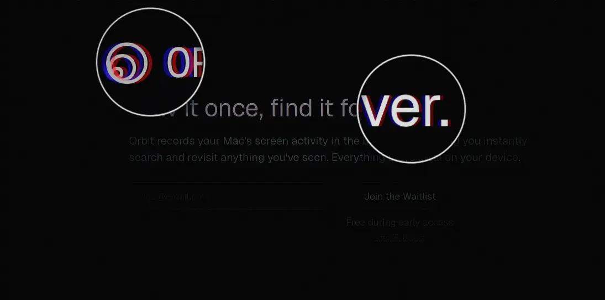
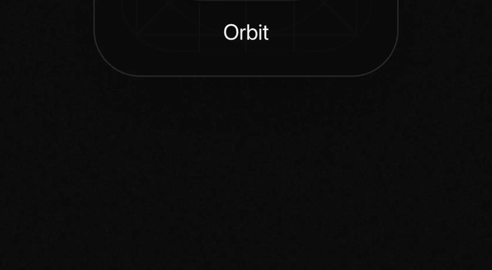
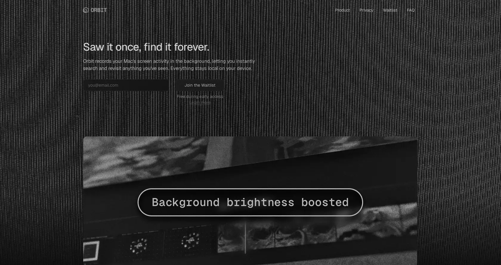
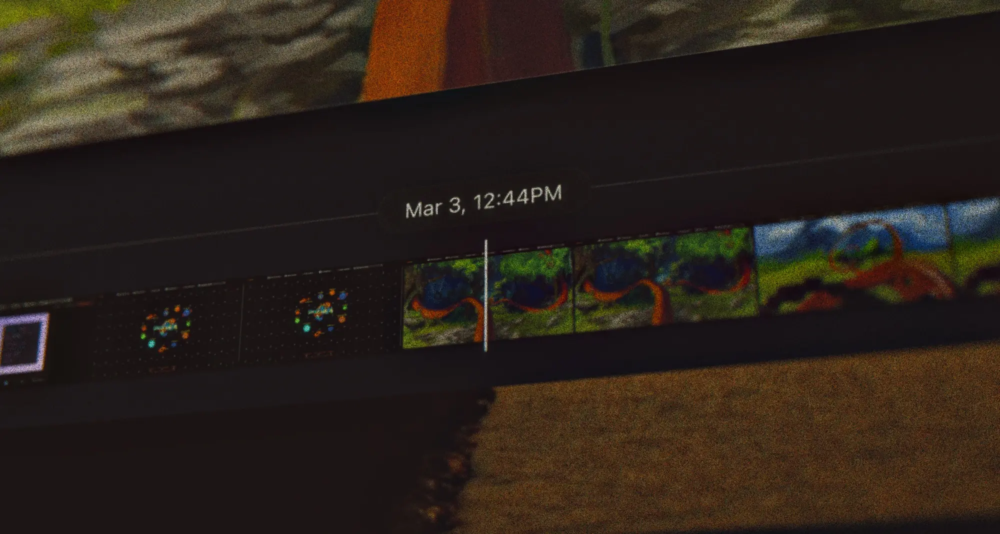
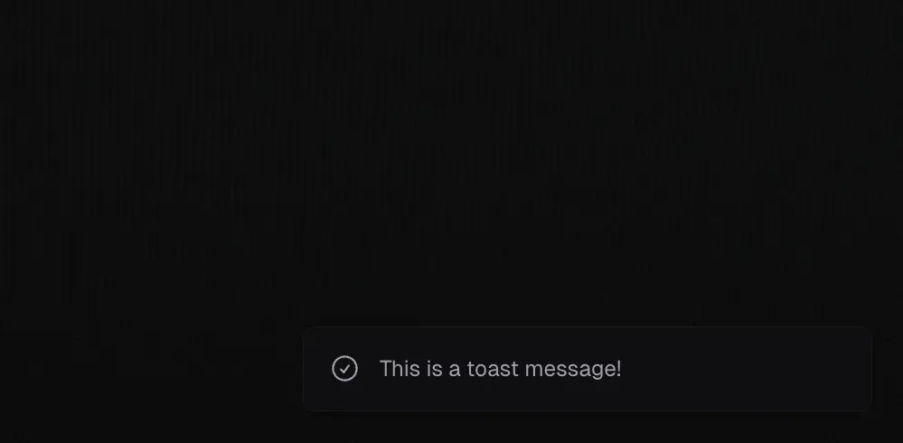

# Design-Details der neuen Orbit-Website

Ich habe kürzlich eine [neue Marketing-Website](https://reachorbit.app/) für meine macOS-App [Orbit](/de/blog/introducing-orbit/) veröffentlicht. Ich habe viel Zeit in die Details gesteckt, damit alles konsistent zur Produkt-UI passt und die Stimmung und den Stil trifft, die ich mit diesem Projekt verfolge.

Wenn du tiefer in die Konzepte und Themen hinter Orbit eintauchen möchtest, kann ich dir [diesen Blogpost](/de/blog/orbit-moodboard/) empfehlen.

In diesem Beitrag zeige ich dir meine Lieblingsdetails der Website. Dinge, an denen ich besonders gern gearbeitet habe und die aus meiner Sicht erwähnenswert sind.

## Chromatic Aberration

Chromatic Aberration ist dieser regenbogenfarbene Rand (oft rot, blau, lila oder grün), der um die Konturen von Motiven in Fotos auftaucht. Man sieht ihn besonders dort, wo dunkle Objekte auf helle Hintergründe treffen, wie ein Ast vor einem sonnigen Himmel. Dieser subtile Effekt verleiht Fotos einen leicht träumerischen, nostalgischen Look.

Da ich mit Orbit Themen rund um Zeitreisen und Nostalgie erkunden möchte, fand ich es passend, den Effekt auch auf der Website einzusetzen. Ich nutze ihn an mehreren Stellen, etwa beim Logo und in Überschriften. Er ist dezent, gibt manchen Elementen aber ein wenig mehr Präsenz.

Schau dir [diesen Post auf X](https://x.com/mt_heckmann/status/1983552312661385228) an, wenn du lernen möchtest, wie man diesen Effekt mit CSS erstellt.

## Noise

Generell bin ich ein großer Fan von digitalen Produkten, die sich nicht super sauber und poliert anfühlen. Ich mag es, wenn sie etwas Textur haben, sich ein bisschen gebraucht anfühlen und einige Imperfektionen aufweisen. Die Chromatic Aberration spielt perfekt in dieses Thema rein.

Eine weitere Sache, die ich gemacht habe, war das Hinzufügen subtiler Noise-Layer auf der Website. Je nach Sektion habe ich verschiedene Arten von Noise übereinandergelegt. Es gibt einen durchgehenden Background-Noise, der über den Haupthintergrund gelegt ist. Dann gibt es im Hero-Bereich noch eine zusätzliche Noise-Ebene, die wie TV-Statik aussieht, mit Linien, die vertikal nach unten verlaufen.

Das gibt dem Hero-Bereich einen schönen Touch und macht ihn interessanter. Es füllt etwas leeren Raum und lenkt den Blick auf natürliche Weise nach unten, was subtil zum Scrollen animiert.
^

## Screenshots

Für die Screenshots habe ich viel mit einem Tool gearbeitet: dem [Tactile Image Viewer](https://t-iv.com/) von [Dominic Scholz](https://x.com/dom_scholz). Damit werden Screenshots zu Fotos, die aussehen, als wären sie mit einer analogen Kamera aufgenommen.

Normalerweise machst du einfach einen regulären Screenshot und fügst ihn auf der Website ein, wenn du Produktfotos zeigen willst. Ich habe das versucht, aber es hat das analoge Feeling zerstört, das ich angestrebt habe. Mit diesem Tool lädst du deinen Screenshot in eine 3D-Umgebung hoch. In dieser Szene positionierst du dann eine virtuelle Kamera, um ein Foto von diesem Screenshot zu machen. Die Webapp fügt dann Effekte wie Grain, Depth of Field und Chromatic Aberration hinzu, damit sich alles etwas imperfekter und realistischer anfühlt. Ich kann dir wirklich empfehlen, es dir anzuschauen!

## Easing der Navigationsleiste

Mit einer Sticky Navigation macht man selten etwas falsch. Besonders, wenn sie die Transition zwischen dem initialen und dem gescrollten Zustand gut ist. Der Code dafür ist ziemlich trivial, nur ein paar CSS-Regeln und ein Scroll-Listener. Der Teil, auf den ich mich konzentrieren möchte, ist das Timing der Transition. Ich habe mit verschiedenen Easing Functions experimentiert, aber die Standard ease-in oder ease-out Optionen haben sich nicht richtig angefühlt. Sie sind okay, aber ich wollte etwas Besseres, das besser zum Vibe passt, den ich angestrebt habe.

Nachdem ich mit custom Easing Values experimentiert und [mich über die `cubic-bezier` Function eingelesen habe](https://blog.maximeheckel.com/posts/cubic-bezier-from-math-to-motion/), habe ich eine gefunden, die mir gefällt: `cubic-bezier(0.34, 1.56, 0.64, 1)`. Sie fühlt sich ziemlich befriedigend an, wie ein mechanisches Teil, das mit einem leichten Rebound einrastet. Manchmal ertappe ich mich dabei, wie ich auf der Landing Page hin und her scrolle, nur um diese Snapping-Bewegung zu beobachten.

<video controls autoplay loop muted style="object-fit: contain; width: 100%; border-radius: 0.5rem; border: 1px solid rgba(255, 255, 255, 0.1); box-shadow: 0 10px 30px rgba(0, 0, 0, 0.2);"
src="https://heckmann-assets.b-cdn.net/heckmann-blog/orbit-website-details/video.webm"
aria-label="Demo of the navigation bar easing animation.">
Your browser does not support the video tag.
</video>

## Icons

Ich wusste von Anfang an, dass ich bei den Icons auf der Website kreativ werden wollte. Die meisten Projekte verwenden heutzutage die gleichen wenigen Icon-Pakete (looking at you, [Lucide](https://lucide.dev/)), besonders mit all den KI-Code-Generatoren und Vibe-Coding-Tools da draußen. Ich wollte das vermeiden und der Seite etwas Einzigartigeres geben.

Im Einklang mit dem Thema der Retro-Ästhetik habe ich nach Retro-Icons gesucht, die ich verwenden konnte. Es war überraschend schwer, gute Open-Source-Icons zu finden. Ich bin auf ein Set namens [Memphis98](https://github.com/Stanton731/Memphis98) von [Stanton731](https://github.com/Stanton731) gestoßen, das das Look and Feel von Windows 2000 nachahmt. Ich habe alle Assets durchgeschaut und versucht, Icons zu finden, die zu den Ideen passen, die ich in der Product-Feature-Sektion darstellen wollte.

Ich musste trotzdem noch etwas Post-Processing machen, wie die Farbe entfernen, den Kontrast erhöhen und einen subtilen Outline hinzufügen. Aber ich mag den finalen Look wirklich. Es ist nicht etwas, das ich heutzutage oft auf Landing Pages sehe, und es bereitet mir immer elias Freude, einfach nur die Icons anzuschauen.

## Toast Notifications

Mir gefällt der Stil der Bibliothek [Sonner](https://sonner.emilkowal.ski/) für Toasts. Mir ist die Ironie dieses Satzes bewusst, da ich gerade über übermäßig verwendete Packages und `shadcn/ui` Defaults geschrieben habe. Aber für die Toast Notifications der Website hatte ich (noch) nicht das Bedürfnis, kreativ und originell zu werden.

Das Problem mit dem Package ist, dass es für React geschrieben ist, und React fühlte sich für diese Landing Page wie Overkill an. Die Seite ist mit Astro gebaut und ich wollte bei Vanilla Typescript bleiben. Klar, ich hätte die React-Komponente in das Astro-Projekt integrieren können, aber ich hatte das Gefühl, dass es eine einfachere Lösung geben musste.

Glücklicherweise bin ich auf ein großartiges Package namens [Vercel Toast](https://github.com/2nthony/vercel-toast/tree/main) von [2nthony](https://github.com/2nthony) gestoßen. Der Autor hat sich vom Vercel Design System inspirieren lassen und eine Toast-Komponente erstellt, die Framework-agnostisch ist. Ich habe das als Basis verwendet und den Code und die Styles angepasst, um zu den Anforderungen und zum Theme der Website zu passen.

Ich bin zufrieden damit, wie die Toasts jetzt aussehen. Es gibt einige Argumente für das [komplette Vermeiden von Toasts](https://x.com/JohnPhamous/status/1903133263713145089) und stattdessen die Bestätigung inline oder neben dem Button anzuzeigen, der geklickt wurde. Es gibt noch viel Raum für Verbesserungen, aber ich bin mit dem aktuellen Stand zufrieden. Wenn du nach einer Toast Library in einem Vanilla-JavaScript-Projekt suchst, kann ich dir definitiv empfehlen, dieses Package auszuprobieren.

## Fazit

Das sind nur einige der Details, die mir an der Website gefallen. Folge mir auf [X](https://x.com/mt_heckmann) für weitere Breakdowns und Deep Dives in die Dinge, an denen ich arbeite, egal ob es die Website oder das Orbit-Produkt selbst ist.

Ich mag wirklich, wohin sich einige Teile der Industrie gerade entwickeln. Es gibt diesen erneuten Fokus auf Craft, darauf sicherzustellen, dass die digitalen Produkte, die wir erstellen, mit Intention gebaut werden. Es fühlt sich wie eine Reaktion auf industrielle, KI- oder massenproduzierten Software an. Nicht, dass daran etwas falsch wäre, aber ich denke, es gibt eine starke _raison d'être_ und viele gute Argumente für [Quality Software](https://stephango.com/quality-software), für digitale Produkte, die mit Sorgfalt und Aufmerksamkeit für den Endnutzer designed sind.

Wenn jemand meine Websites besucht, möchte ich, dass er in einen bestimmten Vibe oder ein bestimmtes Thema eintaucht. Alles sollte sich kohärent und vollständig anfühlen. Ich weiß, dass ich noch viele raue Kanten sowohl am Produkt als auch an der Website abschleifen muss. Aber ich genieße den Prozess, und wenn du daran interessiert bist, dabei zu bleiben, ermutige ich dich, meinen Newsletter zu abonnieren oder mir auf X zu folgen.
