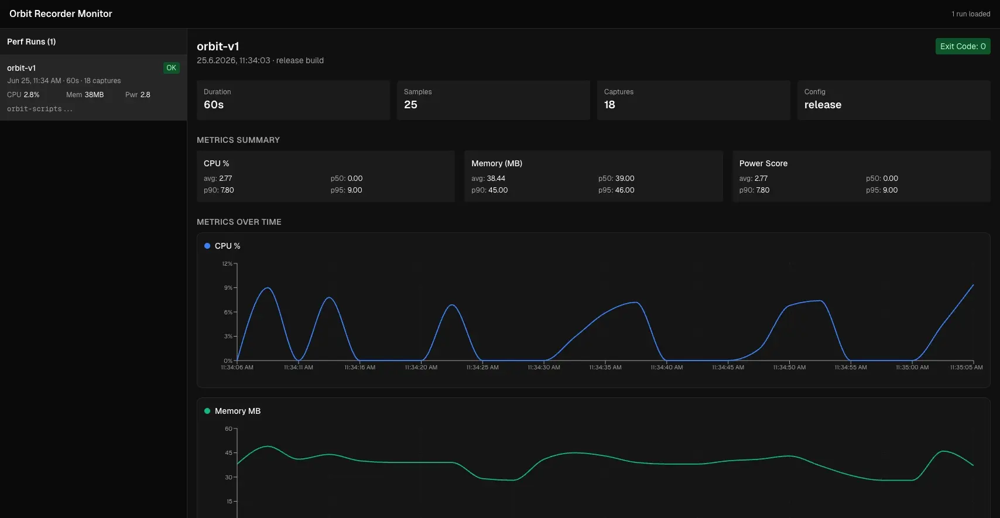
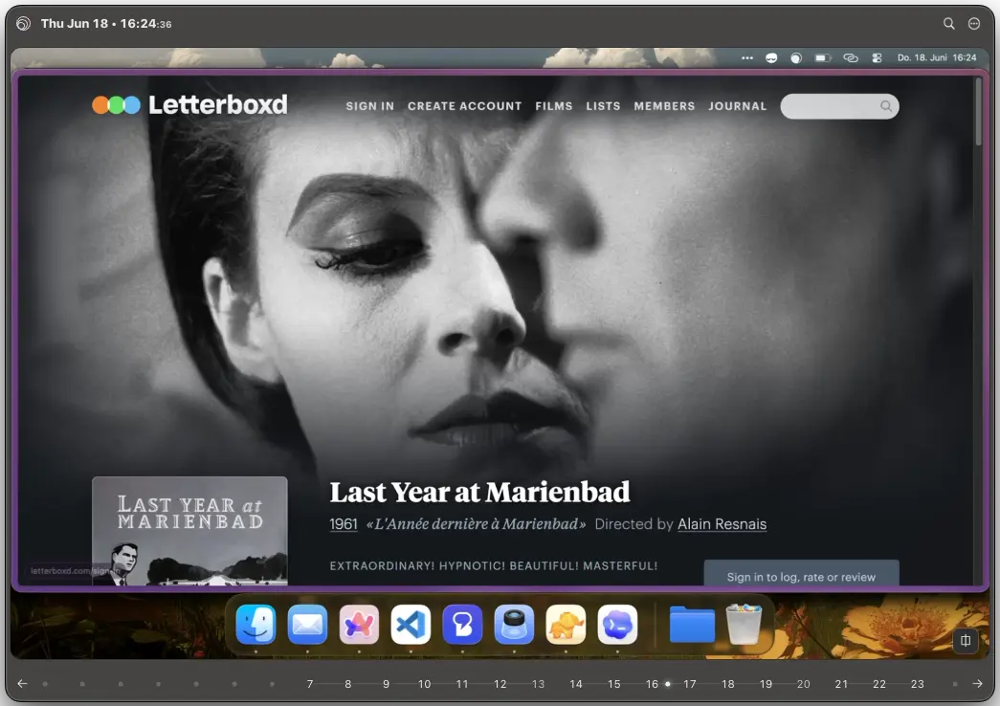
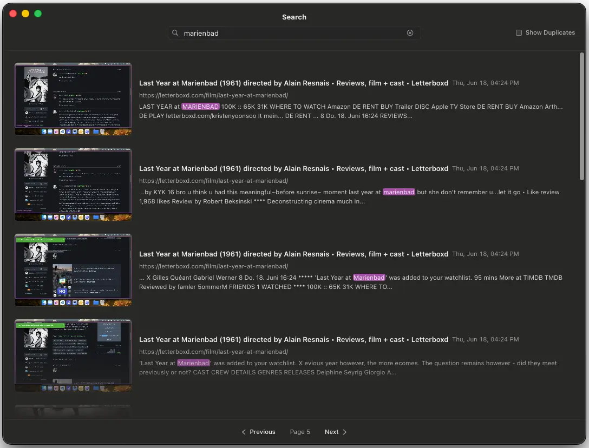
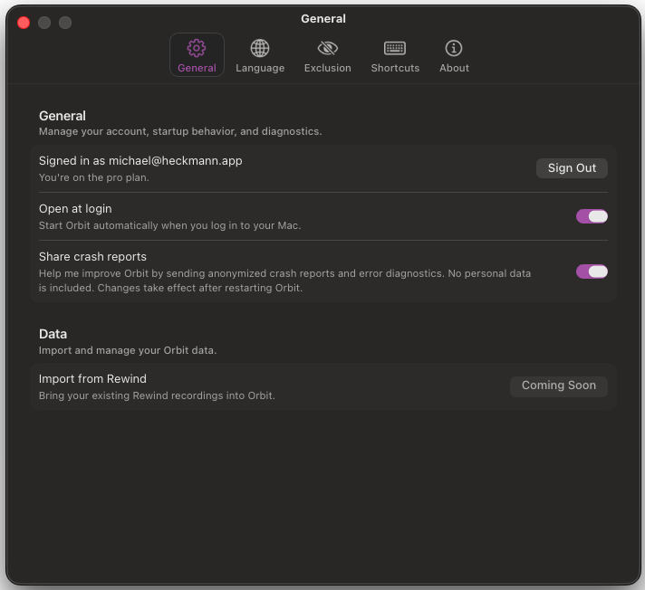

# Orbit neu gedacht: Was sich geändert hat und warum

Nach ein paar Wochen konzentrierter Arbeit freue ich mich, eine neue Version von Orbit zu veröffentlichen. Und das ist kein kleines inkrementelles Update. Ich habe neu darüber nachgedacht, wie Orbit deinen Bildschirm aufnimmt, wie diese Daten gespeichert werden und wie du tatsächlich mit der App interagierst, weil all diese Dinge zusammenhängen und sich gemeinsam ändern mussten.

Die Grundidee bleibt gleich: Orbit zeichnet auf, was auf deinem Bildschirm passiert, damit du es später wiederfinden kannst. Aber wie Orbit das macht, ist jetzt komplett anders. Deshalb lohnt es sich, einmal durchzugehen, was sich geändert hat und warum.

## Die Recording Engine

Das ist der Teil, der sich am stärksten verändert hat. Die alte Version war ziemlich simpel: Alle zwei Sekunden hat Orbit einen Screenshot gemacht, ihn analysiert und in einer Datenbank gespeichert. Irgendwann habe ich Deduplication hinzugefügt, damit sich aufeinanderfolgende Aufnahmen mit gleichem Textinhalt nicht unnötig stapeln. Aber grundsätzlich lief alles weiterhin über einen festen Timer, egal was du gerade gemacht hast.

Die neue Engine achtet stärker darauf, wie du deinen Computer nutzt. Wenn du aktiv arbeitest, browst oder herumklickst, bleibt sie beim Zwei-Sekunden-Intervall. Wenn sie erkennt, dass du gerade nicht interagierst, geht sie auf zehn Sekunden hoch. Deduplication läuft zusätzlich weiterhin darüber.

In der Praxis macht das einen ziemlich großen Unterschied. Ich teste diese Version seit ein paar Wochen, und der alte, durchgehende Verlauf hat einfach zu viele Aufnahmen produziert, die im Grunde dasselbe gezeigt haben. Ein Screenshot desselben Dokuments alle zwei Sekunden, während du es liest, ist nicht besonders hilfreich. Wofür Orbit eigentlich da ist: das wiederzufinden, woran du dich nur noch vage erinnerst. Dafür muss nicht alle zwei Sekunden etwas aufgenommen werden. Es macht auch einen echten Unterschied, wenn du ein Video oder einen Film schaust, weil solche Aufnahmen voller einzigartiger Pixeldaten sind und deutlich mehr Speicher brauchen als zum Beispiel ein Screenshot eines Texteditors.

All das bedeutet auch weniger Last für dein System, weil der Capture-and-Analyze-Zyklus seltener läuft. Ich habe außerdem überarbeitet, wie diese Aufnahmen und Metadaten gespeichert werden, was den belegten Speicherplatz spürbar reduzieren sollte. Ich finde noch heraus, ob ich beim Throttling vielleicht etwas zu aggressiv war, und tune gerade verschiedene Parameter nach. Für den Moment fühlt es sich, basierend auf meiner eigenen täglichen Nutzung, richtig an.

## Data Mobility

Ein Thema, das ich von Early-Access-Nutzern immer wieder gehört habe: Sie möchten mehr Kontrolle darüber, wo ihre Daten gespeichert werden. Das ergibt Sinn. Auch mit smarterem Capturing sammelst du über die Zeit viele Aufnahmen an, und weil alles lokal bleibt, ist es wichtig, wo diese Daten auf deinem Gerät liegen.

Ich habe die neue Storage Layer von Anfang an mit diesem Gedanken gebaut. Die konkreten Features sind noch nicht fertig, aber die Architektur ist darauf ausgelegt, Dinge wie diese möglich zu machen:

- Den Speicherort dauerhaft oder temporär verschieben
- Die Recording History auf unterschiedliche Laufwerke aufteilen
- Aktuelle Aufnahmen auf der internen Festplatte behalten und ältere Aufnahmen woanders archivieren
- Irgendwann Teile deiner Daten in einer privaten Cloud speichern

Das ist einer dieser Bereiche, in denen erst die Grundlage stimmen musste. Die eigentlichen Features werden in den kommenden Monaten folgen.

## Das User Interface

Die alte Version hat dir beim Öffnen eine Spotlight-artige Suchleiste gezeigt. Du hast etwas eingegeben, Ergebnisse kamen zurück. Das hat funktioniert, aber es gab immer diese unausgesprochene Annahme, dass du schon weißt, wonach du suchst.

Die neue Version startet anders. Du drückst den Hotkey und siehst sofort deine neueste Aufnahme in einem leichten Fenster, das sich an macOS Quick Look orientiert.

In vielen Fällen hast du gerade eben etwas gesehen und willst genau dorthin zurück. Dann ist es genau richtig, wenn es beim Öffnen der App direkt vor dir liegt. Die alte Version konnte das nicht, weil der Capture-Prozess eine eingebaute Verzögerung hatte. Jetzt ist es sofort da. Und neben dem praktischen Nutzen sagt dir das noch etwas Grundlegenderes: Orbit funktioniert, nimmt auf und ist bereit, dir das zu zeigen, wonach du gesucht hast.

Das Fenster zeigt dir außerdem eine Timeline für den aktuellen Tag, aufgeteilt nach Stunden. Du kannst hindurchscrollen oder mit den Pfeiltasten in deiner Timeline springen. Ich habe etwas Arbeit hineingesteckt, damit sich die Navigation richtig anfühlt, auch wenn sie noch nicht da ist, wo ich sie haben möchte.

Die Suche funktioniert und hat ein solides Interface, aber auch sie ist noch nicht dort, wo ich sie langfristig sehe. Das ist der Teil der App, auf dessen Neudenken ich mich am meisten freue. Ich kann mir mehrere Richtungen vorstellen: vielleicht bleibt sie im Quick-Look-Fenster, vielleicht wird sie eine eigene Ansicht, vielleicht etwas dazwischen. Ich bin mir noch nicht sicher, was sich am Ende richtig anfühlen wird.

Das gesamte Interface ist auf macOS Tahoe ausgelegt. Da Orbit mit Electron und React gebaut ist und nicht mit AppKit und SwiftUI, braucht es bewusstes Feintuning, damit sich die App im OS zuhause fühlt. Du kannst dem nativen Look nahekommen, aber du triffst ihn nie ganz perfekt, und dann wird es schnell uncanny. Manche Dinge sehen nah genug an nativ aus, dass die Unterschiede plötzlich falsch wirken, statt absichtlich anders. An einigen Stellen lehne ich mich deshalb stärker an die native Ästhetik an, an anderen nehme ich mir mehr kreative Freiheit. Das Ziel ist nicht, so auszusehen, als hätte Apple die App gebaut. Sie soll sich auf deinem Mac einfach wie ein guter Gast verhalten und durch bewusste Designentscheidungen auffallen, nicht weil etwas daneben wirkt.

## Was als Nächstes kommt

Diese Version hat noch nicht alles, was die alte Version hatte, und das ist Absicht. Ich wollte sie veröffentlichen und weiter iterieren, statt alles zurückzuhalten, bis jedes Feature fertig ist.

Die ersten Dinge, an denen ich für Feature Parity arbeite, sind die Rewind-Datenintegration und weitere Konfigurationsoptionen für die Aufzeichnung. Beides sollte innerhalb der nächsten Wochen landen. Danach verschiebt sich der Fokus auf:

- Ein mächtigeres Suchinterface mit Filtern für Metadaten, Zeiträume und App-Kontext
- Mehr Möglichkeiten, mit Aufnahmen zu arbeiten, zum Beispiel Favoriten und Notizen
- Automatische Retention Policies, damit du nur die letzten Monate an Aufnahmen behältst
- Mehr Flexibilität bei Speicherorten
- Und natürlich noch einiges mehr!

Wenn du Orbit ausprobieren möchtest, geh auf [reachorbit.app](https://reachorbit.app) und melde dich für Early Access an. Wenn du Gedanken dazu hast, würde ich sie wirklich gerne hören. Besonders das Suchinterface ist gerade noch die offenste Designfrage. Du findest mich auf [X](https://x.com).
