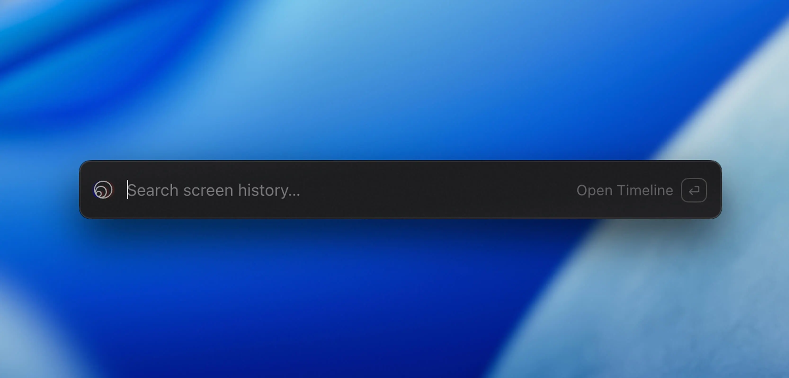
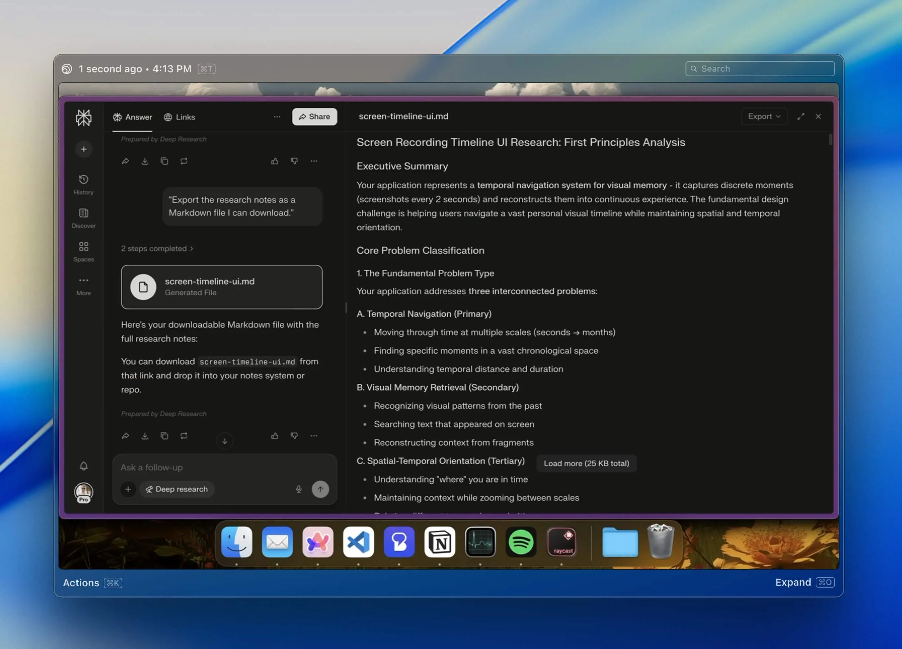
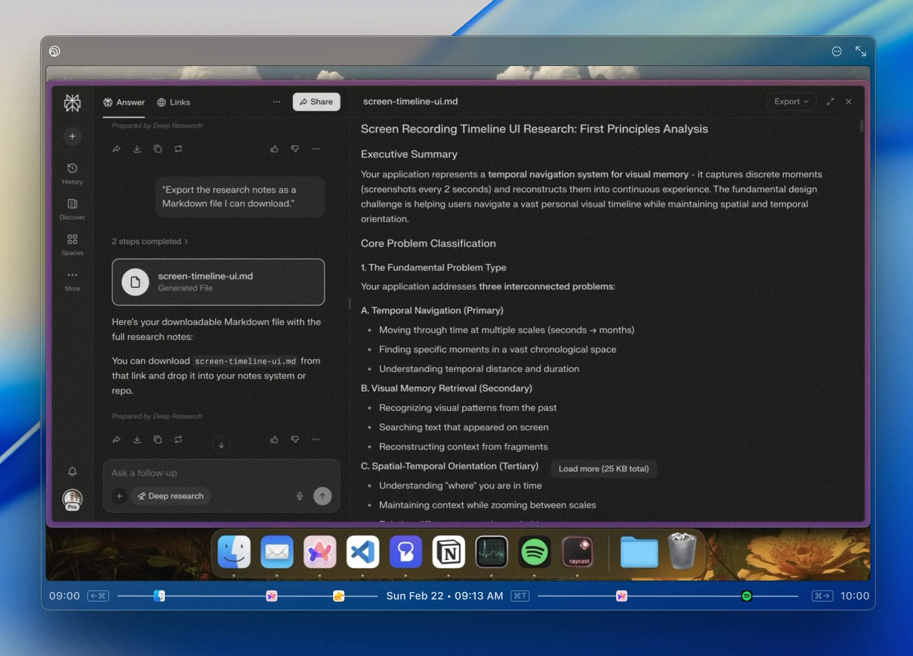
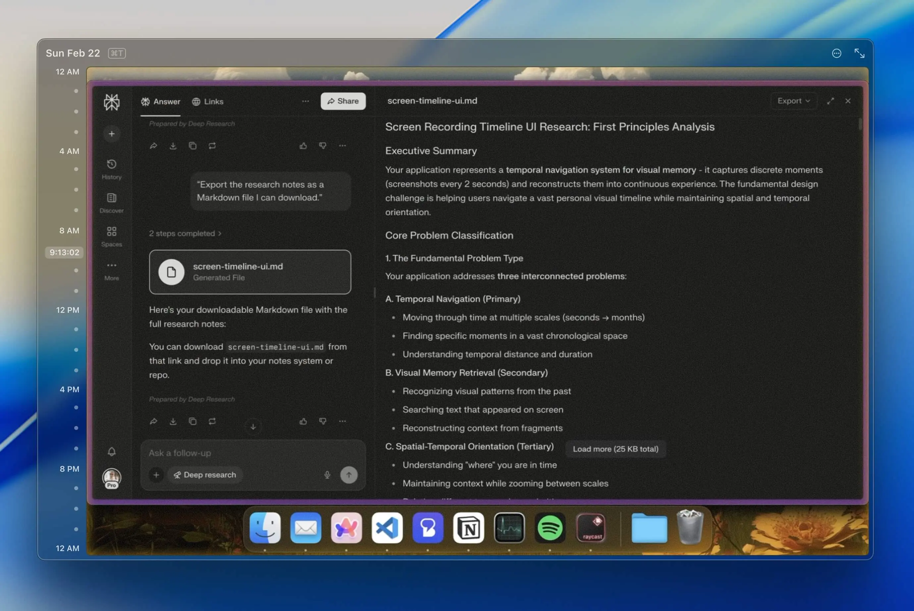

# Design für verschwommene Erinnerungen: Warum ich mich von Keyword-First verabschiedet habe

Wenn du ein Tool baust, mit dem Leute ihre Screen History durchsuchen können, wie sollte es aussehen, wenn es sich öffnet?

Als ich den Entry Point von Orbit ursprünglich designt habe, schien die Antwort offensichtlich: Du suchst etwas, du erinnerst dich an ein Wort, tippst es ein und landest auf einem passenden Screenshot. Das machte für mich total Sinn, denn genau so suche ich selbst.

Das Feedback, das diese Annahme über den Haufen geworfen hat, war simpel. Die Leute fragten immer wieder nach einer Möglichkeit, die Timeline direkt zu öffnen, ohne vorher etwas eintippen zu müssen. Das passierte so oft, dass ich dem wirklich auf den Grund gehen und herausfinden musste, warum die User danach verlangten.

## Warum ich dachte, Keyword-First sei offensichtlich

Meine Überlegung war: Wenn du versuchst, etwas Verlorenes wiederzufinden, hast du einen Grund, dich daran zu erinnern. Dieser Grund hat meistens mit Worten zu tun. Ein Name, eine Nummer, eine Phrase aus dem Text, den du gerade gelesen hast. Der kürzeste Weg sollte also direkt vom Wort zum Screen Capture führen.

<figcaption>Ein Screenshot aus dem aktuellen Design.</figcaption>

Das ist nicht komplett falsch. Aber es setzt voraus, dass du die Suche mit einem konkreten Begriff beginnst, der sich bereits in deinem Kopf gebildet hat. Oft ist das aber gar nicht der Fall. Du kommst mit etwas viel Vagerem: einem ungefähren Gefühl dafür, wann es passiert ist, woran du gearbeitet hast, oder vielleicht nur mit einer groben Richtung. Sowas wie "Ich glaube, ich habe die Rechnung heute Morgen irgendwann in meinem Browser oder in meinen E-Mails gesehen." Die Search Box bringt dir in dem Fall gar nichts, bis du das irgendwie in ein Keyword übersetzen kannst.

Diese Reibung ist minimal, aber es ist genau diese Art von Kleinigkeit, die verhindert, dass sich eine Gewohnheit etabliert.

## Wie der alte Flow tatsächlich aussah

Um zu verstehen, warum die User frustriert waren, hilft es, sich den alten Flow einmal genauer anzusehen:

Du hast den Search Launcher geöffnet, eine Suchanfrage eingetippt, ein Grid mit passenden Screenshots bekommen, einen davon doppelt angeklickt und bist _dann_ in der Timeline View gelandet, wo du von diesem Punkt aus in der Zeit navigieren konntest. Die Timeline war immer da. Du brauchtest nur ein Suchergebnis, um überhaupt dorthin zu gelangen.

Basierend auf dem Feedback habe ich einen zweiten Shortcut hinzugefügt, der direkt zur Timeline beim aktuellsten Capture sprang. Aber zwei separate Entry Points für dieselbe App zu haben, fühlte sich falsch an. Das bedeutet, dass User eine Entscheidung treffen müssen, bevor sie überhaupt angefangen haben. Der ganze Sinn eines Quick-Access-Tools ist doch, dass du nicht darüber nachdenken willst, wie du es öffnest.

Das Ziel war also, beide Pfade zu einem einzigen zusammenzuführen.

## Was mir beim Beobachten der User aufgefallen ist

Wenn man Leuten bei der Nutzung der App zusieht, wird eines ganz klar: Wenn du versuchst, etwas in deiner Screen History zu finden, erinnerst du dich selten direkt daran. Meistens hast du nur ein Puzzleteil: eine ungefähre Zeitspanne, in welcher App du warst, oder vielleicht etwas Visuelles. Du startest mit dieser einen Sache und setzt den Rest nach und nach zusammen. Vielleicht erinnerst du dich dann an bestimmte Keywords oder erkennst eine bestimmte Fensteranordnung wieder, die dir wichtige Hinweise gibt, wie du deine Suche eingrenzen kannst.

Was mir auch aufgefallen ist: Womit man die Suche beginnt, ist von Person zu Person total unterschiedlich. Manche haben direkt ein Keyword parat. Andere wissen, dass es in Relation zu etwas anderem stand. Wieder andere erinnern sich einfach daran, wie es auf dem Bildschirm aussah. Nichts davon ist besser oder valider als das andere. Es sind einfach unterschiedliche Einstiege.

Die Search Box deckt den Keyword-Use-Case gut ab und ignoriert den Rest größtenteils. Wenn du das Wort kennst, bringt sie dich schnell ans Ziel. Wenn nicht, sitzt sie einfach nur da und wartet. Das Ziel dieses Redesigns ist es, jedem einen besseren ersten Schritt zu ermöglichen, völlig unabhängig davon, mit welchem Anhaltspunkt man startet.

## Der neu gestaltete Starting Point

Der neue Launcher ist ähnlich aufgebaut wie die Quick Look-Fenster unter macOS: ein schwebendes Fenster, das über dem aufpoppt, woran du gerade arbeitest. Aber anstatt eines leeren Eingabefeldes öffnet er sich direkt beim aktuellsten Screenshot.

<figcaption>Eine erste Version des neuen Search Inputs.</figcaption>

Wenn du Orbit öffnest, siehst du das, was die App als Letztes gecaptured hat. Das gibt dir sofortige Orientierung. Wenn du etwas von heute Morgen suchst, musst du einfach nur ein paar Stunden zurückscrollen. Am unteren Rand gibt es einen Timeline Strip, der dir anzeigt, in welchen Stunden des Tages Aufnahmen existieren. Diese visuelle Reduzierung ist absolut gewollt. Das Fenster soll sich wie ein schnelles Tool anfühlen und nicht wie etwas, mit dem man sich ausgiebig beschäftigen muss. Du scrubbst darüber und bekommst Thumbnail-Previews, während du dich bewegst – ähnlich wie beim Hovern über eine YouTube Progress Bar. Die Details kommen erst, wenn du danach greifst, nicht vorher.

<figcaption>Eine weitere Version des neuen Search Inputs, diesmal mit einer Timeline.</figcaption>

Diesen Strip so hinzubekommen, dass er sich richtig anfühlt, hat in dieser Version fast am längsten gedauert. Zu viele Informationen auf einmal, und das Fenster wirkt überladen und schwerfällig. Zu wenig, und es ist nicht nützlich. Den Sweet Spot, den ich treffen wollte, war: Genug, um zu navigieren, aber nicht so viel, dass es sich nach Arbeit anfühlt. Ich glaube nicht, dass ich es schon perfekt getroffen habe, aber es ist auf jeden Fall näher dran als vorher.

<figcaption>Eine weitere Idee für den neuen Search Input. Interessant, aber hat es nicht ins finale Design geschafft.</figcaption>

## Mächtig und lightweight zugleich

Es gibt ein Spannungsfeld zwischen der Entwicklung eines mächtigen Tools und dem Anspruch, dass es sich lightweight anfühlen soll. "Mächtig" bedeutet meistens mehr Commands, mehr Context, mehr Optionen. "Lightweight" bedeutet, du öffnest es und weißt sofort, wo du hinschauen und was du tun musst. Beides gleichzeitig hinzubekommen, ist ein echtes Design-Problem, und ich glaube, kein Screen Memory Tool, das ich bisher benutzt habe, hat das vollständig gelöst.

Die Gewohnheit, zu einem Tool zu greifen, bildet sich nur, wenn das Öffnen weniger Aufwand bedeutet, als die Sache einfach manuell zu erledigen. Das ist die Messlatte, an der ich mich orientiere: Es muss schneller und besser sein, etwas in Orbit zu suchen, als in deinen E-Mail-Client oder in deine Browser History zu wechseln und dort zu suchen.

## Die Suche ist noch da, nur schwerer zu erreichen

Wenn du direkt mit einem Keyword kommst, ist das jetzt ein sekundärer Pfad. Die Textsuche funktioniert immer noch: Du gehst zum Search Screen, tippst ein Wort ein und bekommst jeden Screenshot angezeigt, auf dem es zu sehen war. Aber es braucht jetzt mehr Schritte als früher. Für Leute, die schon mit einem Suchbegriff im Kopf starten, ist das ein Rückschritt.

Was ich möchte, ist, dass sich beide Ansätze gleich schnell anfühlen – egal, ob du mit "irgendwann um 15 Uhr" oder "das vegane Shakshuka-Rezept" anfängst. Im Moment hat die Timeline Priorität. Beide auf dasselbe Level zu bringen, ohne dass eines von beiden überladen wirkt, ist das Design-Problem, das ich noch nicht gelöst habe. Eine Richtung, die ich in Betracht ziehe: Der Timeline Strip wechselt in einen Search Mode, sodass du dich nicht durch die Zeit, sondern durch die Keyword Matches klickst. Gleiches Pattern, andere Achse. Ich kann mir vorstellen, dass das funktioniert. Ich kann mir aber auch vorstellen, dass es genau die Art von Feature ist, die das Interface unübersichtlich und unintuitiv macht. Ich halte euch über zukünftige Iterationen des Interfaces auf dem Laufenden.

Das Ganze wird in Version 1.0.0 ausgeliefert. Wenn du Early Access haben möchtest, schau auf [reachorbit.app](https://reachorbit.app) vorbei.

Wenn du dir schon mal Gedanken darüber gemacht hast, wie man einen Entry Point designt, wenn die User nicht immer genau wissen, wonach sie suchen, würde ich wirklich gerne davon hören. Ich bin auf [X](https://x.com/mt_heckmann) unterwegs, oder du erreichst mich per [E-Mail](mailto:michael@heckmann.app).
