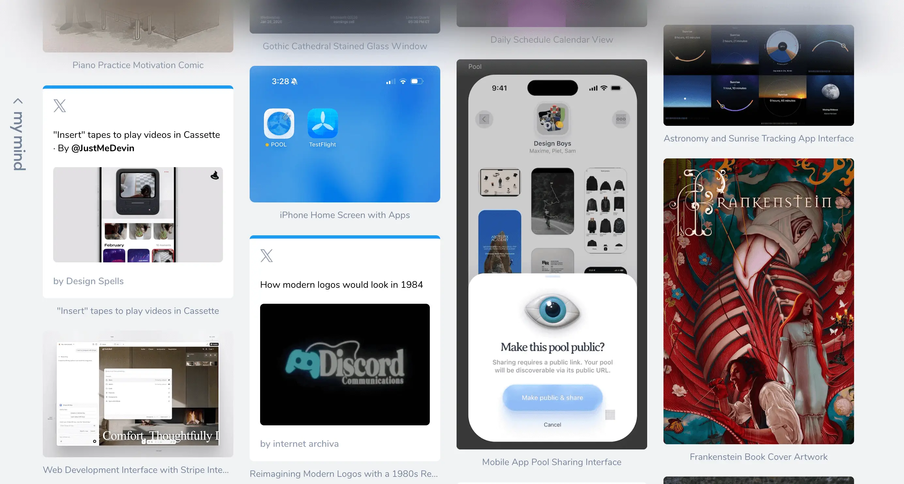
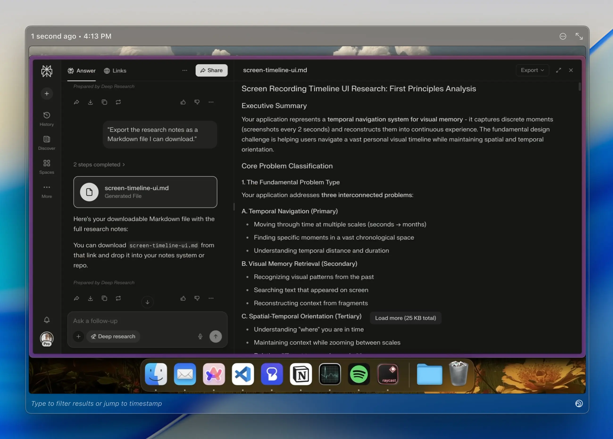

# Die Lücke zwischen dem, was du siehst, und dem, was du erschaffen kannst

Leute fragen mich oft, woher meine Ideen kommen, und mir fällt es ziemlich schwer, darauf zu antworten. Ich habe viel darüber nachgedacht. Aber ich habe das Gefühl, das meiste davon kommt von irgendwoher, worauf ich keinen bewussten Zugriff habe. Natürlich gibt es da die offensichtlichen Dinge: ein Swipe File, das ich seit Jahren pflege, oder bestimmte Erinnerungen an Dinge, die ich gesehen habe und die hängengeblieben sind. Aber das meiste, was meine Entscheidungen wirklich antreibt, ist eher unbewusst. Irgendetwas fühlt sich einfach „off“ an, und ich kann nicht genau sagen, warum. Das Gefühl kommt von einem Ort, an den ich nicht wirklich herankomme.

<figcaption>Ein Screenshot meiner <a href="https://mymind.com/">MyMind</a>-Sammlung visueller Inspiration.</figcaption>

Das passiert durch Exposure. Ich schaue Filme, die meine Gedanken in Gang setzen, spiele Spiele, die mich inspirieren. Ich habe einen natürlichen Hang zu Dingen, bei denen ein Funke überspringt: Die Filme von David Lynch spuken mir schon seit Jahren im Kopf herum. Das Gleiche gilt für die Gemälde von René Magritte. Nicht, weil ich sie systematisch studiere, sondern weil sie in mein Unterbewusstsein gesickert sind und dort geblieben sind. Du kannst nicht immer vorhersagen, was genau hängenbleibt. Du umgibst dich einfach immer wieder mit Dingen, die dich bewegen, und irgendwann wird ein Teil davon zu der Art und Weise, wie du die Dinge siehst.

Das setzt natürlich voraus, dass das, was du konsumierst, auch wirklich bei dir ankommt. Viele Leute scrollen durch die exakt gleichen Referenzen, ohne dass etwas davon hängenbleibt. Ich schätze also, es braucht bis zu einem gewissen Grad auch Intentionalität – du musst offen dafür sein und genau hinschauen.

## Wie dieser Standard entsteht

Je länger du das machst, desto schwerer wird es, das Ganze wieder abzuschalten.

Sich großartigem Craftsmanship auszusetzen, bewirkt zwei Dinge. Das Offensichtliche: Es hebt dein Ceiling. Du bist inspirierter und dein kreativer Spielraum erweitert sich. Aber es hebt eben auch deinen Floor, und dein interner Standard wird dadurch neu kalibriert. Du fängst an zu spüren, wenn etwas nicht stimmt, lange bevor du artikulieren kannst, warum. Eine Transition, die 100ms zu spät kommt, ein Font Weight, das eine Stufe zu heavy ist. Solche Dinge nimmst du wahr, bevor überhaupt eine bewusste Bewertung stattfindet. An einem bestimmten Punkt vergisst du völlig, dass dieser Standard jemals erlernt wurde. Es fühlt sich einfach an wie die natürliche Art, wie Dinge eben sein sollten.

Gegenüber der Arbeit anderer bleibt diese Haltung meist wohlwollend und anerkennend. Wenn es aber um meine eigene Arbeit geht, schaffe ich es anscheinend nicht, mir selbst dieselbe Nachsicht zu gewähren.

## Was der Standard bewirkt

Bei meinen eigenen Produkten spüre ich es fast körperlich, wenn etwas nicht stimmt. Wie ein Stein im Schuh: klein, ständig da und unmöglich zu ignorieren. Ich habe kürzlich ein neues Search Interface designt und wollte weg von einem fixen Input Field, hin zu etwas Offenerem für verschiedene Arten von Suchanfragen. Ich bin dutzende Iterationen durchgegangen. Keine davon fühlte sich richtig an. Nicht „un-shippable“, aber ihnen fehlte die Eleganz von etwas mit richtigem Feinschliff – und diese Lücke ließ mich einfach nicht los.

Das ständige Gefühl von „es ist einfach noch nicht richtig gut“ hat mich immer wieder in die nächste Iteration getrieben. Ohne dieses Gefühl hätte ich wahrscheinlich Iteration drei oder vier geshippt und wäre zum nächsten Task übergegangen. Aber mit ihm konnte ich es einfach nicht.

Ich bin ein Solo Developer, was bedeutet: Wenn ich etwas shippe, das sich unrund anfühlt, gibt es niemanden, dem ich die Schuld geben kann, außer mir selbst.

<figcaption>Eine der Iterationen der neuen Suchoberfläche.</figcaption>

## Der Preis dafür

Gute Arbeit aufzusaugen, hebt deinen Floor. So weit, so gut. Aber es bedeutet eben auch, dass du viel weiter nach vorne schauen kannst, als du aktuell stehst. Die Lücke zwischen dem, was du wahrnehmen kannst, und dem, was du tatsächlich umsetzt, wird also größer, nicht kleiner, je länger du das machst.

Ich habe mich noch nicht entschieden, ob das ein Geschenk oder eine Bürde ist. Wahrscheinlich beides, je nach Tagesform. Genau diese Sensibilität, die dafür sorgt, dass mich ein leicht verschobenes Bild im Settings-Screen stört, ist dieselbe Eigenschaft, die garantiert, dass ich einen Samstagabend damit verbringe, mich durch ein Dutzend Iterationen einer Changelog-Grafik zu arbeiten, die nach einer Woche sowieso irrelevant sein wird.

Diesen Standard zu entwickeln, ist der einfache Teil. Es passiert ohnehin, ob du es willst oder nicht. Der Part, der eine echte Entscheidung erfordert, ist zu wissen, wann du auf ihn hörst und wann du trotzdem shippst. Als Solo Developer habe ich auch noch andere Dinge zu shippen und generell mehr zu tun, als mir Zeit zur Verfügung steht. Manchmal shippe ich also Iteration fünf, obwohl ich genau weiß, dass Nummer zehn die richtige gewesen wäre. Der interne Qualitätsstandard verzeiht das nicht. Und das ist der wahre Preis: nicht nur die Extra-Iterationen, wenn du auf ihn hörst, sondern die leise Unzufriedenheit jedes Mal, wenn du es nicht tust.

Ich arbeite immer noch daran, herauszufinden, wie ich damit umgehen soll. Falls du dafür eine Regel gefunden hast, die funktioniert: Ich würde sie gerne hören. Ich bin auf [X](https://x.com/mt_heckmann).
