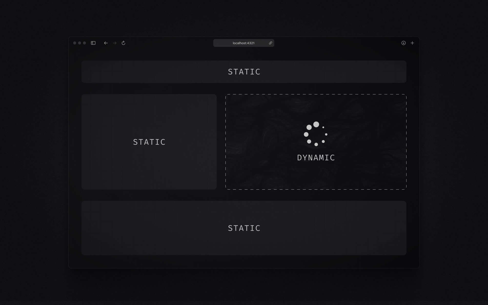
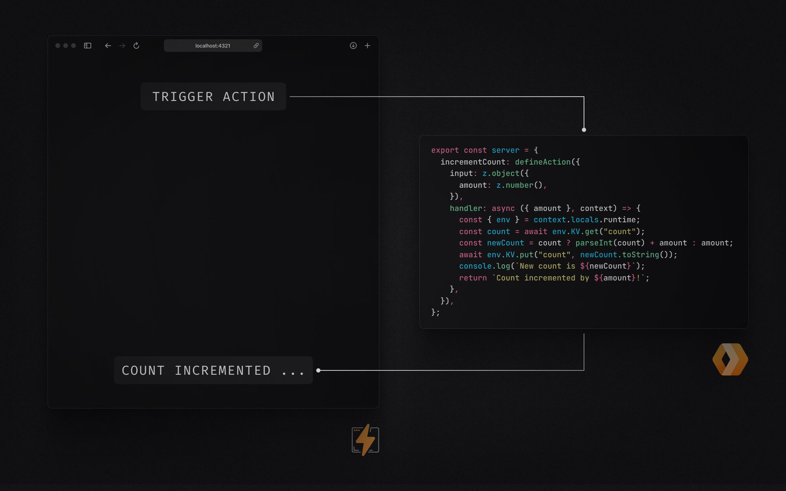

# Deep dive: Setting up Astro server islands & actions on Cloudflare Pages

Coming from React and Next.js, I used to think of Astro mainly as a static site generator. But with the recent releases, Astro has evolved from being just a static site generator to a powerful full-stack framework that combines static and dynamic content. I was especially happy about the introduction of server islands and actions. They allow me to now create rich, interactive applications while maintaining the performance benefits of static content. While other full-stack frameworks like Next.js offer similar capabilities, I always found Astro much easier to reason about and deploy. In this guide, we'll explore how to set up an Astro project with these features and deploy it to Cloudflare Pages. We'll also inspect the build output that the Cloudflare adapter is generating, to better understand the code we're shipping.

You can find the entire project on GitHub: [Astro Cloudflare Deep Dive](https://github.com/michaelheckmann/personal-website/tree/main/code/astro-cloudflare-deep-dive).

## Understanding Astro server islands and actions

Before we jump into the code, let's break down what server islands and actions are and why they're so exciting.



### What are server islands

Think of server islands as pockets of dynamic content within your otherwise static Astro pages. Imagine a blog post – mostly static content. But what if you want to add a comment section or user avatars? Server islands let you create these interactive components. They render on the server and are then injected into the page via script tags after the initial page loads. They're not part of the initial static HTML, which is key. This way, you keep your static content fast and SEO-friendly, but can still sprinkle in dynamic bits where you need them.



### What are server actions

Server actions let you call server-side code right from your Astro components. Think form submissions, database calls, or API interactions. The beauty of server actions is that they're type-safe and live right alongside your frontend code. You can handle sensitive stuff on the server – like API keys or business logic – without exposing them on the client. Plus, Astro server actions come with built-in input validation using `⁠zod` and consistent error handling.

### Why Cloudflare Pages

I love using Cloudflare Pages to deploy my websites and web apps. They have a great free tier and it's just easy to use. It also plays very nicely with Astro, even when you integrate server-side code and bindings to other Cloudflare products. The Astro Cloudflare adapter does all the hard work of creating the right build output that Cloudflare Pages expects.

## Project setup and configuration

Alright, let's get practical and set up an Astro project with server islands and actions.

### Astro starter template

The easiest way to start is by using the Cloudflare starter template. Open your terminal and run the following command:

```bash cn-show-copy
pnpm create cloudflare@latest my-astro-app --framework=astro
```

This command sets up a new Astro project with all the right dependencies and configurations already in place.

Once it's done, `⁠cd` into your new `⁠my-astro-app` directory, and you'll see a project structure that looks something like this:

```
my-astro-app/
├── public/
├── src/
│   ├── actions/
│   ├── assets/
│   ├── components/
│   ├── layouts/
│   └── pages/
├── .gitignore
├── astro.config.mjs
├── package.json
├── README.md
├── tsconfig.json
├── worker-configuration.d.ts
└── wrangler.jsonc
```

### Manual setup

If you're adding server islands and actions to an existing Astro project, make sure you're running the latest version of Astro (5.0 or higher). You'll also need to install the Cloudflare adapter, worker types and wrangler:

```bash cn-show-copy
pnpm add @astrojs/cloudflare
```

```bash cn-show-copy
pnpm add -D @cloudflare/workers-types wrangler
```

#### Configuration files

Here are the key adjustments you'll need to make. They're already implemented if you're using the Cloudflare starter template:

**astro.config.mjs**

Add the Cloudflare adapter to your Astro configuration:

```javascript
// @ts-check
import { defineConfig } from "astro/config";
import cloudflare from "@astrojs/cloudflare";

// https://astro.build/config
export default defineConfig({
  adapter: cloudflare({
    platformProxy: {
      enabled: true,
    },
  }),
});
```

The `platformProxy` option allows us to simulate Cloudflare-specific features locally during development and is highly recommended if you're using bindings to Cloudflare services like `KV` and `Durable Objects`.

Our project uses the default "static" output mode, which means Astro prerenders all pages by default. Previously, adding dynamic content meant choosing between two options: either configuring your entire application for server-side rendering with output mode "server," or making entire routes dynamic using `⁠export const prerender = false`. Server islands introduce a more flexible approach: now you can keep your pages static by default and selectively add dynamic components using the ⁠`server:defer` directive. This gives you fine-grained control over which parts of your page are static and which are server-rendered.

**wrangler.toml**

Create the `wrangler.toml` (or `wrangler.jsonc`) file. This file configures your Cloudflare Workers environment.

```toml
#:schema node_modules/wrangler/config-schema.json
name = "my-astro-app"
compatibility_date = "2025-02-04"
compatibility_flags = [ "nodejs_compat" ]
pages_build_output_dir = "./dist"
```

Key settings here include:

- `name`: Your project name.
- `compatibility_date`: A specific date that determines which Workers runtime features your Worker has access to.
- `compatibility_flags`: `nodejs_compat` is crucial for Node.js compatibility.
- `pages_build_output_dir`: Specifies the directory containing your built Astro site.

**package.json**

Adjust the `scripts` object in your `package.json` to include the following:

```jsonc
"scripts": {
  "dev": "astro dev",   // Run your project locally
  "build": "astro build", // Building your project
  "preview": "astro build && wrangler pages dev", // Preview your production build locally
  "deploy": "astro build && wrangler pages deploy", // Deploy to Cloudflare Pages
  "cf-typegen": "wrangler types" // Generate worker-configuration.d.ts
},
```

These scripts provide convenient commands for development, building, previewing, and deploying your Astro project to Cloudflare Pages.

#### TypeScript

For a smoother development experience, especially with server actions, TypeScript is highly recommended. The starter project includes a `tsconfig.json` which extends Astro's default configuration. To ensure full type safety with Cloudflare Workers, you should add the `@cloudflare/workers-types` to your `compilerOptions.types` in `tsconfig.json`:

**tsconfig.json**

```json
{
  "extends": "astro/tsconfigs/strict",
  "include": [".astro/types.d.ts", "**/*"],
  "exclude": ["dist"],
  "compilerOptions": {
    "types": ["@cloudflare/workers-types/2023-07-01"]
  }
}
```

**worker-configuration.d.ts**

Run `pnpm run cf-typegen` to generate the file `worker-configuration.d.ts`. This file provides TypeScript types for Cloudflare bindings, making it easier to work with environment variables and Cloudflare bindings in your Astro project. It reads from the `wrangler.toml` file to generate the types. Since we haven't defined any bindings or variables yet, the file will just contain an empty interface.

**src/env.d.ts**

Create this file in your `src` directory `src/env.d.ts`:

```typescript
type Runtime = import("@astrojs/cloudflare").Runtime<Env>;

declare namespace App {
  interface Locals extends Runtime {}
}
```

This file plays a crucial role in your development workflow by providing TypeScript type safety for your environment variables, which are exposed through the `worker-configuration.d.ts` file. It creates a bridge between Cloudflare's environment variables and your Astro application, ensuring that you get autocomplete suggestions and type checking when accessing environment variables in your code.

With these configurations in place, your Astro project is ready to leverage server islands and actions on Cloudflare Pages!

## Implementing server islands

After setting up our project, let's now create a simple server island that simulates latency and displays dynamic data.

### Creating a server island component

Create a file named `server-island.astro` in your `src/components` directory and add the following code:

```astro cn-show-copy
---
// Wait for 5 seconds to simulate a slow server
await new Promise((resolve) => setTimeout(resolve, 5000));
const host = Astro.request.headers.get("host");
---

<div>
  <h1>Server Island</h1>
  <p>Host: {host}</p>
</div>
```

This simple component does a couple of things: First, it introduces a 5-second delay using `await new Promise(...)`. This is purely for demonstration to visually emphasize that this component loads after the initial page. In a real-world scenario, this delay could represent fetching data from a database or an external API. Then, it fetches the `host` header from the Astro request and displays it. This shows server-side data access within the component.

### Integration with Cloudflare Pages

Now, let's integrate this server island into our homepage. Open `src/pages/index.astro` and update it to include the `ServerIsland` component:

```astro
---
import ServerIsland from "../components/server-island.astro";
import Welcome from "../components/Welcome.astro";
import Layout from "../layouts/Layout.astro";
---

<Layout>
  <ServerIsland server:defer />
  <Welcome />
</Layout>
```

The `server:defer` directive here is key. It tells Astro to skip rendering this component in the initial response and defer its rendering until later. This ensures that the rest of the page loads quickly, while the page fetches the island in the background.

To see this in action, run `pnpm dev` to start the development server and visit your project (likely on `http://localhost:4321`). You should see the "Welcome" component load instantly, and after a 5-second delay, the "Server Island" component will pop in, displaying the host header.


This simple example demonstrates the power of server islands. You can place dynamic, server-rendered components within your static Astro pages, selectively adding interactivity where needed.

## Working with server actions

Let's develop this example further by adding a server action! We'll create a simple action that returns a greeting.

### Defining a server action

Create a new file `src/actions/index.ts` and add the following code:

```typescript cn-show-copy
import { defineAction } from "astro:actions";
import { z } from "astro:schema";

export const server = {
  getGreeting: defineAction({
    input: z.object({
      name: z.string(),
    }),
    handler: async (input, context) => {
      console.log("action getGreeting called with input", input);
      return `Hello, ${input.name}!`;
    },
  }),
};
```

This code defines a server action using Astro's built-in `⁠defineAction` helper. The action, named `⁠getGreeting`, takes a `⁠name` as input and returns a greeting. We're using `⁠astro:schema` with Zod to validate the input. The action's `⁠handler` function runs on the server when called and receives two parameters: the validated `⁠input` and a `⁠context` object. While we're not using the context in this example, it's valuable for accessing request data or Cloudflare bindings in more complex scenarios. TypeScript automatically figures out the handler's return type, keeping things type-safe.

### Client-side integration

Let's add this action to our `⁠server-island.astro` component. We're putting it in our server component here for simplicity, but remember, server actions work in any Astro component, not just server components.

Modify the component to include a button that calls the `getGreeting` action when clicked:

```astro cn-show-copy
---
// Wait for 5 seconds to simulate a slow server
await new Promise((resolve) => setTimeout(resolve, 5000));
const host = Astro.request.headers.get("host");
---

<div>
  <h1>Server Island</h1>
  <p>Host: {host}</p>
</div>
<div>
  <button>Get Greeting</button>
</div>
<script>
  import { actions } from "astro:actions";

  const button = document.querySelector("button");
  button?.addEventListener("click", async () => {
    // Show alert pop-up with greeting from action
    const { data, error } = await actions.getGreeting({ name: "Michael" });
    if (!error) alert(data);
  });
</script>
```

In the `<script>` block, we select the button element and add an event listener to the button that, on click, calls `actions.getGreeting({ name: "Michael" })`.
This call is fully type-safe, with TypeScript ensuring the input matches our schema and providing proper typing for the returned `⁠data` and `⁠error` properties.

Restart your dev server (`pnpm dev`) and revisit `http://localhost:4321`. Now, within the server island, you'll see a "Get Greeting" button. Click it, and after a brief moment, you should see an alert box pop up with "Hello, Michael!".


## Understanding the build output

Now that server islands and actions are set up, let's understand what happens when we build our Astro project for production.

### Build structure

Run the build command:

```bash cn-show-copy
pnpm run build
```

This command generates a `dist` directory containing the production-ready assets for deployment. Let's explore its structure:

```

dist
├── _astro
│ ├── astro.Dm8K3lV8.svg
│ ├── background.BPKAcmfN.svg
│ └── server-island.astro_astro_type_script_index_0_lang.BsjdNvop.js
├── \_routes.json
├── \_worker.js
│ ├── _@astrojs-ssr-adapter.mjs
│ ├── _astro-internal_middleware.mjs
│ ├── chunks
│ │ ├── ServerIsland_Bc79u-lm.mjs
│ │ ├── _@astrojs-ssr-adapter*D_lazfOM.mjs
│ │ ├── \_astro_internal-actions_Bl2mGVjj.mjs
│ │ ├── astro
│ │ │ └── server_v5JSe12O.mjs
│ │ ├── astro-designed-error-pages_BROhq1O-.mjs
│ │ ├── index_Dlc7Cg9n.mjs
│ │ ├── noop-middleware_BpHVpHBn.mjs
│ │ └── server_D0SgkohY.mjs
│ ├── index.js
│ ├── manifest_sX19WnR9.mjs
│ ├── pages
│ │ ├── \_actions
│ │ │ └── *---path\\\_.astro.mjs
│ │ ├── \_image.astro.mjs
│ │ └── index.astro.mjs
│ └── renderers.mjs
├── favicon.svg
└── index.html

```

- **`_astro/`**: This directory contains static assets like images, fonts, and client-side JavaScript modules. In our example, it includes the Astro and background SVGs and a JavaScript file which contains the client-slide JS to call our server action.
- **`_worker.js/`**: This directory contains the Cloudflare Worker code that handles server-side rendering, server islands, and actions. It's the heart of our dynamic functionality on Cloudflare Pages.
- **`_routes.json`**: This file defines the routing configuration for Cloudflare Pages, specifying which parts of the build output should be handled as static assets and which should be used for serverless functions.
- **`favicon.svg` and `index.html`**: These are static assets. `index.html` is the static shell of our homepage.

### How Cloudflare Pages serves content

The `_routes.json` file dictates how Cloudflare Pages should interpret the output. It essentially tells Cloudflare: "Serve `index.html`, `favicon.svg`, and everything in `_astro/` as static assets. For everything else (like requests to `/_server-islands/*` or action endpoints), invoke the Cloudflare Worker code in `_worker.js`."

This separation is key to the performance benefits. Cloudflare's CDN directly serves static assets, which is fast and cost-effective (often free). Serverless functions (via Cloudflare Workers) only run when necessary – for rendering server islands or handling action requests.

### Server islands in the build output

Open the `dist/index.html` file. You'll see the static shell of your website.

```html
<h1 data-astro-cid-mmc7otgs>
  To get started, open the
  <code data-astro-cid-mmc7otgs>
    <pre data-astro-cid-mmc7otgs>src/pages</pre>
  </code>
  directory in your project.
</h1>
```

Instead of a fully rendered server island, you'll see a placeholder and a `⁠<script>` tag:

```html
<!--[if astro]>server-island-start<!
[endif]--><link
  rel="preload"
  as="fetch"
  href="/_server-islands/ServerIsland?e=default&p=&s=%7B%7D"
  crossorigin="anonymous"
/>
<script async type="module" data-island-id="...">
  // ... JavaScript code to fetch and inject the server island HTML
</script>
```

This is how server islands work in the build output. The initial HTML contains a placeholder. Client-side JavaScript then fetches the rendered HTML for the server island from a specific endpoint (`/_server-islands/ServerIsland`) and dynamically injects it into the page.

Inside `_worker.js/index.js`, you'll find the code that maps server island names to their corresponding modules:

```javascript
const serverIslandMap = new Map([
  ["ServerIsland", () => import("./chunks/ServerIsland_Bc79u-lm.mjs")],
]);
```

The server island code itself lives in a chunk file within the `_worker.js/chunks` directory and is served on-demand when requested.

### Server actions in the build output

The server action code is also bundled within the `_worker.js` directory, ensuring it runs only on the server.

If we trace an action through the build output, we'll see it go through these files:

- `dist/_worker.js/pages/_actions/_---path_-.astro.mjs`
- `dist/_worker.js/chunks/server_D0SgkohY.mjs`
- `dist/_worker.js/chunks/_astro_internal-actions_Bl2mGVjj.mjs`

Peeking into `dist/_worker.js/chunks/_astro_internal-actions_Bl2mGVjj.mjs`, we can indeed find our `getGreeting` action definition:

```javascript
const server = {
  getGreeting: defineAction({
    input: objectType({
      name: stringType(),
    }),
    handler: async (input, context) => {
      console.log("action getGreeting called with input", input);
      return `Hello, ${input.name}!`;
    },
  }),
};
```

This confirms that our action's handler function, including the input validation and the greeting logic, is compiled and placed within the server-side worker code. When you call `actions.getGreeting()` from the client, it triggers a network request to a specific endpoint that's managed by the Cloudflare Worker. The Worker then executes the `getGreeting` action handler and returns the result back to the client.

## Deployment and production

Let's deploy our Astro project to Cloudflare Pages.

### Deployment options

Here are two common options for deployment:

**1. GitHub Integration (Recommended for Continuous Deployment):**

- Push your project to a GitHub repository.
- In your Cloudflare dashboard, navigate to "Workers & Pages" and then "Pages"
- Click "Create a new Pages project" and select "Connect to Git"
- Choose your GitHub repository and branch.
- Under "Framework preset," select "Astro"
- Set the "Build command" to `pnpm run build` and the "Build output directory" to `dist`.
- Click "Save and Deploy."

Cloudflare Pages will automatically build and deploy your site whenever you push changes to your GitHub repository.

**2. CLI Deployment (For Manual Deployments or Scripting):**

You can deploy directly from your terminal using the `wrangler pages deploy` command. Add the following script to your `package.json` scripts section if it's not already there:

```json
"deploy": "astro build && wrangler pages deploy"
```

Then, run:

```bash cn-show-copy
pnpm run deploy
```

This command first builds your Astro project (`astro build`) and then uses Wrangler to deploy the contents of the `dist` directory to Cloudflare Pages (`wrangler pages deploy`). Make sure you have wrangler added to your dependencies and configured (`pnpm add -D wrangler` and `wrangler login`).

### Verification

After deployment, visit your Cloudflare Pages project URL. You should see your Astro site live! To double-check that server islands and actions are working correctly:

1.  Inspect the page source: Confirm that the initial HTML for the server island is a placeholder and not the rendered content.
2.  Check the "Server Island" component: Verify that it loads after a short delay (in our example, 5 seconds) and displays the host header.
3.  Click the "Get Greeting" button: Ensure the alert box with "Hello, Michael!" appears, confirming the server action is being executed.

For deeper verification and monitoring, you can use Cloudflare's Functions logs.

1.  Go to your project on Cloudflare Pages.
2.  Check the "Deployments" page to see the status of your deployment.
3.  Click on "View details" to see the uploaded assets and deployed functions.
4.  Go to the "Functions" tab and begin the log stream.
5.  Visit your page and interact with the server island and action. Back in the "Functions" tab, you should see:
    - A GET request retrieving the server island code.
    - A POST request when the server action (such as "getGreeting") is invoked.

## Conclusion

The combination of Astro's server islands and actions with Cloudflare Pages provides an efficient architecture for modern web applications. Static content is served directly from Cloudflare's CDN edge network, while dynamic functionality is handled by Cloudflare Workers when needed. This approach optimizes both performance and cost while maintaining a straightforward development experience.

For more information, check out these resources:

- [Astro Documentation](https://docs.astro.build)
- [Cloudflare Pages Documentation](https://developers.cloudflare.com/pages)
- [Example Project](https://github.com/alexweberk/astro-action-cloudflare)
- [Detailed Tutorial](https://alexweberk.com/blog/astro-actions-on-cloudflare)
