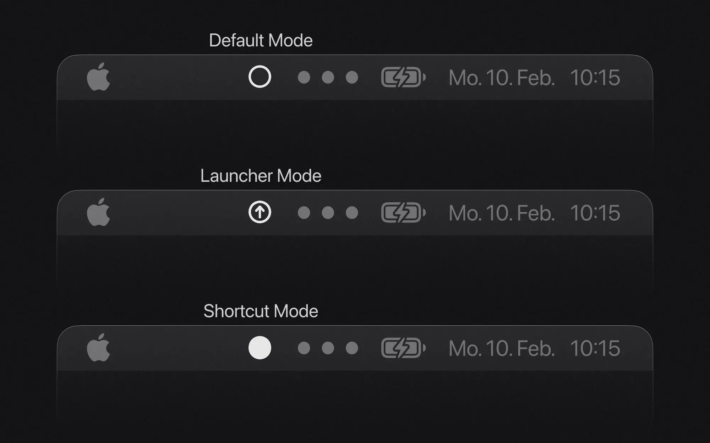
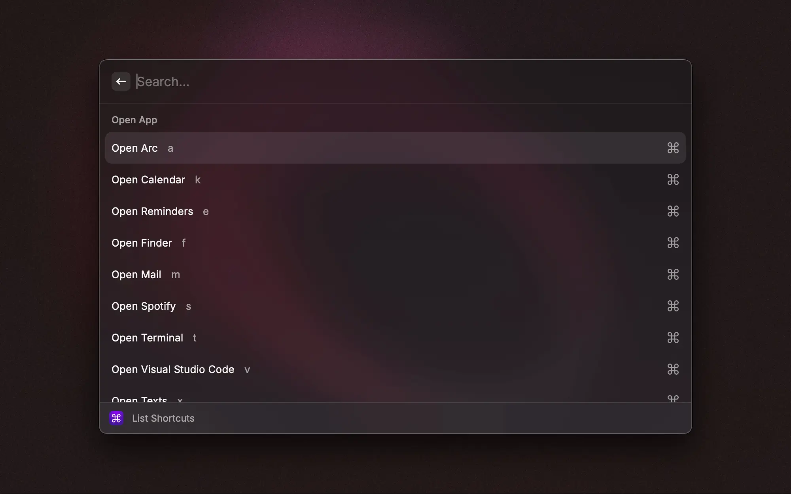

# Building a custom multi-key shortcut system with skhd and Raycast

## The problem with traditional shortcuts

Setting up a comprehensive hotkey system on macOS was a frustrating experience for me. With only so many key combinations available, I kept running into conflicts with existing application shortcuts. For example, I wanted to map my clipboard history to <kbd>Cmd</kbd> + <kbd>Shift</kbd> + <kbd>C</kbd>, but discovered that Arc browser already used this combination for copying URLs. While I could have changed Arc's shortcut, I realized I needed a more systematic approach that would get rid of these conflicts altogether rather than constantly shuffling shortcuts around. This led me to explore alternative approaches.

I was pleasantly surprised to discover Max Stoiber's solution in his [interview on the Raycast Youtube Channel](https://youtu.be/m5MDv9qwhU8?t=156). His approach uses Karabiner Elements to create 'layers' (imagine different sets of shortcuts that become available after pressing a specific key combination). For example, pressing a leader key followed by 'f' could activate a 'finder layer' with file management shortcuts at your fingertips.

While trying to replicate his setup, I encountered issues with Karabiner. It would reset my keyboard mapping, causing the keys I pressed on my physical keyboard to produce different characters on screen. I wanted a simpler solution with visual feedback on the active mode. This led me to create my own system. It combines skhd (a lightweight keyboard shortcut manager) and Raycast (a powerful application launcher and productivity tool).

### What we'll build

In this project, we'll recreate this custom multi-key shortcut system. This setup will allow you to use the same key to trigger different actions depending on the active mode or layer. We'll set up skhd to handle key events. We will integrate it with two Raycast extensions. One extension will provide a menu bar command for visual feedback of the active mode. The other will generate a searchable list, serving as always up-to-date documentation of your shortcuts. Additionally, we'll build a TypeScript-based configuration generator for easy, type-safe setup of your shortcuts. The final result is a highly customizable, efficient, and maintainable way to trigger applications, scripts, and system actions with just a few key presses.

You can find the entire project on GitHub: [Multi-Key Shortcuts](https://github.com/michaelheckmann/personal-website/tree/main/code/multi-key-shortcuts).

## Multi-key shortcuts

### Understanding modes

The core concept of my system revolves around modes. These modes describe different states that your keyboard can be in, each with its own set of shortcuts. I use three primary modes:

- Default Mode: The normal state where keys behave as expected
- Launcher Mode: Dedicated to opening applications
- Shortcut Mode: For executing scripts and other actions

The beauty of this approach is that the same key can trigger different actions depending on the active mode. For example:

- In Launcher Mode, pressing <kbd>C</kbd> might open Chrome
- In Shortcut Mode, pressing <kbd>C</kbd> might open the clipboard history
- Similarly, in Launcher Mode, pressing <kbd>S</kbd> might open Spotify
- While in Shortcut Mode, pressing <kbd>S</kbd> might activate the screenshot tool

This approach suits my workflow, but you can create many different modes for a wide range of use cases.

### How mode switching works

Each mode is activated by a specific hotkey combination:

- <kbd>Cmd</kbd> + <kbd>Space</kbd>: Toggle Shortcut Mode
- <kbd>Cmd</kbd> + <kbd>Shift</kbd> + <kbd>Space</kbd>: Toggle Launcher Mode
- ⁠<kbd>Esc</kbd>: Return to Default Mode

The visual feedback on which mode is active is crucial. Without any indicators, it would be easy to lose track of which mode you're in and trigger unintended actions. I've implemented this through a Raycast menu bar extension that indicates the active mode.

Let's explore the technical implementation of this system.

## Technical implementation

### Setting up skhd

skhd is the keyboard shortcut manager that drives this system. It's a lightweight tool that monitors keyboard input and executes commands based on your configuration.

Before we begin, you'll need Homebrew installed on your Mac. If you haven't installed it yet, you can find instructions at [brew.sh](https://brew.sh).

Installing and starting skhd is straightforward:

```bash cn-show-copy
brew install skhd
skhd --start-service
```

This will create a configuration file at `~/.skhdrc`. This file is where you'll define all your shortcuts and modes using skhd's simple configuration syntax. You can edit and reload the file while skhd is running, making it easy to adjust your setup on the fly. Learn more about skhd in the [official documentation](https://github.com/koekeishiya/skhd).

### The TypeScript generator

Instead of writing skhd configuration directly, I created a TypeScript-based generator that provides type safety and better organization. This approach allows for better maintainability, validation, and reuse of common patterns.

The generator serves these purposes:

- Type-safe configuration of shortcuts and modes
- Validation to prevent conflicts
- Helper functions for common operations
- Single source of truth for all shortcuts

#### Project structure

The TypeScript-based generator consists of these components:

```
├── src/
│ ├── config.ts # Main configuration file defining modes and shortcuts
│ ├── constants.ts # System-wide constants and defaults
│ ├── types.ts # Type definitions for the configuration
│ ├── utils.ts # Utility functions for generating commands
│ └── index.ts # Entry point that generates the skhd configuration

```

#### Type system

The `types.ts` file defines the core types for modes, shortcuts, and modifiers:

```typescript
type Modifier = "fn" | "cmd"; // ...
type KeyLiteral = "return" | "tab"; // ...
type Char = "a" | "b" | "c" | "d"; // ...
type Key = KeyLiteral | Char | `0x${string}`; // Supports hex codes for special keys

// Icons that are supported by the menu-bar-manager extension
type Icon = "default" | "shortcut" | "launcher";
type Mode = {
  name: string;
  icon: Icon;
  isDefault: boolean;
};
```

I took the available modifiers and key literals from this issue on the skhd repository: [Key names and modifiers](https://github.com/koekeishiya/skhd/issues/1).

With these types in place, I am sure that my configuration is correct and can be validated before being loaded into skhd.

#### Configuration

The `config.ts` file defines the modes, mode shortcuts, and the shortcuts themselves:

```typescript
// Mode Definitions
const modes = [
  {
    name: "default",
    icon: "default",
    isDefault: true,
  },
  {
    name: "shortcut",
    icon: "shortcut",
    isDefault: false,
  },
  {
    name: "launcher",
    icon: "launcher",
    isDefault: false,
  },
] as const;

// Mode Activation Shortcuts
const modeShortcuts = {
  shortcut: {
    modifiers: ["cmd"],
    key: "space",
  },
  launcher: {
    modifiers: ["cmd", "shift"],
    key: "space",
  },
};

// Example Shortcuts
const shortcuts = [
  {
    mode: "launcher",
    modifiers: ["cmd"],
    key: "a",
    comment: "Open Arc",
    command: openApp("Arc"),
    omitModifierAllowed: true,
  },
  // ... more shortcuts
];
```

Let's go through the configuration of the shortcuts:

1. **Mode:** The mode in which the shortcut is active.
2. **Modifiers:** The modifier keys to press with the key.
3. **Key:** The key that triggers the command.
4. **Comment:** A description of the shortcut for documentation purposes.
5. **Command:** The command executed when you trigger the shortcut.
6. **OmitModifierAllowed:** A flag that allows the user to press the key without the modifier.

**Implementation Deep Dive: OmitModifierAllowed**

With the ⁠omitModifierAllowed flag enabled, you can execute a command even without holding the modifier key. For example, in shortcut mode (activated via <kbd>Cmd</kbd> + <kbd>Space</kbd>), you can execute commands by keeping your thumb on the Command key (<kbd>Cmd</kbd> + <kbd>C</kbd>) or by simply pressing the letter key alone (just <kbd>C</kbd>).

I found it tedious to have to decide to always lift the thumb off the modifier, or to purposefully force the thumb to stay on the modifier key. This makes the interaction more natural and forgiving. The only limitation is that you can only set up one "modifier-free" shortcut per letter in each mode. It's best to reserve this option for your most frequent commands.

#### Validation

Before generating the final skhd configuration, it's crucial to validate our shortcuts to prevent runtime errors and ensure consistency. This validation step catches common issues like duplicate shortcuts within the same mode, which could lead to unpredictable behavior. The generator includes built-in validation:

```typescript
const validateShortcuts = (shortcuts) => {
  // Create a shortcut string from the configuration
  const renderedShortcuts = shortcuts.map(renderBaseShortcut);
  // Check for duplicates
  let duplicates = renderedShortcuts.filter(
    (command, index) => renderedShortcuts.indexOf(command) !== index,
  );
  if (duplicates.length > 0) {
    throw new Error(`Duplicate shortcuts: ${duplicates.join(", ")}`);
  }
  return shortcuts;
};
```

#### Utility functions

To standardize common operations and reduce the chance of errors, I've created a set of helper functions. These utilities handle everything from formatting AppleScript commands to opening URLs in specific Arc spaces. Here are some useful examples:

```typescript
// Creates a single-line AppleScript command from a multi-line script
const createAppleScriptCommand = (script: string) => {
  return (
    "osascript " +
    script
      .trim()
      .split("\n")
      .map((s) => `-e '${s}'`)
      .join(" ")
  );
};

// Open a Raycast extension with optional parameters.
const openRaycast = (
  script: `${string}/${string}/${string}`,
  params?: {
    // Usedful for forcing Raycast to open, necessary for some commands to work
    forceFocus?: boolean;
    // Arguments can be defined as a key-value pair
    arguments?: Record<string, string>;
    launchType?: "userInitiated" | "background";
  },
) => {
  let command = `open -g 'raycast://extensions/${script}`;

  const searchParams = new URLSearchParams();

  if (params?.arguments) {
    searchParams.append("arguments", JSON.stringify(params.arguments));
  }
  if (params?.launchType) {
    searchParams.append("launchType", params.launchType);
  }

  command += `?${searchParams.toString()}'`;

  if (params?.forceFocus) {
    command += ` && open -a 'Raycast'`;
  }
  return command;
};

const openUrl = (url: string, space?: Space) => {
  // Use the standard open command if no space is specified
  if (!space) {
    return open(url);
  }
  // Open a URL in Arc in the specified space
  return createAppleScriptCommand(`
    tell application "Arc"
      tell front window      
        tell space "${space}"
          make new tab with properties {URL:"${url}"}
        end tell
      end tell
      activate
    end tell
  `);
};

// Simulate a keypress using a built-in skhd command
const executeKeypress = (keyCombo: { key: Key; modifiers?: Modifier[] }) => {
  const command = renderBaseShortcut(keyCombo);
  return `skhd -k '${command}'`;
};
```

#### Generated configuration

The TypeScript generator creates a skhd configuration file that implements our shortcut system. The generated file contains three main sections: mode definitions, mode switching commands, and the actual shortcuts. Here's an example:

```bash frame="none"
# Define modes and their visual indicators
:: default : open -g 'raycast://extensions/michaelheckmann/menu-bar-manager/change-icon?launchType=background&arguments=%7B%22icon%22%3A%22default%22%7D'
:: shortcut @ : open -g 'raycast://extensions/michaelheckmann/menu-bar-manager/change-icon?launchType=background&arguments=%7B%22icon%22%3A%22shortcut%22%7D'
:: launcher @ : open -g 'raycast://extensions/michaelheckmann/menu-bar-manager/change-icon?launchType=background&arguments=%7B%22icon%22%3A%22launcher%22%7D'

# Mode Shortcut Commands
## Default -> Shortcut
default < cmd - space ; shortcut
## Shortcut -> Default
shortcut < cmd - space ; default
shortcut < escape ; default
## Default -> Launcher
default < cmd + shift - space ; launcher
## Launcher -> Default
launcher < cmd + shift - space ; default
launcher < escape ; default

# Shortcuts
## Shortcut: Open Arc
launcher < cmd - a : open -a 'Arc'; skhd -k 'cmd + shift - space'
launcher < a : open -a 'Arc'; skhd -k 'cmd + shift - space'

## Shortcut: Open Calendar
launcher < cmd - k : open -a 'Calendar'; skhd -k 'cmd + shift - space'
launcher < k : open -a 'Calendar'; skhd -k 'cmd + shift - space'

# ... more shortcuts
```

Let's examine each section of the configuration:

**Mode Definitions**

Each mode is defined with its visual indicator command that updates the menu bar icon through our Raycast extension. The `@` symbol after mode names (for example, `shortcut @`) serves an important purpose in preventing confusion. Without it, pressing an undefined key in a mode would silently fail and not return to the default mode. This could be confusing: you might press an unconfigured key, unknowingly remain in the mode, and later trigger unexpected shortcuts because you forgot the active mode. By capturing all key presses with `@`, the system maintains its state until explicitly told to change, making the behavior more predictable and transparent.

**Mode Switching**

The configuration defines clear paths for transitioning between modes. Using <kbd>Cmd</kbd> + <kbd>Space</kbd> toggles between Default and Shortcut modes, while <kbd>Cmd</kbd> + <kbd>Shift</kbd> + <kbd>Space</kbd> handles transitions between Default and Launcher modes. To ensure users can always reset the system, <kbd>Esc</kbd> is configured to return to Default mode from any other mode. This consistent escape hatch helps prevent users from getting stuck in a mode.

**Shortcuts**

The final section contains the actual shortcut definitions, each associated with a specific mode. When a shortcut has the `omitModifierAllowed` flag enabled, the generator creates two entries: one with the modifier (for example, <kbd>Cmd</kbd> + <kbd>a</kbd>) and one without (<kbd>a</kbd>). This flexibility makes the shortcuts more convenient to use. After executing any command, the system automatically returns to Default mode by simulating the appropriate mode-switch key combination.

#### Interesting patterns

During the implementation of this system, I encountered some issues with certain shortcuts that required creative solutions. Here are two particularly interesting cases:

##### Opening Raycast AI chat presets

While implementing shortcuts for Raycast features, I discovered that the Deeplink `raycast://extensions/raycast/raycast-ai/search-ai-chat-presets` didn't behave as expected. Although it successfully opened the AI Chat presets command in Raycast, it failed to bring the Raycast window into focus.

The solution was straightforward: I added a `forceFocus` option to the `openRaycast` function. This ensures that the Raycast window comes to the foreground, even when Raycast isn't the active application:

```typescript
const shortcut = {
  mode: "shortcut",
  modifiers: ["cmd", "shift"],
  key: "p",
  comment: "Search AI Chat Presets",
  command: openRaycast("raycast/raycast-ai/search-ai-chat-presets", {
    forceFocus: true,
  }),
};
```

This generates the following skhd command:

```bash frame="none"
## Shortcut: Search AI Chat Presets
shortcut < cmd + shift - p : open -g 'raycast://extensions/raycast/raycast-ai/search-ai-chat-presets?' && open -a 'Raycast'; skhd -k 'cmd - space'
```

##### Executing no-view Raycast commands

A particular challenge arose with certain Raycast extensions that don't create a new view but instead work with inline input. Take the `Quick Add Reminder` command from the `apple-reminders` extension as an example. When using these commands normally in Raycast, you type the command name and then enter your input inline, right in the Raycast window.

The traditional Deeplink approach (`raycast://extensions/...`) didn't work well for these commands. While you can pass arguments through the Deeplink's query parameters, this would immediately execute the command without giving you a chance to provide input. What I wanted instead was to open Raycast with the command prefilled but not executed, allowing me to type my input.

The solution I found was to leverage Raycast's internal hotkey system. Here's how it works:

1. First, I assigned an uncommon hotkey (in this case `hyper ^`) to the command within Raycast's settings
2. Then, instead of using a Deeplink, I configured my skhd shortcut to simulate pressing this hotkey

```typescript
const shortcut = {
  mode: "shortcut",
  modifiers: ["cmd"],
  key: "r",
  comment: "Create a Reminder",
  // Hex code for the ^ key
  command: executeKeypress({ key: "0x0A", modifiers: ["hyper"] }),
  omitModifierAllowed: true,
};
```

This generates the following skhd commands:

```bash frame="none"
## Shortcut: Create a Reminder
shortcut < cmd - r : skhd -k 'cmd - space'; skhd -k 'hyper - 0x0A'
shortcut < r : skhd -k 'cmd - space'; skhd -k 'hyper - 0x0A'
```

When triggered, this shortcut opens Raycast with the `Quick Add Reminder` command prefilled and ready to accept input, exactly as if you had typed the command name manually. A crucial detail here is the order of operations: the mode switch must occur before executing the keypress command. If you don't switch back to default mode first, skhd interprets the key press within the "shortcut" mode and it never reaches Raycast.

## Integration with Raycast

Raycast serves two crucial functions in this setup: providing visual feedback for the active mode through a menu bar icon, and offering a searchable interface for all configured shortcuts.

### Menu bar manager extension

The Menu Bar Manager extension provides visual feedback by displaying different icons based on the active mode. While simple in concept, this visual indicator is essential for understanding which mode is currently active.



The `package.json` file configures the extension:

```json
{
  "commands": [
    {
      "name": "change-icon",
      "title": "Change Icon",
      "subtitle": "Change the menu bar icon",
      "description": "Change the menu bar icon programmatically",
      "mode": "menu-bar",
      "arguments": [
        {
          "name": "icon",
          "placeholder": "🚀",
          "type": "text",
          "description": "The icon to set"
        }
      ]
    }
  ]
}
```

`change-icon.tsx` implements the core functionality, updating the menu bar icon based on the argument:

```typescript
import { LaunchProps, MenuBarExtra } from "@raycast/api";
import { states } from "./states";

export default function Command({
  arguments: { icon },
}: LaunchProps<{ arguments: Arguments.ChangeIcon }>) {
  const state = states[icon] ?? states.default;
  return <MenuBarExtra icon={state.icon} tooltip={state.tooltip} />;
}
```

`states.ts` defines the available states and their icons:

```typescript
import { Icon } from "@raycast/api";

type States = Record<
  string,
  {
    icon: Icon;
    tooltip: string;
  }
>;

// The keys of the states object correspond to the icons that can be set
// and were also defined in the Icon type in the generator's types.ts file
export const states: States = {
  default: {
    icon: Icon.Circle,
    tooltip: "Default state",
  },
  shortcut: {
    icon: Icon.CircleFilled,
    tooltip: "Executing shortcut",
  },
  launcher: {
    icon: Icon.ArrowUpCircle,
    tooltip: "Opening app",
  },
};
```

These icons are updated through the skhd configuration, which passes the appropriate icon name as a query parameter in the generated commands.

### Shortcuts documentation extension

To make the shortcut system more discoverable and easier to use, I created an extension that automatically parses the `skhdrc` file and presents the shortcuts in a searchable list. This extension ensures that users always have access to up-to-date documentation of available shortcuts.



The parsing logic in `parse-skhdrc.ts` extracts shortcut information from the configuration file:

```typescript
// Avoid "magic strings"
const SKHDRC_PATH = path.join(homedir(), ".skhdrc");
const DESCRIPTION_PREFIX = "## Shortcut:";
const MODE_DELIMITER = "<";
const COMMAND_DELIMITER = ":";
const COMMAND_END = ";";

const parseSkhdrc = () => {
  const file = fs.readFileSync(SKHDRC_PATH, "utf8");
  const lines = file.split("\n");
  const shortcuts: Shortcut[] = [];

  // Track current shortcut while parsing - reset after each complete definition
  let currentShortcut: Shortcut = {
    description: "",
    mode: "",
    keys: [],
    command: "",
  };

  lines.forEach((line) => {
    const trimmedLine = line.trim();
    const isDescription = trimmedLine.startsWith(DESCRIPTION_PREFIX);

    // Skip empty lines and lines before first shortcut description
    if (!trimmedLine) return;
    if (!isDescription && !currentShortcut.description) return;

    if (isDescription) {
      // When we hit a new description, save previous shortcut if it exists
      // This handles multi-key shortcuts that share the same command
      if (currentShortcut.description) {
        // Sort keys by length for consistent display and easier comparison
        currentShortcut.keys = currentShortcut.keys.sort(
          (a, b) => a.length - b.length,
        );
        shortcuts.push(currentShortcut);
        // Reset to prepare for next shortcut definition
        currentShortcut = {
          description: "",
          mode: "",
          keys: [],
          command: "",
        };
      }

      const description = trimmedLine.replace(DESCRIPTION_PREFIX, "");
      currentShortcut.description = description.trim();
      return;
    }

    // For non-description lines, our goal is to extract the mode, key, and command.
    // This follows the pattern: "mode < key : command ;"
    const [mode, ...commandPartOne] = trimmedLine.split(MODE_DELIMITER);
    currentShortcut.mode = mode.trim();

    const [key, ...commandPartTwo] = commandPartOne
      .join(MODE_DELIMITER)
      .split(COMMAND_DELIMITER);

    // The replaceKey function replaces specific key names in a command string with their corresponding symbols. E.g. cmd -> ⌘
    currentShortcut.keys.push(replaceKey(key.trim()));

    const [command] = commandPartTwo.join(COMMAND_DELIMITER).split(COMMAND_END);
    currentShortcut.command = command.trim();
  });

  // Don't forget to add the final shortcut after processing all lines
  if (currentShortcut) {
    currentShortcut.keys = currentShortcut.keys.sort(
      (a, b) => a.length - b.length,
    );
    shortcuts.push(currentShortcut);
  }

  // The groupByCommand function groups shortcuts by related actions (e.g. open app, open URL, execute Raycast command)
  return groupByCommand(shortcuts);
};
```

The parser extracts shortcut information by identifying specific patterns:

- Description lines starting with `## Shortcut:`
- Mode definitions using the `<` delimiter
- Commands following the `:` delimiter

The parsed shortcuts are then displayed in a user-friendly list through `list-shortcuts.tsx`:

```tsx
const items = parseSkhdrc();
export default function Command() {
  return (
    <List>
      {Object.entries(items).map(([section, items]) => (
        <List.Section key={section} title={section}>
          {items.map((item) => (
            <List.Item
              key={item.command}
              title={item.description}
              subtitle={item.keys[0]}
              accessories={[
                { tooltip: item.command, icon: Icon.CommandSymbol },
              ]}
            />
          ))}
        </List.Section>
      ))}
    </List>
  );
}
```

This creates a searchable interface where shortcuts are:

- Grouped by command type
- Displayed with their descriptions
- Show the required key combinations
- Include tooltips with the full command

## Conclusion

This custom shortcut system has proven to be highly effective for my workflow. Its key strengths include:

- Quick access to a wide range of actions through intuitive key combinations
- Clear visual feedback through the menu bar icon, preventing accidental commands
- Type-safe configuration through the TypeScript generator
- Low latency and reliable performance
- Easy maintenance and extensibility

While I occasionally experience minor issues (like the menu bar icon sometimes not updating correctly), the system has been proven stable and useful. This project was also a great learning experience. I now know way more about building config generators, using Raycast menu bar commands and designing multi-key hotkey setups.

### Future considerations: LeaderKey

An interesting alternative to this custom setup is [LeaderKey](https://github.com/mikker/LeaderKey.app). The project takes inspiration from the same source (Max Stoiber's multi-key setup) but provides a more polished, packaged solution with compelling features:

- Nested multi-key shortcuts
- Built-in visual feedback
- No need for custom configuration generators
- Native macOS app experience

LeaderKey might be worth considering if you want a more turnkey solution that doesn't require maintaining custom code. I am currently exploring LeaderKey as a potential replacement for my custom setup, and I'm impressed with its implementation so far. Its polished user experience and thoughtful design make it a promising alternative that might eventually replace my current system.
