# Project Orbit: Moodboard and themes

After some thought, I've settled on "Orbit" as the temporary codename for my Rewind alternative. While I don't think it'll become the final product name, I like its general vibe and theme. It's also helpful to pick a codename clearly unrelated to the final name, just to avoid confusion later on. By the way: I stumbled across this fun article about popular developer codenames while brainstorming — definitely worth a look: [The Developer Obsession With Code Names](https://www.pingdom.com/blog/the-developer-obsession-with-code-names-186-interesting-examples/).

In my previous post, I focused mostly on technical aspects and feature ideas. Today I want to step back and share more about the vibe and aesthetic direction I'd like to create for Orbit. I've put together a small moodboard to show some themes that resonate with me. My actual inspiration board is bigger and scattered across apps like [Cosmos](https://www.cosmos.so) and [MyMind](https://mymind.com/), but the images and ideas below should give you a pretty clear sense of the direction I'd love to explore.

## Retrofuturism

I'm quite a nostalgic person, often dwelling on old memories (though my brain seems to play hide-and-seek with those memories more often than I'd like). What fascinates me about retrofuturism is the intersection of looking backward and imagining forward. Think time travel, nostalgia, vivid but outdated predictions of futuristic tech. There's a unique tension in combining these contrasts and I think that capturing this aesthetic could set an interesting tone for the experiences I'd like to build.

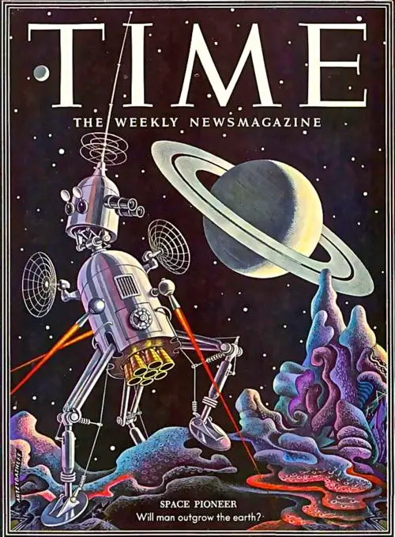

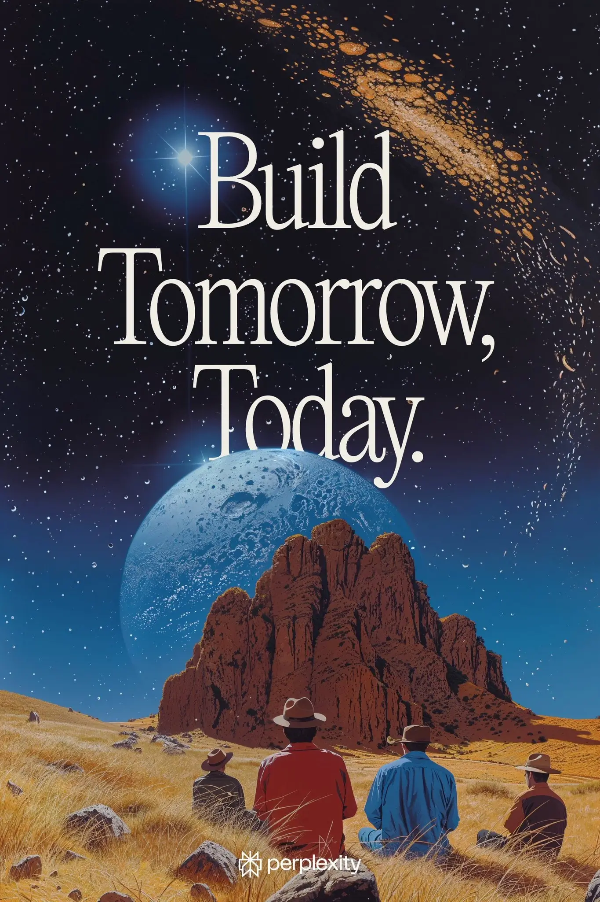

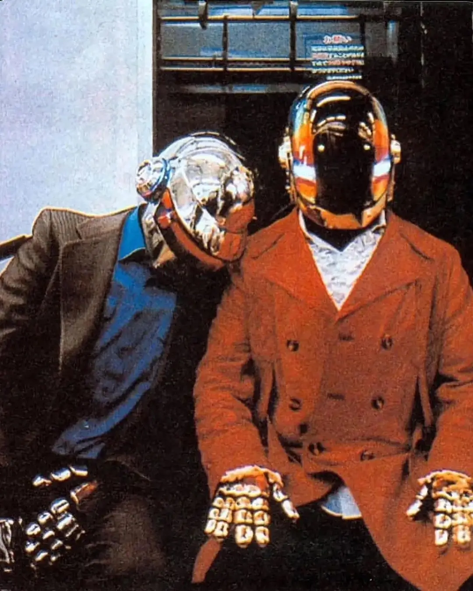

## Analog clocks

Clocks are a natural symbol of everything Orbit represents: memory, nostalgia, and the passage of time. Analog clocks, in particular, evoke warmth and familiarity — a sense of emotional connection I want my product to reflect. I love them as visual metaphors for revisiting past moments and traveling through memories.

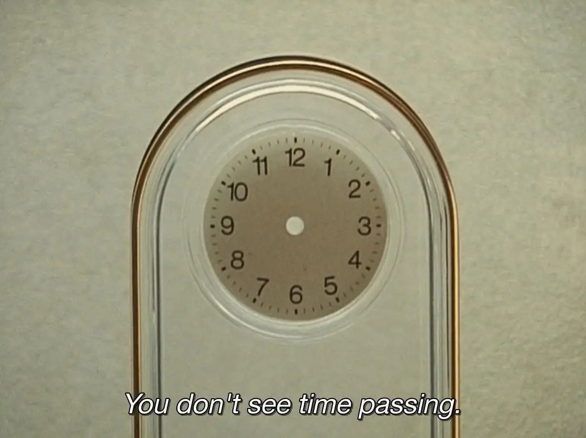

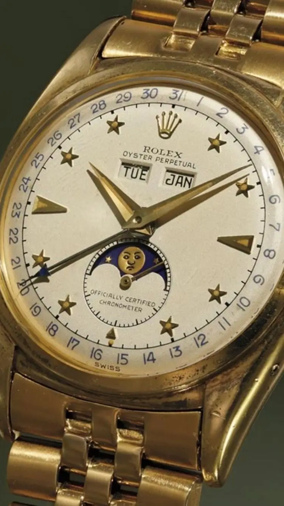

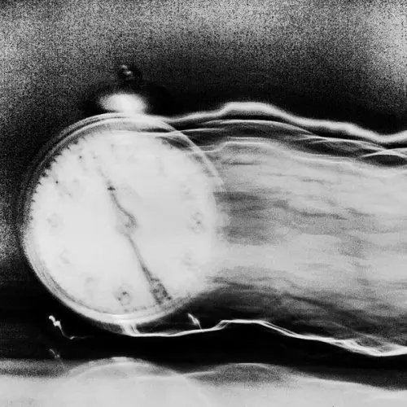

## Rotary dials

Rotary dials are another nostalgic detail I find really interesting. They're tactile, intuitive, and carry a sense of charm rarely found in today's interfaces. While rotary-style interactions may not be practically useful everywhere, I'd like to adapt aspects of their tactile nature and nostalgic look and feel into the product's design language. Subtle references to these old-school elements might also help convey a sense of playful nostalgia and tangible interaction.

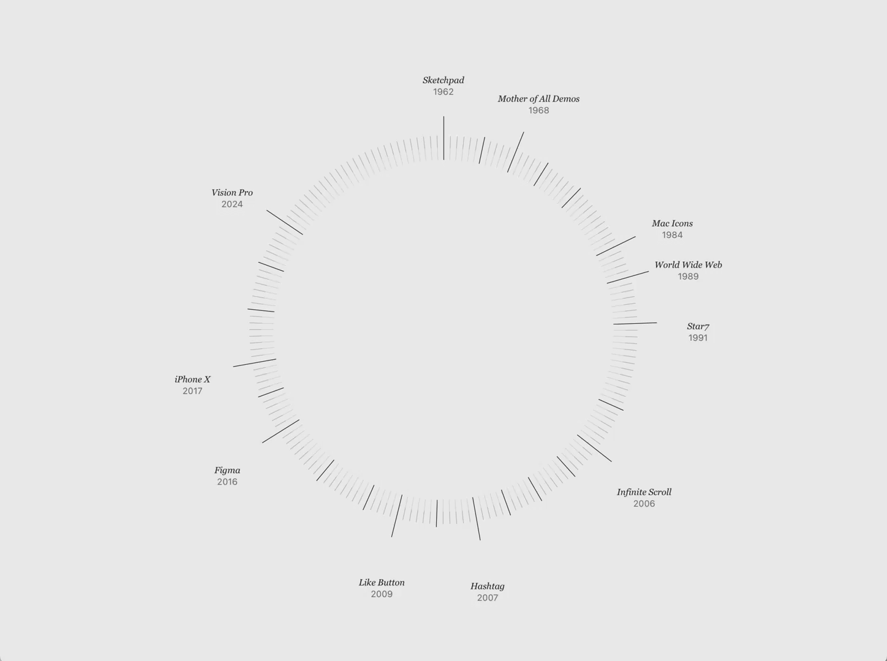

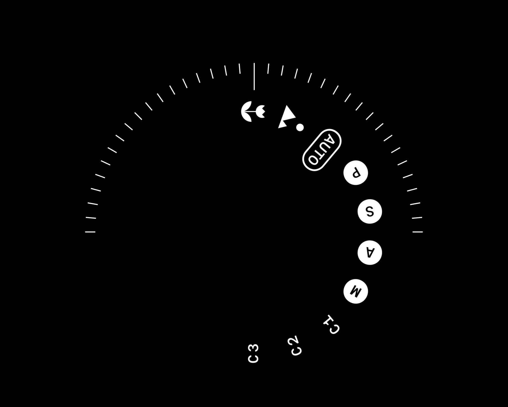

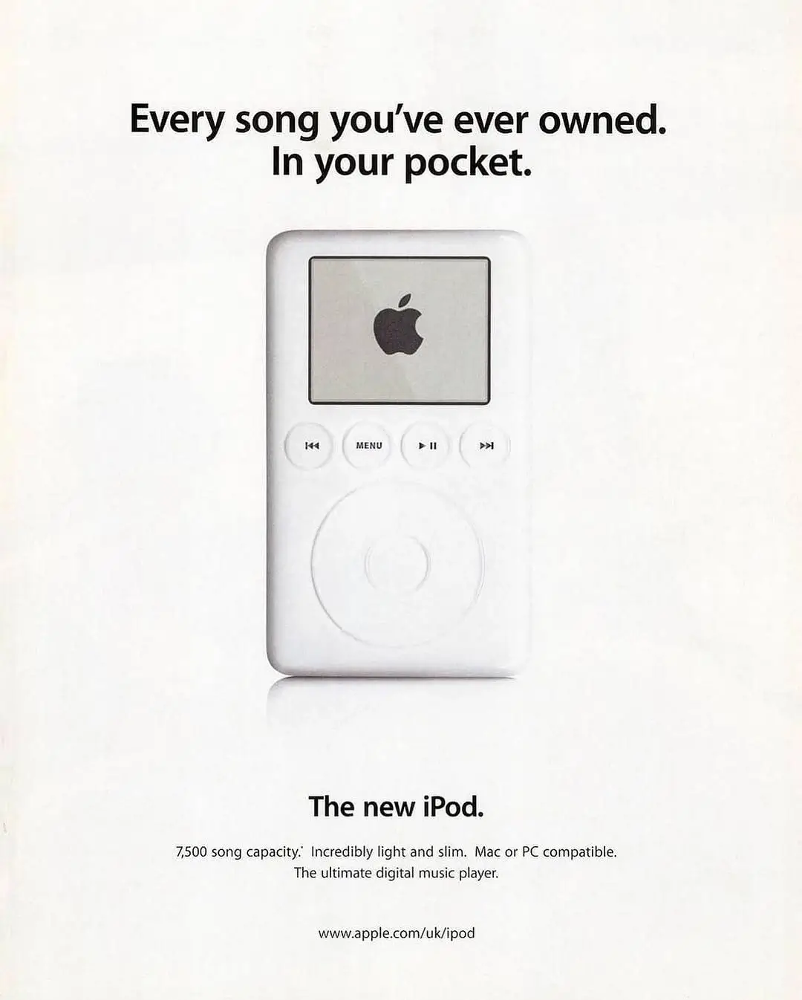

## VHS Tapes

For me, VHS tapes perfectly symbolize capturing and revisiting memories. Although I'm slightly too young to have personally recorded with them, I distinctly remember watching old VHS tapes with my parents as a child. Their physicality, imperfections, and iconic covers make them not only beautifully nostalgic but also visually interesting.

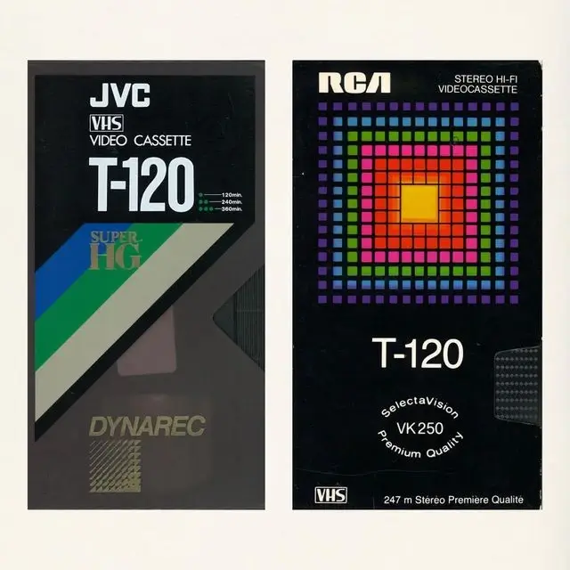

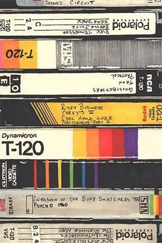

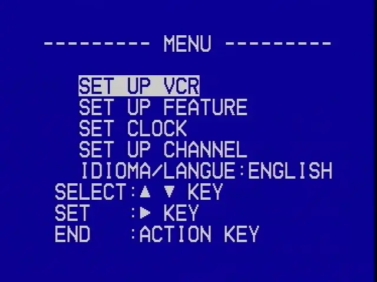

## Spirals

Spirals intrigue me — unlike a static circle, a spiral moves forward yet continually revisits familiar territory. They visually capture the feeling of traveling back through time, rediscovering your past but from a fresh perspective. I'm not yet certain how this element will factor into the product design, but I think there's potential here for subtle, engaging visual metaphors.

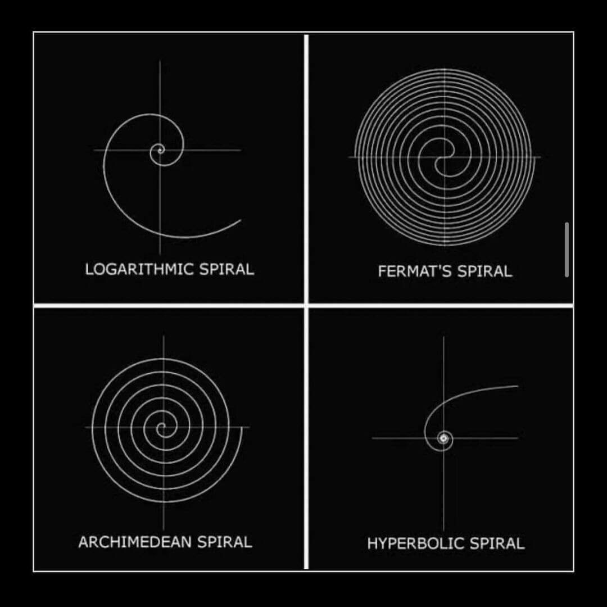

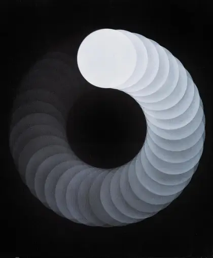

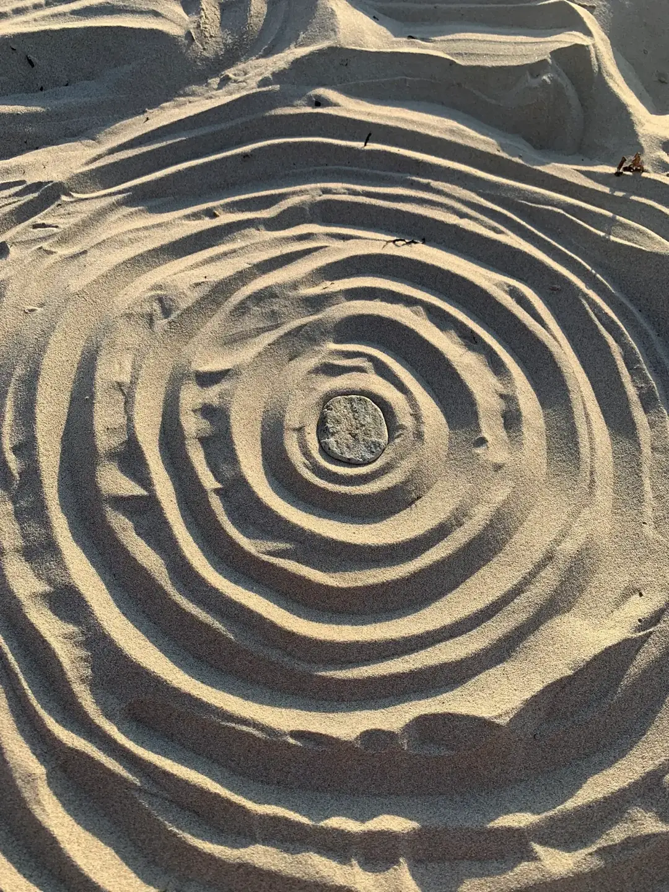

## Bringing It Together

These themes feel like a good jumping-off point for Orbit, helping me craft a product that's more than simply functional. My hope is they'll serve as inspiration for designs that are beautiful, intuitive, nostalgic, and meaningful. While I don't yet know exactly how these visual concepts will translate to the final UI, they'll certainly influence branding, messaging, and overall vibe. I'll revisit these ideas as the project progresses and let their influence evolve naturally.

I'd love to hear what you think. Do these themes resonate with you? Do they bring specific memories, ideas, or references to mind — or maybe suggest other interesting directions? Let me know your thoughts on Twitter!
