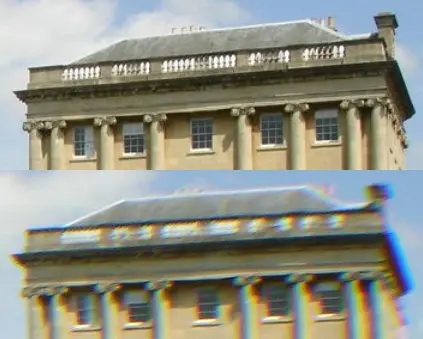

# Design details from the new Orbit website

I recently released a [new marketing website](https://reachorbit.app/) for my macOS app [Orbit](/en/blog/introducing-orbit/). I spent a lot of time on the details, making sure everything felt consistent with the product UI and accurately reflected the mood and style I'm going for with this project.

If you want a deep dive into the concepts and themes behind Orbit, I encourage you to check out [this blog post](/en/blog/orbit-moodboard/).

In this post, I’ll walk you through my favorite details on the website, the kind of stuff I really enjoyed working on and think is worth mentioning.

## Chromatic aberration

Chromatic aberration is that rainbow-colored edge (often red, blue, purple, or green) that appears around the outlines of subjects in photos. You see it especially where dark objects meet bright backgrounds, like a tree branch against a sunny sky. This subtle effect gives photos a slightly dreamy, nostalgic feel.

Since I want to explore themes around time-travel and nostalgia with Orbit, I thought it would be a nice effect to incorporate on the website. I've used it on multiple elements like the logo and headings. It's subtle, but I think it adds a nice touch and gives a bit more prominence to key elements.

Check out [this post on X](https://x.com/mt_heckmann/status/1983552312661385228), if you want to learn how to create this effect with CSS.

## Noise

In general, I'm a big fan of digital products that don't feel super clean and polished. I like it when they have some texture, when they feel a bit used and have some imperfections. The chromatic aberration really plays into that.

Another thing I did was add subtle layers of noise to the website. Depending on the section, I layered different types of noise. There's a continuous background noise that's overlaid on top of the main background. Then in the hero section, there's an additional layer of noise that looks like TV static with lines running vertically toward the bottom.

I think it adds a nice touch and makes the hero section more interesting. It fills in some of the empty space and creates a natural guide for the eye that points downward, subtly encouraging people to scroll.

## Screenshots

For the screenshots, I made heavy use of a tool called the [Tactile Image Viewer](https://t-iv.com/) by [Dominic Scholz](https://x.com/dom_scholz). It's a great tool that turns screenshots into photos that could have been captured with an analog camera.

Usually when you put product photos on a website, you just take a regular screenshot and paste it in. I tried that, but it broke the analog feel I was going for. With this tool, you upload your screenshot to a 3D environment. Inside of this scene, you're then positioning a virtual camera to take a photo of this screenshot. It adds nice effects like grain, depth of field, and chromatic aberration to make everything feel a bit more imperfect and realistic. I really encourage you to check it out!

## Easing on the nav bar

You seldom go wrong with a sticky nav bar. Especially one that transitions between the initial and the scrolled state. The code for this is pretty trivial, just some CSS rules and a scroll listener. The part that I want to focus on is the timing of the transition. I experimented with different easing functions, but the standard ease-in or ease-out options didn't feel right. They're fine, but I wanted something better, more appropriate to the vibe I was going for.

After experimenting with custom easing values and [reading up on the `cubic-bezier` function](https://blog.maximeheckel.com/posts/cubic-bezier-from-math-to-motion/), I found one I like: `cubic-bezier(0.34, 1.56, 0.64, 1)`. It feels pretty satisfying, like a mechanical piece clicking into place with a slight rebound. I sometimes catch myself scrolling on the landing page, going back and forth, just to watch this snapping motion.

<video controls autoplay loop muted style="object-fit: contain; width: 100%; border-radius: 0.5rem; border: 1px solid rgba(255, 255, 255, 0.1); box-shadow: 0 10px 30px rgba(0, 0, 0, 0.2);"
src="https://heckmann-assets.b-cdn.net/heckmann-blog/orbit-website-details/video.webm"
aria-label="Demo of the navigation bar easing animation.">
Your browser does not support the video tag.
</video>

## Icons

I knew from the beginning that I wanted to get creative with the icons on the website. Most projects these days use the same few icon packages (looking at you [Lucide](https://lucide.dev/)), especially with all the AI code generators and vibe-coding tools out there. I wanted to avoid that and give the site something more unique.

Sticking with the theme of retro aesthetics, I looked for some retro icons I could use. It was surprisingly hard to find good open-source ones. I landed on a set called [Memphis98](https://github.com/Stanton731/Memphis98) by [Stanton731](https://github.com/Stanton731), which mimics the look and feel of Windows 2000. I looked through all the assets, trying to find icons that fit the ideas I wanted to portray in the product feature section.

I still had to do some post-processing on them, like removing the color, increasing the contrast, and adding a subtle outline. But I really like the final look. It's not something I see too often on landing pages these days, and it always gives me a bit of joy just looking at the icons.

## Toast notifications

I really like the style of the [Sonner](https://sonner.emilkowal.ski/) library for displaying toasts. I am aware of the irony of this sentence given that I have just written about overused packages and `shadcn/ui` defaults. But for the website’s toast notifications, I didn’t feel the need to get creative and original (just yet).

The problem with the package is it's written for React, and React felt like overkill for this landing page. The site is built with Astro and I wanted to stick to vanilla Typescript. Sure, I could have integrated the React component in the Astro project, but I felt like there had to be a simpler solution.

Luckily, I came across a great package called [Vercel Toast](https://github.com/2nthony/vercel-toast/tree/main) by [2nthony](https://github.com/2nthony). The author took inspiration from the Vercel design system and created a toast component that's framework agnostic. I used that as a base and tweaked the code and styles to fit the requirements and theme of the website.

I'm happy with how the toasts look now. There are some arguments to be made about [avoiding toasts altogether](https://x.com/JohnPhamous/status/1903133263713145089) and displaying a confirmation inline or next to the button that was clicked. There's still lots of room for improvement, but I'm happy with the current state. If you're looking for a toast library in a vanilla JavaScript project, I can definitely recommend checking this package out.

## Conclusion

These are just some of the details I like about the website. Follow me on [X](https://x.com/mt_heckmann) for more breakdowns and deep dives into the things I'm working on, whether it's the website or the Orbit product itself.

I really like where some parts of the industry are heading right now. There's this renewed focus on craft, on making sure the digital products we create are built with intention. It feels like a reaction to industrial, AI- or mass-produced software. Not that there's anything wrong with those, but I think there is a strong _raison d’être_ and lots of good arguments for [quality software](https://stephango.com/quality-software), for digital products that are designed with care and attention to the end user.

When someone visits my websites, I want them to feel immersed in a particular vibe or theme. Everything should feel coherent and complete. I know that I’ll still have to sand down plenty of rough edges both on the product and on the website. But I'm enjoying the process, and if you’re interested in following along, I’ll encourage you to subscribe to my newsletter or follow me on X.
